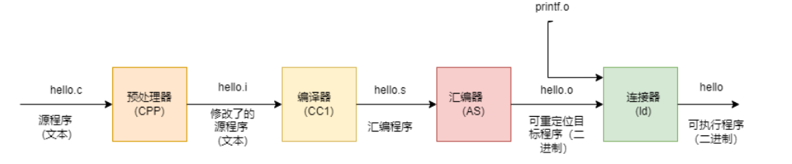
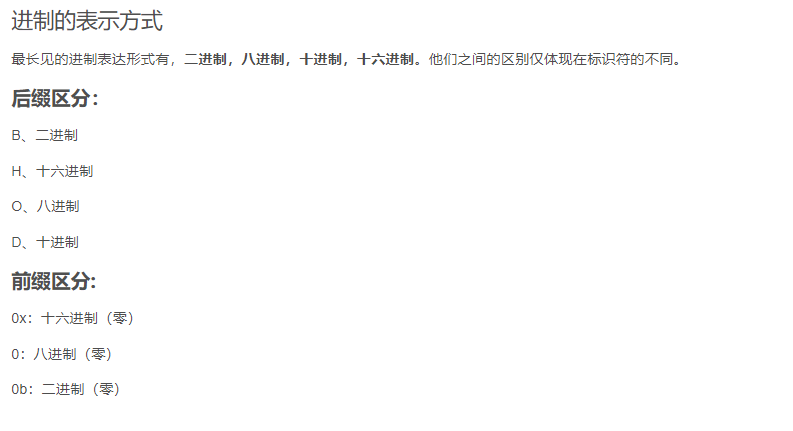
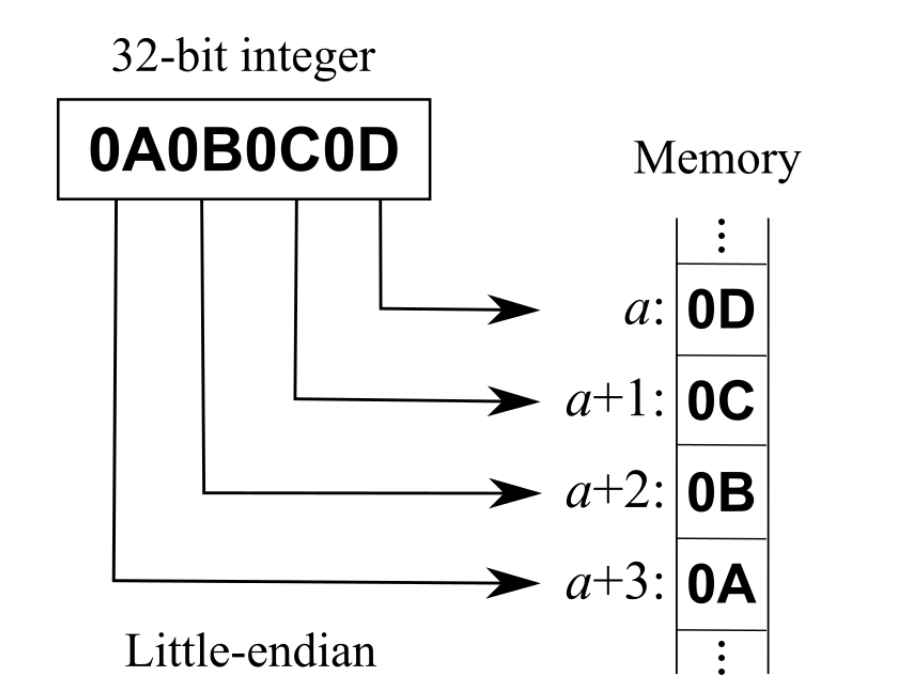
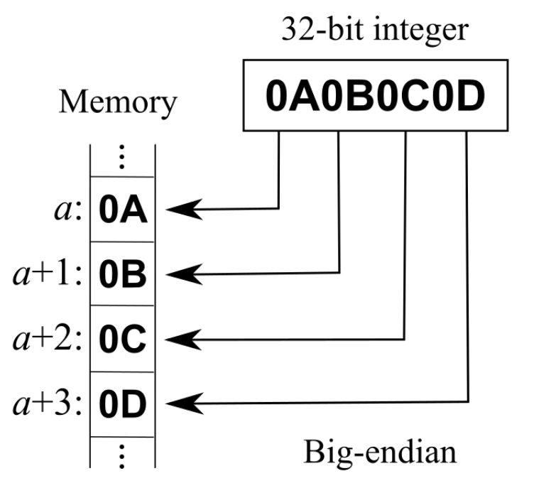

<center><span style="font-size:2rem;font-weight:bold;">C++面试突击</span></center>

<div style="page-break-after: always;"></div>

[toc]

<div style="page-break-after: always;"></div>

# C++的编译连接模型

## 为什么需要编译

我们常见的C/C++语言，CPU是无法理解的，这就需要我们将编写好的代码翻译成机器可执行的二进制指令，编译的过程本质上也是翻译的过程。

## 编译的处理过程

   

编译器读取源文件`CPP`并将其翻译为可执行文件`ELF`，`ELF`文件可以经过操作系统进行加载执行。常见的编译过程分为四个过程：**预处理、编译、汇编、链接。**

## 预处理

将源文件转换为翻译单元的过程，比如引入头文件，去除注释，处理所有的条件编译指令(`#ifdef,#ifndef,#else,elif,#endif`)，宏的替换(`#define`)，添加行号，保留所有的编译器指令。

防止头文件被循环展开的解决方法：

### #ifdef的解决方案

```C++
#ifndef
//
//
#endif
```

### #pragma once解决方案

```C++
#pragma once
//
```

## 编译

将源文件翻译成汇编语言，里面涉及多种优化操作。

## 汇编

将汇编语言翻译成机器语言。

## 链接

汇编程序生成的目标文件即为 .o 文件，单独的 .o 文件可能无法执行。因为一个程序可能由多个源文件组成，此时就存在多个 .o 文件。文件 A 中的函数引用了另一个文件 B 中定义的符号或者调用了某个库文件中的函数，这就需要链接处理。**那链接的目的就是将这些文件对应的目标文件连接成一个整体，从而生成一个可被操作系统加载执行的ELF 程序文件**

### 静态链接

代码在生成可执行文件时，将该程序所需要的全部外部调用函数全部拷贝到最终的可执行程序文件中，在该程序被执行时，该程序运行时所需要的全部代码都会被装入到该进程的虚拟地址空间中。在 Linux 系统下，静态链接库一般以 .a 结尾，我们可以将多个 .o 文件链接成一个静态链接库。

### 动态链接

代码在生成可执行文件时，该程序所调用的部分程序被放到动态链接库或共享对象的某个目标文件中，链接程序只是在最终的可执行程序中记录了共享对象的名字等一些信息，最终生成的 ELF 文件中并不包含这些调用程序二进制指令。在程序执行时，当需要调用这部分程序时，操作系统会将这些动态链或者共享对象进行加载，并将全部内容会被映射到该进行运行的虚拟地址的空间。在 Linux 系统下，动态链接库一般以 .so 结尾，我们可以将多个 .o 文件链接成一个动态链接库。

### 优缺点

**静态链接**浪费空间，每个可执行程序都会有目标文件的一个副本，这样如果目标文件进行了更新操作，就需要重新进行编译链接生成可执行程序（更新困难），优点就是执行的时候运行速度快，因为可执行程序具备了程序运行的所有内容；**动态链接**节省内存、更新方便，但是动态链接是在程序运行时，每次执行都需要链接，相比静态链接会有一定的性能损失。静态链接是由连接器完成的，动态链接最终是由操作系统来完成链接的功能。

# C++的内存管理

`C++` 程序在运行时也会按照不同的功能划分不同的段，`C++` 程序使用的内存分区一般包括：**栈、堆、全局/静态存储区、常量存储区、代码区。**

* **栈**：目前绝大部分CPU 体系都是基于栈来运行程序，栈中主要存放**函数的局部变量、函数参数、返回地址**等，栈空间一般由**操作系统进行默认分配或者程序指定分配**，栈空间在进程生存周期一直都存在，当进程退出时，操作系统才会对栈空间进行回收。

* **堆**：**动态申请的内存空间，就是由 malloc 函数或者 new 函数分配的内存块，由程序控制它的分配和释放**，可以在程序运行周期内随时进行申请和释放，如果进程结束后还没有释放，操作系统会自动回收。

* **全局区/静态存储区**：主要为 .bss 段和 .data 段，存放**全局变量和静态变量**，程序运行结束操作系统自动释放，在 C 中，未初始化的放在 .bss 段中，初始化的放在 .data 段中，C++ 中不再区分了。

* **常量存储区**：.rodata 段，**存放的是常量，不允许修改**，程序运行结束自动释放。

* **代码区**：.text 段，**存放代码，不允许修改，但可以执行**。编译后的二进制文件存放在这里

# 堆、栈的区别

## 堆

当程序在运行时，需要动态申请额外的内存来存放相应的数据和变量，此时就需要用到堆。堆的内存空间一般由操作系统或者专门内存程序来管理的。**在 C/C++ 一般用 malloc 或者 new 来从堆中申请内存，使用 free 或者 delete 来释放空间，**空间释放后会有操作系统进行回收。当然在实际的程序运行中动态内存管理非常复杂，会有许多非常复杂的技巧来处理。

## 堆与栈的优缺点：

* 申请方式：栈中存放的变量在编译时由编译器为其在栈上分配了空间，即程序编译后该变量在栈中使用的内存即确定，释放时也由于函数调用的返回，栈的空间会自动进行回收。堆中存放的变量由程序运行时决定的，会有操作系统或者内存管理模块来进行分配的。

* 申请后系统响应：

分配栈空间时如果剩余空间大于申请空间则分配成功，否则分配失败栈溢出，绝大多数情况下，栈的空间较小，一般栈上分配的变量不会占用太大的空间，且当函数返回时，当前栈帧中的变量生存周期会结束；

申请堆空间，堆在内存中呈现的方式类似于链表（记录空闲地址空间的链表），在链表上寻找第一个大于申请空间的节点分配给程序，将该节点从链表中删除，大多数系统中该块空间的首地址存放的是本次分配空间的大小，便于释放，将该块空间上的剩余空间再次连接在空闲链表上，堆上可以分配较大的空间，如果不对申请的内存进行释放，则堆上存储的变量生存周期一直存在，直到当前进程退出。
**栈在内存中是连续的一块空间（向低地址扩展）最大容量是系统预定好的，且只能被当前的线程访问；堆在内存中的空间（向高地址扩展）是不连续的，中间允许有间隔，堆中的内存并不是线程安全的，同一进程的线程都都可访问。**

* 申请效率：栈是由系统自动分配，申请效率高，但程序员无法控制；堆是由程序员主动申请，效率低，使用起来方便但是容易产生碎片。
  存放的内容：栈中存放的是局部变量，函数的参数；堆中存放的内容由程序员控制。

* 实际的内存管理
  实际的内存管理可能更为复杂，一般分为两级内存管理。
  操作系统按照段页式来管理内存，当需要创建新的进程或者线程时，操作系统会为新创建的进程分配物理页，当运行的进程需要更多的内存时，操作系统也会为其分配新的物理页并将其映射到该进程的虚拟地址空间中。
  程序运行时，每个程序都含有一个内存管理的子程序，专门负责程序中的内存申请和释放，其中的技巧可能非常复杂，并且涉及许多内存分配的算法。

# 变量定义与生存周期

`C/C++` 变量有两个非常重要的属性：**作用域与生命周期**，这两个属性代表从时间和空间两个不同的维度来描述一个变量。

## 作用域

作用域即一个变量可以被引用的范围，常见的作用域可分为 6 种：**全局作用域，局部作用域，语句作用域，类作用域，命名空间作用域和文件作用域**。从作用域来来看：

**全局变量**：具有全局作用域。全局变量只需在一个源文件中定义，就可以作用于所有的源文件。其他不包含全局变量定义的源文件需要用 extern 关键字再次声明这个全局变量。

**静态全局变量**：具有文件作用域。它与全局变量的区别在于如果程序包含多个文件的话，它作用于定义它的文件里，不能作用到其它文件里，即被 static 关键字修饰过的变量具有文件作用域。这样即使两个不同的源文件都定义了相同名字的静态全局变量，它们也是不同的变量。

**局部变量**：具有局部作用域。它是自动对象（auto），在程序运行期间不是一直存在，而是只在函数执行期间存在，函数的一次调用执行结束后，变量被撤销，其所占用的内存也被收回，局部变量对于函数外部的程序来说是不可见的。当然内部实际更复杂，实际是以 {} 为作用域的。

**静态局部变量**：具有局部作用域。它只被初始化一次，自从第一次被初始化直到程序运行结束都一直存在，它和全局变量的区别在于全局变量对所有的函数都是可见的，而静态局部变量只对定义自己的函数体始终可见, 只有定义该变量的函数内部可以使用访问和修改该变量。

## 生命周期

生命周期即该变量可以被引用的时间段（生存期表示变量存在的时间）。

**全局变量**: 全局变量在整个程序运行期间都会一直存在，都可以随时访问，当程序结束时，对应的变量则会自动销毁，内存会被系统回收。
**局部变量**: 局部变量的生命周期仅限于函数被调用期间，当函数调用结束时，该变量会自动销毁。
**静态局部变量**：实际上静态局部变量的作用域仅限于函数内部，它的作用域与局部变量相同，但实际上该变量在程序运行期间是一直存在的，生命周期贯穿于整个程序运行期间。局部静态变量只能被初始化一次。

## 存储区域

静态变量与全局变量存储与**静态、全局存储区**

局部变量存储与栈区(动态申请的内存处于堆区)

## 注意

静态变量和栈变量（存储在栈中的变量）、堆变量（存储在堆中的变量）的区别：静态变量会被放在程序的静态数据存储区（.data 段，bss 段，rodata 段）中（静态变量会自动初始化），这样可以在下一次调用的时候还可以保持原来的赋值。而栈变量或堆变量不能保证在下一次调用的时候依然保持原来的值。
静态变量和全局变量的区别：静态变量仅在变量的作用范围内可见，实际是依靠编译器来控制作用域。全局变量在整个程序范围内都可可见，只需声明该全局变量，即可使用。
**全局变量定义在不要在头文件中定义**：如果在头文件中定义全局变量，当该头文件被多个文件 include 时，该头文件中的全局变量就会被定义多次，编译时会因为重复定义而报错，因此不能再头文件中定义全局变量。**一般情况下我们将变量的定义放在 .cpp 文件中，一般在 .h 文件使用extern 对变量进行声明。**

# 大端与小端

## 进制标识符

  

## 字节序

字节顺序又称端序或尾序（Endianness），在计算机科学领域中，指电脑内存中或在数字通信链路中，组成多字节的字的字节的排列顺序。在几乎所有的机器上，多字节对象都被存储为连续的字节序列。例如在 C 语言中，一个类型为 int 的变量 x 地址为 0x100，那么其对应地址表达式 &x 的值为 0x100，x 的四个字节将被存储在电脑内存的 0x100，0x101，0x102，0x103 位置。

字节的排列方式常见的方式有两种：将一个多位数的低位放在较小的地址处，高位放在较大的地址处，则称小端序（Little-Endian）；反之则称大端序（Big-Endian）

为什么需要字节序这个规定，主要是因为在网络应用中字节序是一个必须被考虑的因素，对于不同 CPU 可能采用不同标准的字节序，所以均按照网络标准转化成相应的字节序。

### 小端序Little-Endian

将低序字节存储在起始地址（低位编址），在变量指针转换的时候地址保持不变，比如 `int64*` 转到 `int32*`，对于机器计算来说更友好和自然。

   

### 大端序Big-Endian

将高序字节存储在起始地址（高位编址），内存顺序和数字的书写顺序是一致的，对于人的直观思维比较容易理解，网络字节序统一规定采用 `Big-Endian`。

   

# 内存泄漏

内存泄漏
程序在堆中申请的动态内存，在程序使用完成时没有得到及时的释放。当这些变量的生命周期已结束时，该变量在堆中所占用的内存未能得到释放，从而就导致了堆中可使用的内存越来越少，最终可能产生系统运行较慢或者系统因内存不足而崩溃的问题。

**内存泄漏并非指内存从物理上消失，而是指程序在运行过程中，由于疏忽或错误而失去了对该内存的控制，从而造成了内存的浪费。**
**内存泄漏主要指堆上分配的变量，因为栈中分配的变量，随着函数退出时会自动回收。而堆是动态分配的，一旦用户申请了内存分配而为及时释放，那么该部分内存在整个程序运行周期内都是被占用的，其他程序无法再使用这部分内存。**
对于实际的程序来说，我们在调用过程中使用 malloc、calloc、realloc、new 等分配内存时，使用完后要调用相应的 free 或 delete 释放内存，否则这块内存就会造成内存泄漏。当然在实际应用中，我们可能在使用系统资源或者在堆中创建对象时，没有及时将这些资源或者对象进行释放时，也会造成内存泄漏，这些资源或者对象的创建实际也占用了堆中的内存，在使用完成时应及时将其进行释放。

# 智能指针


# C和C++的对比

C 语言是典型面向过程（Procedure Oriented）的编程语言，C++ 则是典型面向对象（Object Oriented）的编程语言，当然 C++ 也支持面向过程编程。

## 解析

面向过程（Procedure Oriented）：一种以过程为中心的编程思想，侧重于分析解决问题所需的步骤，使用函数把这些步骤依次实现。
面向对象（Object Oriented）：侧重于把构成问题的事务分解为各个对象。建立对象的目的不是完成其中的一个步骤，而是描述某个事务在解决整个具体问题步骤中的行为。**面向对象语言的显著特征就是支持封装、继承、类的抽象。**

## 相同

C++ 能够大部分兼容 C 的语法，且二者之间相同的关键字和运算符功能和作用也几乎相同；二者之间的内存模型与硬件比较接近，几乎都可以直接操纵硬件。栈、堆、静态变量这些概念在两种语言都存在。

## 不同

* C 为面向过程的编程语言，不支持面向对象，不支持**继承、多态、封装**。
* 类型检查更为严格，C 语言中的类型转换几乎是任意的，但是 C++ 编译器对于类型转换进行非常严格检查，部分强制类型转换在 C 语言编译器下可以通过，但在 C++ 编译器下无法通过。
* C 和 C++ 中都有结构的概念，但是在 C 语言中结构只有成员变量，而没成员方法，C 的成员变量没有权限控制，该结构体的变量对所有调用全部可见；而在 C++ 中结构中，它可以有自己的成员变量和成员函数，C++ 对类的成员变量具有访问权限控制。
* 增加了**面向对象的机制、泛型编程的机制（Template）、异常处理、引用、运算符重载、标准模板库（STL）、命名空间（避免全局命名冲突**）。
* 应用领域：对于 C 语言程序员来说，程序的底层实现和内存分布基本上都可见，所以一般常用于直接控制硬件，特别是 C 语言在嵌入式领域应用很广，比如常见的驱动开发等与硬件直接打交道的领域，C++ 可以用于应用层开发，用户界面开发等与操作系统打交道的领域，特别是图形图像编程领域，几乎所有的高性能图形图像库都是用 C++ 实现的。

# C++11的新特性

## auto类型推导

auto 关键字：自动类型推导，编译器会在 **编译期间** 通过初始值或者函数返回值推导出变量的类型，通过 auto 定义的变量必须有初始值。
auto 关键字基本的使用语法如下：

```C++
auto var = val1 + val2; // 根据 val1 和 val2 相加的结果推断出 var 的类型
auto ret = [](double x){return x*x;}; // 根据函数返回值推导出 ret 的类型
auto al = { 10, 11, 12 }; //类型是std::initializer_list<int>
```

使用 auto 关键字做类型自动推导时，依次施加以下规则:
首先，如果初始化表达式是引用，首先去除引用；
上一步后，如果剩下的初始化表达式有顶层的 const 或 volatile 限定符，去除掉。使用 auto 关键字声明变量的类型，不能自动推导出顶层的 const 或者 volatile，也不能自动推导出引用类型，需要程序中显式声明，比如以下程序：

```C++
const int v1 = 101;
auto v2 = v1;       // v2 类型是int，脱去初始化表达式的顶层const
v2 = 102；            // 可赋值
int a = 100;
int &b = a; 
auto c = b;          // c 类型为int，脱去初始化表达式的 &
```

初始化表达式为数组，`auto` 关键字推导的类型为指针。数组名在初始化表达式中自动隐式转换为首元素地址的右值。

```C++
int a[9]; 
auto j = a; // 此时j 为指针为 int* 类型，而不是 int(*)[9] 类型
std::cout << typeid(j).name() << " "<<sizeof(j)<<" "<<sizeof(a)<< std::endl;
```

## decltype类型推导

decltype 关键字：decltype 是 “declare type” 的缩写，译为“声明类型”。和 auto 的功能一样，都用来在编译时期进行自动类型推导。如果希望从表达式中推断出要定义的变量的类型，但是不想用该表达式的值初始化变量，这时就不能再用 auto。decltype 作用是选择并返回操作数的数据类型。

```C++
auto var = val1 + val2; 
decltype(val1 + val2) var1 = 0; 
```

auto 根据 = 右边的初始值 val1 + val2 推导出变量的类型，并将该初始值赋值给变量 var；decltype 根据 val1 + val2 表达式推导出变量的类型，变量的初始值和与表达式的值无关。

auto 要求变量必须初始化，因为它是根据初始化的值推导出变量的类型，而 decltype 不要求，定义变量的时候可初始化也可以不初始化。

若**表达式 e 为一个无括号的变量、函数参数、类成员访问**，那么返回类型即为该变量或参数或类成员在源程序中的“声明类型”；
否则的话，根据表达式的值分类（value categories），设 T 为 e 的类型：
**若 e 是一个左值（lvalue，即“可寻址值”），则 decltype(e) 将返回T&；**
**若 e 是一个临终值（xvalue），则返回值为 T&& ；**
**若 e 是一个纯右值（prvalue），则返回值为 T。**

```C++
const int&& foo();
const int bar();
int i;
struct A { double x; };
const A* a = new A();
decltype(foo()) x1; // 类型为const int&&
decltype(bar()) x2; // 类型为int
decltype(i) x3; // 类型为int
decltype(a->x) x4; // 类型为double
decltype((a->x)) x5; // 类型为const double&
```

## Lamda表达式

`lambda` 表达式，又被称为 `lambda` 函数或者 `lambda` 匿名函数。与inline函数类似
`lambda` 匿名函数的定义:

```C++
[capture list] (parameter list) -> return type
{
function body;
};
```

其中：

capture list：捕获列表，指 lambda 所在函数中定义的局部变量的列表。定义在与 lambda 函数相同作用域的参数引用也可以被使用，一般被称作 closure（闭包），以下为闭包的常见用法。

```C++
[]      // 沒有定义任何外部变量。使用未定义变量会引发错误。
[x, &y] // x以传值方式传入（默认），y以引用方式传入。
[&]     // 任何被使用到的外部变量都隐式地以引用方式加以引用。
[=]     // 任何被使用到的外部变量都隐式地以传值方式加以引用。
[&, x]  // x显式地以传值方式加以引用。其余变量以引用方式加以引用。
[=, &z] // z显式地以引用方式加以引用。其余变量以传值方式加以引用。
```

例子：

```C++
int main()
{
    int a = 10;
    auto f = [&a](int x)-> int {
        a = 20;
        return a + x;
    };
    cout<<a<<endl; // 10
    cout<<f(10)<<endl; // 30
    cout<<a<<endl; // 20
    return 0;
}
```

`return type`、`parameter list`、`function body`：分别表示返回值类型、参数列表、函数体，和普通函数一样。

例子

```C++
#include <iostream>
#include <algorithm>
using namespace std;

int main()
{
    int arr[4] = {4, 2, 3, 1};
    //对 a 数组中的元素进行升序排序
    sort(arr, arr + 4, [=](int x, int y) -> bool{ return x < y; } );
    auto f = [&](int x)-> int {
        return arr[0] + x;
    }

    for(int n : arr){
        cout << n << " ";
    }
    return 0;
}
```

需要注意的是 lambda 函数按照传值方式捕获的环境中的变量，在 lambda 函数内部是不能修改的。否则，编译器会报错。其值是 lambda 函数定义时捕获的值，不再改变**。如果在 lambda 函数定义时加上 mutable 关键字，则该捕获的传值变量在 lambda 函数内部是可以修改的，对同一个 lambda 函数的随后调用也会累加影响该捕获的传值变量，但对外部被捕获的那个变量本身无影响。**

例子

```C++
#include <iostream> 
using namespace std;
int main()
{
	size_t t = 9;
	auto f = [t]() mutable{
		t++;
		return t; 
	};
	cout << f() << endl; // 10
	t = 100;
	cout << f() << endl; // 11
	cout << "t:" << t << endl; // t: 100
	return 0;
}
```

## 范围for语句

语法格式

```C++
for (declaration : expression){
    statement
}
```

参数的含义：
expression：必须是一个序列，例如用花括号括起来的初始值列表、数组、vector，string 等，这些类型的共同特点是拥有能返回迭代器的 beign、end 成员。
declaration：此处定义一个变量，序列中的每一个元素都能转化成该变量的类型，常用 auto 类型说明符。
实例：

```c++
#include <iostream>
#include <vector>
using namespace std;
int main() {
    char arr[] = "hello world!";
    for (char c : arr) {
        cout << c;
    }  
    return 0;
}
/*
程序执行结果为：
hello world!
*/
```

## 右值引用

C++ 表达式中的 “值分类”（value categories）属性为左值或右值。其中左值是对应（refer to）内存中有确定存储地址的对象的表达式的值，而右值是所有不是左值的表达式的值。因而，右值可以是字面量、临时对象等表达式。能否被赋值不是区分 C++ 左值与右值的依据，C++ 的 const 左值是不可赋值的；而作为临时对象的右值可能允许被赋值。**左值与右值的根本区别在于是否允许取地址 & 运算符获得对应的内存地址。**

## 标准库move函数

`move()` 函数：通过该函数可获得绑定到左值上的右值引用。通过 `move` 获取变量的右值引用，从而可以调用对象的移动拷贝构造函数和移动赋值构造函数。

**即把左值替换为右值引用**

## 智能指针

```
auto_ptr` 在 `C++ 11` 中被，取而代之的是 `unique_ptr
```

## constexpr

常量表示式对编译器来说是优化的机会，编译器时常在编译期执行它们并且将值存入程序中。同样地，在许多场合下，C++ 标准要求使用常量表示式。例如在数组大小的定义上，以及枚举值（enumerator values）都要求必须是常量表示式。常量表示式不能含有函数调用或是对象构造函数。所以像是以下的例子是不合法的：

```c++
int g() {return 5;}
int f[g() + 10]; // 不合法的C++ 写法
```

由于编译器无从得知函数 g() 的返回值为常量，因此表达式 g() + 10 就不能确定是常量。C++ 11 引进关键字 constexpr 允许用户保证函数或是对象构造函数是编译期常量，编译器在编译时将去验证函数返回常量。

```C++
constexpr int g() {return 5;}
int f[g() + 10]; // 合法
```


用 constexpr 修饰函数将限制函数的行为。

* 函数的回返值类型不能为void；

* 函数体不能声明变量或定义新的类型；

* 函数体只能包含声明、null语句或者一段return语句；

* 函数的内容必须依照 "return expr" 的形式，在参数替换后，expr 必须是个常量表达式；

* 这些常量表达式只能够调用其他被定义为 constexpr 的函数，或是其他常量形式的参数。

* constexpr 修饰符的函数直到在该编译单元内被定义之前是不能够被调用的。声明为 constexpr 的函数也可以像其他函数一样用于常量表达式以外的调用。

* C++ 11 中的常量表达式中的变量都必须是常量，可以使用 constexpr 关键字来定义表达式中的变量：
  ```c++
  constexpr double PI = 3.14;
  constexpr double Degree = PI * 2.0;
  ```

  如果创建用户定义类型的常量表达式，则自定义类型的构造函数必须用 constexpr 声明，函数体仅包含声明或 null 语句，不能声明变量或定义类型。构造函数的实参值应该是常量表达式，直接初始化类的数据成员。同时该类型对象的拷贝构造函数应该也定义为 constexpr，以允许 constexpr 函数返回一个该类型的对象。C++ 14 以后的规则有所改动。

## 使用或者禁用对象的默认函数

C++ 11 中允许显式地表明采用或拒用编译器提供的内置函数。

允许编译器生成默认的构造函数:
default 函数：= default 表示编译器生成默认的函数，例如：生成默认的构造函数。
禁止编译器使用类或者结构体中的某个函数:
delete 函数：= delete 修改某个函数则表示该函数不能被调用。与 default 不同的是，= delete 也能适用于非编译器内置函数，所有的成员函数都可以用 =delete 来进行修饰。

例子

```C++
#include <iostream>
using namespace std;

class A
{
public:
	A() = default; // 表示使用默认的构造函数
	~A() = default;	// 表示使用默认的析构函数
	A(const A &) = delete; // 表示类的对象禁止拷贝构造
	A &operator=(const A &) = delete; // 表示类的对象禁止拷贝赋值
};
int main()
{
	A ex1;
	A ex2 = ex1; // error: use of deleted function 'A::A(const A&)'
	A ex3;
	ex3 = ex1; // error: use of deleted function 'A& A::operator=(const A&)'
	return 0;
}
```

## 可扩展的随机数

`C++ 11` 将会提供产生伪随机数的新方法。`C++ 11` 的随机数功能分为两部分：

随机数生成引擎，其中包含该生成引擎的状态，用来产生随机数。
随机数分布，这可以用来决定产生随机数的范围，也可以决定以何种分布方式产生随机数。
随机数生成对象即是由随机数生成引擎和分布所构成。
针对产生随机数的机制，C++ 11 将会提供三种算法，每一种算法都有其强项和弱项：
linear_congruential：可以产生整数，速度较慢，随机数质量较差；
subtract_with_carry: 可以产生整数和随机数，速度较快，随机数质量中等；
mersenne_twister：可以产生整数，速度较快，随机数质量较好；

C++ 11 将会提供一些标准分布：uniform_int_distribution（离散型均匀分布），bernoulli_distribution（伯努利分布），geometric_distribution（几何分布），poisson_distribution（卜瓦松分布），binomial_distribution（二项分布），uniform_real_distribution（离散型均匀分布)，exponential_distribution（指数分布），normal_distribution（正态分布）和 gamma_distribution（伽玛分布）。

例子

```C++
std::uniform_int_distribution<int> distribution(0, 99); // 离散型均匀分布
std::mt19937 engine; // 随机数生成引擎
auto generator = std::bind(distribution, engine); // 将随机数生成引擎和分布绑定生成函数
int random = generator();  // 产生随机数
```

# c++中常用的一些关键字与关键库函数

## explicit的作用

用来声明类构造函数是显式调用的，而非隐式调用，可以**阻止调用构造函数时进行隐式转换和赋值初始化**。只可用于修饰单参构造函数，因为无参构造函数和多参构造函数本身就是显示调用的，再加上 explicit 关键字也没有什么意义。

隐式转换

```C++
#include <iostream>
#include <cstring>
using namespace std;

class A
{
public:
    int var;
    A(int tmp)
    {
        var = tmp;
    }
};
int main()
{
    A ex = 10; // 发生了隐式转换
    return 0;
}
```

上述代码中，`A ex = 10`; 在编译时，进行了隐式转换，将 `10` 转换成 `A` 类型的对象，然后将该对象赋值给 `ex`，等同于如下操作：

为了避免隐式转换，可用 `explicit` 关键字进行声明：

```C++
#include <iostream>
#include <cstring>
using namespace std;

class A
{
public:
    int var;
    explicit A(int tmp)
    {
        var = tmp;
        cout << var << endl;
    }
};
int main()
{
    A ex(100);
    A ex1 = 10; // error: conversion from 'int' to non-scalar type 'A' requested
    return 0;
}
```

在日常使用时一般情况下建议声明 explicit 的构造函数，从而可以阻止编译器执行非预期 (往往也不被期望) 的类型转换，因为某些非预期的类型转换可能会引起意向不到的错误。

## C和C++static中的作用

在 C 语言中，使用 static 可以定义**局部静态变量、外部静态变量、静态函数**。
在 C++ 中，使用 static 可以定义**局部静态变量、全局静态变量、静态函数、静态成员变量和静态成员函数**。因为 C++ 中有类的概念，静态成员变量、静态成员函数都是与类有关的概念。

### staic全局静态向量

**普通全局变量和 static 全局静态变量都为静态存储方式**。普通全局变量的作用域是整个源程序，当一个源程序由多个源文件组成时，普通全局变量在各个源文件中都是有效的；

**静态全局变量**则限制了其作用域，**即只在定义该变量的源文件内有效**，在同一源程序的其它源文件中不能使用它。由于静态全局变量的作用域限于一个源文件内，只能为该源文件内的函数公用，因此可以避免在其他源文件中引起错误。

**静态全局变量只初始化一次，防止在其他文件中使用。**实际上全局静态变量存储在内存的静态存储区，生命周期贯穿于整个程序运行期间。静态变量会被放在程序的静态数据存储区，这样可以在下一次调用的时候还可以保持原来的赋值，静态变量用 static 告知编译器，自己仅仅在变量的作用范围内可见，实际是依靠编译器来控制作用域。

### static局部静态变量

局部静态变量只能被初始化一次。与全局静态变量不同的是静态局部变量的作用域仅限于函数内部，它的作用域与函数内部的局部变量相同。实际上局部静态变量同样也存储在静态存储区，因此它的生命周期贯穿于整个程序运行期间。

### static静态函数

`static` 函数限制函数的作用域，仅可在定义该函数的文件内部调用

### static静态成员变量

静态成员变量是在类内进行声明，在类外进行定义和初始化，在类外进行定义和初始化的时候不要出现 static 关键字和 private、public、protected 访问规则。
**静态成员变量相当于类域中的全局变量，被类的所有对象所共享，包括派生类的对象，且只能该变量只能被初始化一次，不能在类的构造函数中对静态成员变量进行初始化。**

例子

```C++
// C++ program to demonstrate static
// variables inside a class
#include<iostream>
using namespace std;

class GfG
{
public:
	static int i;
	GfG() {
		
	};
};

int GfG::i = 1; // initial

int main()
{
    GfG obj1;
    GfG obj2;
    obj1.i =2; // error
    obj2.i = 3; // error
    GfG::i = 10; // assignment
    // prints value of i
    cout << obj1.i<<" "<<obj2.i; // 10 
}
```

- 静态成员变量可以作为成员函数的参数，而普通成员变量不可以。

```C++
#include <iostream>
using namespace std;

class A
{
public:
    static int s_var;
    int var;
    void fun1(int i = s_var); // 正确，静态成员变量可以作为成员函数的参数
    void fun2(int i = var);   //  error: invalid use of non-static data member 'A::var'
};
int main()
{
    return 0;
}
```

- 静**态数据成员的类型可以是所属类的类型，而普通数据成员的类型只能是该类类型的指针或引用。**

```C++
#include <iostream>
using namespace std;

class A
{
public:
    static A s_var; // 正确，静态数据成员
    A var;          // error: field 'var' has incomplete type 'A'
    A *p;           // 正确，指针
    A &var1;        // 正确，引用
};

int main()
{
    return 0;
}
```

### static静态成员函数

静态成员函数不能调用非静态成员变量或者非静态成员函数，因为静态成员函数没有 this 指针。静态成员函数做为类作用域的全局函数。
**静态成员函数不能声明成虚函数（virtual）、const 函数和 volatile 函数。**

## const的作用及用法

* **const 修饰普通变量或者成员变量，定义成 const 常量**，相较于宏常量可进行类型检查，节省内存空间，提高了效率。
* **const 修饰函数参数，使得传递过来的函数参数的值不能改变。**
* **const 修饰成员函数，使得成员函数不能修改任何类型的成员变量（mutable 修饰的变量除外）**，**也不能调用非 const 成员函数**，因为非 const 成员函数可能会修改成员变量。

### const指针

- `const` 修饰指针指向的内容，则指针指向的内容不可变，但是指针本身的内容可以改变

```C++
int x = 0;
int *q = &x;
const int *p = &x;
*p = 10; // error
p = q; // OK
```

* `const` 修饰指针，则指针为不可变量，指针指向的内容可以变，但指针本身不能变。

```C++
int a = 8;
int* const p = &a; // 指针为常量
*p = 9;  // OK
int  b = 7;
p = &b; // error
```

* `const` 修饰指针和指针指向的内容，则指针和指针指向的内容都为不可变量。

```C++
int a = 8;
const int * const  p = &a;
```

### const引用

**const 引用是指向 const 对象的引用，可以读取变量，但不能通过引用修改指向的对象**。我们可以将 const 引用指向非 const 变量，但不能使用非 const 引用指向 const 变量。const 引用可以初始化为不同类型的对象或者右值（如字面值常量），但非 const 引用不可以。

```C++
int i = 10;
const int &ref = i;
double d = 3.14;
const int &ref2 = d;
```

### const成员变量

**const 成员变量只能在类内声明、定义，在构造函数初始化列表中初始化。**
const 成员变量只在某个对象的生存周期内是常量，对于整个类而言却是可变的，因为类可以创建多个对象，不同类的 const 成员变量的值是不同的。因此不能在类的声明中初始化 const 成员变量。

### const函数参数与返回值

用 const 修饰函数参数，表明函数参数为常量，在函数内部不可以修改参数的内容，一般我们使用 const 指针或者 const 引用。函数返回值如果为指针或者引用，我们可以用 const 指针或者引用接受返回值，此时指向的内容则不可以修改。

### const成员函数

不能修改成员变量的值，除非有 `mutable` 修饰；只能访问成员变量。
不能调用非常量成员函数，以防修改成员变量的值。

const 对象只能访问 const 成员函数,而非 const 对象可以访问任意的成员函数，包括 const 成员函数。
加上 mutable 修饰符的数据成员,对于任何情况下通过任何手段都可修改,自然此时的 const 成员函数是可以修改它的。

例子

```C++
#include <iostream>
using namespace std;
class A
{
public:
	int var;
	A(int tmp) : var(tmp) {}
	void c_fun(int tmp) const // const 成员函数
	{
		var = tmp; // error: assignment of member 'A::var' in read-only object. 在 const 成员函数中，不能修改任何类成员变量。		
		fun(tmp); // error: passing 'const A' as 'this' argument discards qualifiers. const 成员函数不能调用非 const 成员函数，因为非 const 成员函数可能会修改成员变量。
	}

	void fun(int tmp)
	{
		var = tmp;
	}
};
int main()
{
    return 0;
}
```

## define和const的区别

二者之间的区别:

* 编译阶段：define 是在编译预处理阶段进行替换，const 是在编译阶段确定其值。
* 安全性：define 定义的宏常量没有数据类型，只是进行简单的代码替换，不会进行类型安全的检查；const 定义的常量是有类型的，是要进行判断的，可以避免一些低级的错误。
* 存储空间：define 定义的宏定义只是作为代码替换的表达式而已，宏定义本身不占用内存空间，define 定义的宏常量，在程序中使用多少次就会进行多少次替换，内存中有多个备份，实际使用宏定义替换代码时占用的是代码段的空间；const 定义的常量占用静态存储区的只读空间，程序运行过程中常量只有一份。
* 调试：define 定义的宏常量不能调试，因为在预编译阶段就已经进行替换了；const 定义的常量可以进行调试。
  define 可以接受参数构造非常复杂的表达式，const 不能接受参数。

## define和typedef的区别

* #define 作为预处理指令，在编译预处理时进行替换操作，不作正确性检查，只有在编译已被展开的源程序时才会发现可能的错误并报错。**typedef 是关键字，在编译时处理，有类型检查功能，用来给一个已经存在的类型一个别名，但不能在一个函数定义里面使用 typedef 。**
* typedef 用来定义类型的别名，方便使用。#define 不仅可以为类型取别名，还可以定义常量、变量、编译开关等。
* #define 没有作用域的限制，只要是之前预定义过的宏，在以后的程序中都可以使用，如果在 .cpp 文件中定义了宏，则在整个文件中都可以使用该宏，如果在 .h 文件中定义了宏，则只要包含该头文件都可以使用；而 typedef 有自己的作用域，如果在函数之外定义了类型，则在整个文件中都可以使用该类型定义，如果在函数内部定义了该类型，则只能在函数内部使用该类型。
* 指针的操作：typedef 和 #define 在处理指针时不完全一样。比如以下程序：

例子

```c++
#include <stdio.h>
typedef char* ptr;
#define PTR char*
int main()
{
	ptr a, b, c;
	PTR x, y, z;
	printf("sizeof a:%zu\n" ,sizeof(a) );
	printf("sizeof b:%zu\n" ,sizeof(b) );
	printf("sizeof c:%zu\n" ,sizeof(c) );
	printf("sizeof x:%zu\n" ,sizeof(x) );
	printf("sizeof y:%zu\n" ,sizeof(y) );
	printf("sizeof z:%zu\n" ,sizeof(z) );
	return 0;
}
```

由于在处理，typedef 定义了新的类型，因此变量 a, b, c 都属于指针类型，而 #define 只是做了简单的替换，被替换为语句 char *x, y, z 实际 x,y 为 char 类型。

## inline的作用与使用方法

inline 是一个关键字，可以用于定义内联函数。内联函数，像普通函数一样被调用，但是在调用时并不通过函数调用的机制而是直接在调用点处展开，这样可以大大减少由函数调用带来的开销，从而提高程序的运行效率。

内联函数设计的目的之一，就是取代 #define 的这项功能。由于使用 #define 定义的“函数”，编译器不会检查其参数的正确性等，而使用 inline 定义的函数，可以指定参数类型，则会被编译器校验）。**内联函数可以在头文件中被定义，并被多个 .cpp 文件 include，而不会有重定义错误。这也是设计内联函数的主要目的之一。**

使用方法：**类内定义成员函数默认是内联函数，除了虚函数以外，因为虚函数是在运行时决定的，在编译时还无法确定虚函数的实际调用。**
在类内定义成员函数，可以不用在函数头部加 inline 关键字，因为编译器会自动将类内定义的函数（构造函数、析构函数、普通成员函数等）声明为内联函数，代码如下:

```C++
#include <iostream>
using namespace std;

class A{
public:
    int var;
    A(int tmp){ 
      var = tmp;
    }
    void fun(){ 
        cout << var << endl;
    }
};

int main()
{    
    return 0;
}
```

类外定义成员函数，若想定义为内联函数，需用关键字声明
当在类内声明函数，在类外定义函数时，如果想将该函数定义为内联函数，则可以在类内声明时不加 inline 关键字，而在类外定义函数时加上 inline 关键字。**关键字 inline 必须与函数定义体放在一起才能使函数成为内联，如果只是 inline 放在函数声明前面不起任何作用。**

```c++
#include <iostream>
using namespace std;

class A{
public:
    int var;
    A(int tmp){ 
      var = tmp;
    }
    void fun();
};

inline void A::fun(){
    cout << var << endl;
}

int main()
{    
    return 0;
}
```

## inline优缺点

**内联函数不是在调用时发生控制转移关系，而是在编译阶段将函数体嵌入到每一个调用该函数的语句块中，编译器会将程序中出现内联函数的调用表达式用内联函数的函数体来替换。**

内联函数具有以下优点：
不会产生函数调用开销。节省了调用函数时在堆栈上推送/弹出变量的开销。节省了函数返回调用的开销。当你内联一个函数时，你可以让编译器对函数体执行上下文特定的优化，其他优化可以通过考虑调用上下文和被调用上下文的流程来获得，而对于普通函数不会有这种优化。
内联函数的缺点：
从内联函数中添加的变量会消耗额外的寄存器，在内联函数之后，如果要使用寄存器的变量数量增加，则可能会在寄存器变量资源利用方面产生开销。在函数调用点替换内联函数体时，函数使用的变量总数也会增加，用于存储变量的寄存器数量也会增加。因此，如果在函数内联变量数量急剧增加之后，它肯定会导致寄存器利用率的开销。
如果你使用太多的内联函数，那么二进制可执行文件的大小会很大，因为相同的代码重复。
过多的内联也会降低指令缓存命中率，从而降低从缓存内存到主内存的指令获取速度。
如果有人更改内联函数内的代码，内联函数可能会增加编译时间开销，那么所有调用位置都必须重新编译，因为编译器需要再次替换所有代码，否则它将继续使用旧功能.
内联函数可能会导致抖动，因为内联可能会增加二进制可执行文件的大小。内存抖动会导致计算机性能下降。

## #define与inline的区别

* **内联函数是在编译时展开，而宏在编译预处理时展开；在编译的时候，内联函数直接被嵌入到目标代码中去，而宏只是一个简单的文本替换。**
* 内联函数是真正的函数，和普通函数调用的方法一样，在调用点处直接展开，避免了函数的参数压栈操作，减少了调用的开销，在编译后的代码段中可以看到内联函数的定义。宏定义编写较为复杂，常需要增加一些括号来避免歧义。宏定义只进行文本替换，不会对参数的类型、语句能否正常编译等进行检查，因此在实际使用宏时非常容易出错。而内联函数是真正的函数，会对参数的类型、函数体内的语句编写是否正确等进行检查。
* 内联函数可以进行调试，宏定义的“函数”无法调试。
* 由于类的成员函数全部为内联函数，通过内联函数，可以访问类的数据成员，而宏不能访问类的数据成员。
* 在 inline 函数传递参数只计算一次，而在使用宏定义的情况下，每次在程序中使用宏时都会计算表达式参数，因此宏会对表达式参数计算多次。

## new与malloc的区别

* new 在申请内存的同时，会调用对象的构造函数，对象会进行初始化，malloc 仅仅在堆中申请一块指定大小的内存空间，并不会对内存和对象进行初始化。

* new 可以指定内存空间初始化对象，而 malloc 只能从堆中申请内存。

* new 是 c++ 中的一个操作符，而 malloc 是 C 中的一个函数。

* new 的返回值为一个对象的指针类型，而 malloc 统一返回 void * 指针。

* new 内存分配成功，返回该对象类型的指针，分配失败，抛出 bad_alloc 异常；而 malloc 成功申请到内存，返回指向该内存的指针；分配失败，返回 NULL 指针。

* new 的空间大小由编译器会自动计算，而 malloc 则需要指定空间大小。

* new 作为一个运算符可以进行重载，而 malloc 作为一个函数不支持重载。

* malloc 可以更改申请过的空间大小，我们可以 realloc 指定空间大小，而 new 一旦申请则无法更改。

```C++
 ptr=(类型名称)malloc(sizeof(数据类型)*n（申请数个该数据类型的空间）)
//ptr为事先声明的指针
例如：
double* ptr;
ptr=(double*)malloc(sizeof(double)*12);
```

## delete与free的区别

### free 的简介：

free 释放 heap 中申请的动态内存空间，只能释放 malloc，calloc，realloc 申请的内存。

**需要注意的是，free 函数只是将参数指针指向的内存归还给操作系统，并不会把参数指针置 NULL，为了以后访问到被操作系统重新分配后的错误数据，所以在调用 free 之后，通常需要手动将指针置 NULL。**

内存资源都是由操作系统来管理的，而不是编译器，编译器只是向操作系统提出申请，所以 free 函数是没有能力去真正的 free 内存的，只是向内存管理模块归还了内存，其他模块还可以继续申请使用这些内存。

**free 后指针仍然指向原来的堆地址，实际还可以使用，但操作系统可能将这块内存已经分配给其他模块使用，一般建议在 free 以后将指针置为空。**

一个指针经过两次 free，也是比较危险的操作，因为可能该段内存已被别的内存使用申请使用了，free 之后会造成严重后果。

### delete 的简介：

delete 是 C++ 中的一个操作符，如果对象存在析构函数，它**首先执行该对象所属类的析构函数，进而通过调用 operator delete 的标准库函数来释放所占的内存空间**。

delete 用来释放单个对象所占的空间，只会调用一次析构函数；delete [] 用来释放数组空间，会对数组中的每个元素都调用一次析构函数。

delete 只能用来释放 new 操作返回的指针，否则会产生不可预知的后果。在单个对象上的删除 使用 delete [] 的数组形式，以及对数组使用非数组形式的删除都会产生不可预知的后果。如果 new 的对象是指定地址，则不能直接调用 delete。

### delete 与 free 的区别：


delete 是 C++ 中的一个操作符，可以进行重载；而 free 是 C 中的一个函数，不能进行重载；

free 只会释放指向的内存，不会执行对象的析构函数；delete 则可以执行对象的析构函数；

## C和C++中struct的区别

在 C 语言中 struct 是用 户自定义数据类型；在 C++ 中 struct 是抽象数据类型，支持成员函数的定义。C++ 中的 class 可以实现 struct 的所有功能，C++ 为了兼容 C 语言保留了 struct 关键字。
C 语言中 struct 没有访问权限的设置，是一些变量的集合体，不能定义成员函数；C++ 中 struct 可以和类一样，有访问权限，并可以定义成员函数。
C 语言中 struct 定义的自定义数据类型，在定义该类型的变量时，需要加上 struct 关键字，例如：struct A var;，定义 A 类型的变量；而 C++ 中，不用加该关键字，例如：A var。
C++ 中 struct 可以继承，也可以实现多态，而 C 语言中不支持继承和多态。

## struct与union的区别

union 是联合体，struct 是结构体。union 中的所有成员变量共享同一段内存空间，struct 中的每个成员变量独占内存空间。
联合体和结构体都是由若干个数据类型不同的数据成员组成。使用时，联合体只有一个有效的成员；而结构体所有的成员都有效。
对联合体的不同成员赋值，将会对覆盖其他成员的值，而对于结构体的对不同成员赋值时，相互不影响。
联合体的大小为其内部所有变量的最大值，按照最大类型的倍数进行分配大小；结构体分配内存的大小遵循内存对齐原则。
struct 可以定义变长数组成员变量 int a[]，union 中不能包含有这种不确定长度的变量。
以下为示例程序:

```C++
#include <iostream>
using namespace std;

typedef union
{
    char c[10];
    char cc1; // char 1 字节，按该类型的倍数分配大小
} u11;

typedef union
{
    char c[10];
    int i; // int 4 字节，按该类型的倍数分配大小
} u22;

typedef union
{
    char c[10];
    double d; // double 8 字节，按该类型的倍数分配大小
} u33;

typedef struct s1
{
    char c;   // 1 字节
    double d; // 1（char）+ 7（内存对齐）+ 8（double）= 16 字节
} s11;

typedef struct s2
{
    char c;   // 1 字节
    char cc;  // 1（char）+ 1（char）= 2 字节
    double d; // 2 + 6（内存对齐）+ 8（double）= 16 字节
} s22;

typedef struct s3
{
    char c;   // 1 字节
    double d; // 1（char）+ 7（内存对齐）+ 8（double）= 16 字节
    char cc;  // 16 + 1（char）+ 7（内存对齐）= 24 字节
} s33;

int main()
{
    cout << sizeof(u11) << endl; // 10
    cout << sizeof(u22) << endl; // 12
    cout << sizeof(u33) << endl; // 16
    cout << sizeof(s11) << endl; // 16
    cout << sizeof(s22) << endl; // 16
    cout << sizeof(s33) << endl; // 24

    cout << sizeof(int) << endl;    // 4
    cout << sizeof(double) << endl; // 8
    return 0;
}
```

## class与struct的异同

C++ 中为了兼容 C 语言而保留了 C 语言的 struct 关键字，并且加以扩充。在 C 语言中，struct 只能包含成员变量，不能包含成员函数。而在 C++ 中，struct 类似于 class，既可以包含成员变量，又可以包含成员函数。
C++ 中的 struct 和 class 基本是通用的，唯有几个细节不同：

class 中类中的成员默认都是 private 属性的；而在 struct 中结构体中的成员默认都是 public 属性的。
class 继承默认是 private 继承，而 struct 继承默认是 public 继承。
class 可以用于定义模板参数，struct 不能用于定义模板参数。
例子

```C++
#include<iostream>

using namespace std;

class A{
public:
    void funA(){
        cout << "class A" << endl;
    }
};

struct B: A{ // 由于 B 是 struct，A 的默认继承级别为 public
public:
    void funB(){
        cout << "class B" << endl;
    }
};

class C: B{ // 由于 C 是 class，B 的默认继承级别为 private，所以无法访问基类 B 中的 printB 函数

};

int main(){
    A ex1;
    ex1.funA(); // class A

    B ex2;
    ex2.funA(); // class A
    ex2.funB(); // class B

    C ex3;
    ex3.funB(); // error: 'B' is not an accessible base of 'C'.
    return 0;
}
```

## volatile 的作用与使用场景

### volatile 的简介：

volatile 的作用：当对象的值可能在程序的控制或检测之外被改变时，应该将该对象声明为 volatile，告知编译器不应对这样的对象进行优化。volatile 关键字修饰变量后，提醒编译器它后面所定义的变量随时都有可能改变，因此编译后的程序每次需要存储或读取这个变量的时候，都会直接从变量地址中读取数据。如果没有 volatile 关键字，则编译器可能优化读取和存储，可能暂时使用寄存器中的值，如果这个变量由别的程序更新了的话，将出现不一致的现象。

### `volatile` 主要作用如下

- 阻止编译器为了提高速度将一个变量缓存到寄存器内而不写回；（缓存一致性协议、轻量级同步）
- 阻止编译器调整操作 `volatile` 变量的指令排序。

# C++面向对象特性

## 面向对象的三大特性

面向对象：对象是指具体的某一个事物，这些事物的抽象就是类，类中包含**数据（成员变量）和动作（成员方法）**。
面向对象的三大特性：

* **封装**：将具体的实现过程和数据封装成一个函数，只能通过接口进行访问，降低耦合性。
* **继承**：子类继承父类的特征和行为，子类有父类的非 private 方法或成员变量，子类可以对父类的方法进行重写，增强了类之间的耦合性，但是当父类中的成员变量、成员函数或者类本身被 final 关键字修饰时，修饰的类不能继承，修饰的成员不能重写或修改。
* **多态**：多态就是不同继承类的对象，对同一消息做出不同的响应，基类的指针指向或绑定到派生类的对象，使得基类指针呈现不同的表现方式。在 C++ 中多态一般是使用虚函数来实现的，使用基类指针调用函数方法时，如果该指针指向的是一个基类的对象，则调用的是基类的虚函数；如果该指针指向的是一个派生类的对象，则调用的是派生类的虚函数。

## 重载、隐藏、重写的区别

### 函数重载

重载是指同一可访问区内被**声明几个具有不同参数列（参数的类型、个数、顺序）的==同名函数==，根据参数列表确定调用哪个函数**，重载不关心函数返回类型。

例子

```C++
class A
{
public:
    void fun(int tmp);
    void fun(float tmp);        // 重载 参数类型不同（相对于上一个函数）
    void fun(int tmp, float tmp1); // 重载 参数个数不同（相对于上一个函数）
    void fun(float tmp, int tmp1); // 重载 参数顺序不同（相对于上一个函数）
    int fun(int tmp);            // error: 'int A::fun(int)' cannot be overloaded 错误：注意重载不关心函数返回类型
};
```

### 函数隐藏

函数隐藏是指派生类的函数屏蔽了与其同名的基类函数，只要是与基类同名的成员函数，不管参数列表是否相同，基类函数都会被隐藏。

例子

```C++
#include <iostream>
using namespace std;

class Base
{
public:
    void fun(int tmp, float tmp1) { cout << "Base::fun(int tmp, float tmp1)" << endl; }
};

class Derive : public Base
{
public:
    void fun(int tmp) { cout << "Derive::fun(int tmp)" << endl; } // 隐藏基类中的同名函数
};

int main()
{
    Derive ex;
    ex.fun(1);       // Derive::fun(int tmp)
    ex.fun(1, 0.01); // error: candidate expects 1 argument, 2 provided
    return 0;
}
```

说明: 上述代码中 ex.fun(1, 0.01); 出现错误，说明派生类中将基类的同名函数隐藏了。若是想调用基类中的同名函数，可以加上类型名指明 ex.Base::fun(1, 0.01);，这样就可以调用基类中的同名函数。

### 函数重写

函数覆盖是指派生类中存在重新定义的函数。函数名、参数列表、返回值类型都必须同基类中被重写的函数一致，只有函数体不同。派生类调用时会调用派生类的重写函数，不会调用被重写函数。重写的基类中被重写的函数必须有 virtual 修饰。

例子

```C++
#include <iostream>
using namespace std;

class Base
{
public:
    virtual void fun(int tmp) { cout << "Base::fun(int tmp) : " << tmp << endl; }
};

class Derived : public Base
{
public:
    virtual void fun(int tmp) { cout << "Derived::fun(int tmp) : " << tmp << endl; } // 重写基类中的 fun 函数
};
int main()
{
    Base *p = new Derived();
    p->fun(3); // Derived::fun(int) : 3
    return 0;
}
```

### 重写和重载区别

**范围区别**：对于类中函数的重载或者重写而言，重载发生在同一个类的内部，重写发生在不同的类之间（子类和父类之间）。
**参数区别**：重载的函数需要与原函数有相同的函数名、不同的参数列表，不关注函数的返回值类型；重写的函数的函数名、参数列表和返回值类型都需要和原函数相同，父类中被重写的函数需要有 virtual 修饰。
**virtual 关键字**：重写的函数基类中必须有 virtual 关键字的修饰，重载的函数可以有 virtual 关键字的修饰也可以没有。

### 隐藏、重写、重载的区别

**范围区别**：隐藏与重载范围不同，隐藏发生在不同类中。
**参数区别**：隐藏函数和被隐藏函数参数列表可以相同，也可以不同，但函数名一定相同；当参数不同时，无论基类中的函数是否被 virtual 修饰，基类函数都是被隐藏，而不是重写。
**利用重写可以实现多态**，而隐藏不可以。如果使用基类指针 p 指向派生类对象，利用这个指针调用函数时，对于隐藏的函数，会根据指针的类型去调用函数；对于重写的函数，会根据指针所指对象的类型去调用函数。重写必须使用 virtual 关键字，此时会更改派生类虚函数表的表项。
隐藏是发生在编译时，即在编译时由编译器实现隐藏，而重写一般发生运行时，即运行时会查找类的虚函数表，决定调用函数接口。

## 多态及其实现方法

### 多态的概念

多态就是不同继承类的对象，对同一消息做出不同的响应，基类的指针指向或绑定到派生类的对象，使得基类指针呈现不同的表现方式。在基类的函数前加上 virtual 关键字，在派生类中重写该函数，运行时将会根据对象的实际类型来调用相应的函数。如果对象类型是派生类，就调用派生类的函数；如果对象类型是基类，就调用基类的函数。

例子

```C++
#include <iostream>
using namespace std;

class Base
{
public:
	virtual void fun() { cout << "Base::fun()" << endl; }

	virtual void fun1() { cout << "Base::fun1()" << endl; }

	virtual void fun2() { cout << "Base::fun2()" << endl; }
};
class Derive : public Base
{
public:
	void fun() { cout << "Derive::fun()" << endl; }

	virtual void D_fun1() { cout << "Derive::D_fun1()" << endl; }

	virtual void D_fun2() { cout << "Derive::D_fun2()" << endl; }
};
int main()
{
	Base *p = new Derive();
	p->fun(); // Derive::fun() 调用派生类中的虚函数
	return 0;
}
```

多态是通过虚函数实现的，虚函数的地址保存在虚函数表中，虚函数表的地址保存在含有虚函数的类的实例对象的内存空间中。

### 总结

如果使用虚函数，基类指针指向派生类对象并调用对象方法时，使用的是子类的方法;
如果未使用虚函数，则是普通的隐藏，则基类指针指向派生类对象时，使用的是基类的方法（与指针类型看齐）
**基类指针能指向派生类对象，但是派生类指针不能指向基类对象**

## 虚函数与纯虚函数

### 虚函数

被 `virtual` 关键字修饰的成员函数，`C++` 的虚函数在运行时动态绑定，从而实现多态。

例子

```C++
#include <iostream>
using namespace std;

class A
{
public:
    virtual void v_fun() // 虚函数
    {
        cout << "A::v_fun()" << endl;
    }
};
class B : public A
{
public:
    void v_fun()
    {
        cout << "B::v_fun()" << endl;
    }
};
int main()
{
    A *p = new B();
    p->v_fun(); // B::v_fun()
    return 0;
}
```

### 纯虚函数

纯虚函数在类中声明时，用 virtual 关键字修饰且加上 =0，且没有函数的具体实现；
**含有纯虚函数的类称为抽象类（只要含有纯虚函数这个类就是抽象类），类中只有接口定义，没有具体的实现方法；**
继承纯虚函数的派生类，如果没有完全实现基类纯虚函数，依然是抽象类，**不能实例化对象。**
对于抽象类需要说明的是:
**抽象类对象不能作为函数的参数，不能创建对象，不能作为函数返回类型；**
可以声明抽象类指针，可以声明抽象类的引用；
**抽象类只能作为基类来使用**，其纯虚函数的实现由派生类给出。如果派生类中没有重新定义纯虚函数，而只是继承基类的纯虚函数，则这个派生类仍然还是一个抽象类。如果派生类中给出了基类纯虚函数的实现，则该派生类就不再是抽象类了，它是一个可以建立对象的具体的类。

### 区别

虚函数和纯虚函数可以出现在同一个类中，该类称为抽象基类（含有纯虚函数的类称为抽象基类）。
**使用方式不同**：虚函数可以直接使用，纯虚函数必须在派生类中实现后才能使用；
**定义形式不同**：虚函数在定义时在普通函数的基础上加上 virtual 关键字，纯虚函数定义时除了加上 virtual 关键字还需要加上 =0;
虚函数必须实现，否则编译器会报错；
对于实现纯虚函数的派生类，该纯虚函数在派生类中被称为虚函数，虚函数和纯虚函数都可以在派生类中重写；
**析构函数最好定义为虚函数，特别是对于含有继承关系的类；析构函数可以定义为纯虚函数，此时，其所在的类为抽象基类，不能创建实例化对象**。

## 类的构造函数

### 默认构造函数

默认构造函数（default constructor）就是在**没有显式提供初始化式时调用的构造函数**。**它由不带参数的构造函数，或者为所有的形参提供默认实参的构造函数定义**。如果定义某个类的变量时没有提供初始化时就会使用默认构造函数。

#### 不带参数的自动以默认构造函数

例子

```C++
#include <iostream>

using namespace std;

class A
{
public:
    A(){ // 类的默认构造函数
        var = 10;
        c = 'q';
    }
    A(int val = 10)
    int var;
    char c;
};

int main()
{
    A ex;
    cout << ex.c << endl << ex.var << endl;
    return 0;
}
/*
运行结果：
q
10
*/
```

#### 为所有形参提供默认值的构造函数

例子

```C++
#include <iostream>

using namespace std;

class A
{
public:
    A(int _var = 10, char _c = 'q'){ // 类的默认构造函数
        var = _var;
        c = _c;
    }
    int var;
    char c;
};

int main()
{
    A ex;
    cout << ex.c << endl << ex.var << endl;
    return 0;
}
/*
运行结果：
q
10
*/
```

#### 编译器自动分配的构造函数

如果用户定义的类中没有显式的定义任何构造函数，编译器就会自动为该类型生成默认构造函数，称为合成的默认构造函数。

也可以使用default关键字自定义缺省构造函数

例子

```C++
class str
{
    public:
    	str()=default;
};
```


#### 总结

一般情况下，如果类中包含内置或复合类型的成员，则该类就不应该依赖于合成的默认构造函数，它应该定义自己的构造函数来初始化这些成员。多数情况下，编译器为类生成一个公有的默认构造函数，只有下面两种情况例外:

一个类显式地声明了任何构造函数，编译器不生成公有的默认构造函数。在这种情况下，如果程序需要一个默认构造函数，需要由类的设计者提供。
一个类声明了一个非公有的默认构造函数，编译器不会生成公有的默认构造函数。
在大多数情况下，C++ 编译器为未声明构造函数之 class 合成一个默认构造函数：
如果该类没有任何构造函数，但是包含一个对象类型的成员变量，且该变量有一个显式的默认构造函数；
如果该类没有任何构造函数，但是其父类含有显式的默认构造函数；
如果该类没有任何构造函数，但是含有（或父类含有）虚函数；
如果该类没有任何构造函数，但是带有一个虚基类；

### 禁止使用相应构造函数

为类的构造函数增加 `= delete` 修饰符，可以达到虽然声明了构造函数但禁止使用的目的。

如果我们仅仅将构造函数设置为私有，类内部的成员和友元还可以访问，无法完全禁止。而在 C++11 以后，在成员函数声明后加 "= delete"则可以禁止该函数的使用，而需要保留的加 "= default"。

例子

```C++
#include <iostream>

using namespace std;

class A {
public:
    int var1, var2;
    A(){
        var1 = 10;
        var2 = 20;
    }
    A(int tmp1, int tmp2) = delete;
};

int main()
{
    A ex1;    
    A ex2(12,13); // error: use of deleted function 'A::A(int, int)'
    return 0;
}
```

## 构造函数与析构函数是否可以定义成虚函数

**构造函数一般不定义为虚函数:**
从存储空间的角度考虑：构造函数是在实例化对象的时候进行调用，如果此时将构造函数定义成虚函数，需要通过访问该对象所在的内存空间才能进行虚函数的调用（因为需要通过指向虚函数表的指针调用虚函数表，虽然虚函数表在编译时就有了，但是没有虚函数的指针，虚函数的指针只有在创建了对象才有），但是此时该对象还未创建，便无法进行虚函数的调用。所以构造函数不能定义成虚函数。
从使用的角度考虑：虚函数是基类的指针指向派生类的对象时，通过该指针实现对派生类的虚函数的调用，构造函数是在创建对象时自动调用的。
从实现上考虑：虚函数表是在创建对象之后才有的，因此不能定义成虚函数。
从类型上考虑：在创建对象时需要明确其类型。
**析构函数一般定义成虚函数：**
析构函数定义成虚函数是为了防止内存泄漏，因为当基类的指针或者引用指向或绑定到派生类的对象时，如果未将基类的析构函数定义成虚函数，会调用基类的析构函数，那么只能将基类的成员所占的空间释放掉，派生类中特有的就会无法释放内存空间导致内存泄漏。

例子

```C++
#include <iostream>

using namespace std;

class A {
private:
    int val;
public:
    virtual ~A() {
        cout<<"A destroy!"<<endl;
    }
};

class B: public  A {
private:
    int *arr;
public:
    B() {
        arr = new int[10];
    }
    virtual ~B() {
        cout<<"B destroy!"<<endl;
        delete arr;
    }
};

int main() {
    A *base = new B();
    delete base;
    return 0;
}
// B destroy!
// A destroy!
```

## 使用初始化列表可以减少构造函数开销

在构造函数时尽量使用类初始化列表，会减少调用默认的构造函数产生的开销

对象的成员函数数据类型可分为语言内置类型和用户自定义类，对于用户自定义类型，利用成员初始化列表效率高。用户自定义类型如果使用类初始化列表，直接调用该成员变量对应的构造函数即完成初始化；

如果在构造函数中初始化，由于 C++ 规定对象的成员变量的初始化动作发生在进入自身的构造函数本体之前，那么在执行构造函数之前首先调用默认的构造函数为成员变量设初值，在进入函数体之后，再显式调用该成员变量对应的构造函数。因此使用列表初始化会减少调用默认的构造函数的过程，效率更高一些。

当类中数据成员存在引用类型时，必须用初始化列表,且初始化顺序与类内声明顺序有关，与初始化列表顺序无关

例子

```c++
class str
{
    public:
    	str(const string val,int& p) :x(val),y(0),ref(p)
        {//
        }
    private:
    string x;
    int y;
    int& ref;
};
```

## 类的大小

### 空类的大小

空类声明时编译器不会生成任何成员函数：
对于空类，声明编译器不会生成任何的成员函数，只会生成 1 个字节的占位符。由于在实际程序中，空类同样可以被实例化，而每个实例在内存中都有一个独一无二的地址，为了达到这个目的，编译器往往会给一个空类隐含的加一个字节，这样空类在实例化后在内存得到了独一无二的地址，所以 sizeof(A) 的大小为 1。

例子

```C++
#include <iostream>
using namespace std;

class A
{
};

int main()
{
    A a;
    cout << "sizeof(A):" << sizeof(a) << endl; // sizeof(A):1
    return 0;
}
```

空类定义时编译器会生成 6 个成员函数：
当空类 A 定义对象时，sizeof(A) 仍是为 1，但编译器会在需要时生成 6 个成员函数：**缺省的构造函数、拷贝构造函数、析构函数、赋值运算符、两个取址运算符**。

例子

```C++
#include <iostream>
using namespace std;
/*
class A
{}; 该空类的等价写法如下：
*/
class A
{
public:
    A(){};                                       // 缺省构造函数
    A(const A &tmp){};                           // 拷贝构造函数
    ~A(){};                                      // 析构函数
    A &operator=(const A &tmp){};                // 赋值运算符
    A *operator&() { return this; };             // 取址运算符
    const A *operator&() const { return this; }; // 取址运算符（const 版本）
};

int main()
{
    A *p = new A(); 
    cout << "sizeof(A):" << sizeof(A) << endl; // sizeof(A):1
    delete p;       
    return 0;
}
```

### 类的大小

说明：类的大小是指类的实例化对象的大小，用 `sizeof` 对类型名操作时，结果是该类型的对象的大小。计算原则如下：

* 遵循结构体的成员变量对齐原则。
* 与普通成员变量有关，与成员函数和静态成员无关。即普通成员函数，静态成员函数，静态数据成员，静态常量数据成员均对类的大小无影响。因为静态数据成员被类的对象共享，并不属于哪个具体的对象。
* 虚函数对类的大小有影响，是因为虚函数表指针的影响。
* 虚继承对类的大小有影响，是因为虚基表指针带来的影响。

例子

```C++
/*
说明：程序是在 64 位编译器下测试的
*/
#include <iostream>

using namespace std;

class A
{
private:
    static int s_var; // 不影响类的大小
    const int c_var;  // 4 字节
    int var;          // 8 字节 4 + 4 (int) = 8
    char var1;        // 12 字节 8 + 1 (char) + 3 (填充) = 12
public:
    A(int temp) : c_var(temp) {} // 不影响类的大小
    ~A() {}                    // 不影响类的大小
};

class B
{
};
int main()
{
    A ex1(4);
    B ex2;
    cout << sizeof(ex1) << endl; // 12 字节
    cout << sizeof(ex2) << endl; // 1 字节
    return 0;
}
```

## 禁止一个类被实例化的三个方法

- 在类中定义一个纯虚函数，使该类成为抽象基类，因为不能创建抽象基类的实例化对象；
- 将类的所有构造函数声明为私有 `private`；
- `C++ 11` 以后，将类的所有构造函数用 `=delete` 修饰；

## 实例化一个对象所需要的阶段

**分配空间**
创建类对象首先要为该对象分配内存空间。不同的对象，为其分配空间的时机未必相同。全局对象、静态对象、分配在栈区域内的对象，在编译阶段进行内存分配；存储在堆空间的对象，是在运行阶段进行内存分配。

**初始化**
首先明确一点：初始化不同于赋值。初始化发生在赋值之前，初始化随对象的创建而进行，而赋值是在对象创建好后，为其赋上相应的值。这一点可以联想下上一个问题中提到：初始化列表先于构造函数体内的代码执行，初始化列表执行的是数据成员的初始化过程，这个可以从成员对象的构造函数被调用看的出来。

**赋值**
对象初始化完成后，可以对其进行赋值。对于一个类的对象，其成员变量的赋值过程发生在类的构造函数的函数体中。当执行完该函数体，也就意味着类对象的实例化过程完成了。（总结：构造函数实现了对象的初始化和赋值两个过程，对象的初始化是通过初始化列表来完成，而对象的赋值则才是通过构造函数的函数体来实现。）

注：对于拥有虚函数的类的对象，还需要给虚表指针赋值。

没有继承关系的类，分配完内存后，首先给虚表指针赋值，然后再列表初始化以及执行构造函数的函数体，即上述中的初始化和赋值操作。
有继承关系的类，分配内存之后，首先进行基类的构造过程，然后给该派生类的虚表指针赋值，最后再列表初始化以及执行构造函数的函数体，即上述中的初始化和赋值操作。

## 友元函数与友元类的使用

友元函数的作用：友元（friend）提供了不同类的成员函数之间、类的成员函数与一般函数之间进行数据共享的机制。通过友元，一个普通的函数或另一个类中的成员函数可以访问类中的私有成员和保护成员。
例子

```C++
#include <iostream>

using namespace std;

class A
{
    friend ostream &operator<<(ostream &_cout, const A &tmp); // 声明为类的友元函数

public:
    A(int tmp) : var(tmp)
    {
    }

private:
    int var;
};

ostream &operator<<(ostream &_cout, const A &tmp)
{
    _cout << tmp.var;
    return _cout;
}

int main()
{
    A ex(4);
    cout << ex << endl; // 4
    return 0;
}

```

由于类的 private 和 protected 成员变量只能由类的成员函数访问或者派生类访问，友元类则提供提供一种通用的方法，使得不同类之间可以访问其 private 和 protected 成员变量，用于不同类之间共享数据。

例子

```C++
#include <iostream>

using namespace std;

class A
{
    friend class B;

public:
    A() : var(10){}
    A(int tmp) : var(tmp) {}
    void fun()
    {
        cout << "fun():" << var << endl;
    }

private:
    int var;
};

class B
{
public:
    B() {}
    void fun()
    {
        cout << "fun():" << ex.var << endl; // 访问类 A 中的私有成员
    }

private:
    A ex;
};

int main()
{
    B ex;
    ex.fun(); // fun():10
    return 0;
}
```

## 静态绑定与动态绑定的区别

静态类型和动态类型：

静态类型：变量在声明时的类型，是在编译阶段确定的。静态类型不能更改。
动态类型：目前所指对象的类型，是在运行阶段确定的。动态类型可以更改。
静态绑定和动态绑定：
**静态绑定是指程序在编译阶段确定对象的类型（静态类型）。**
**动态绑定是指程序在运行阶段确定对象的类型（动态类型）。**
静态绑定和动态绑定的区别：
发生的时期不同：如上。
对象的静态类型不能更改，动态类型可以更改。
注：对于类的成员函数，只有虚函数是动态绑定，其他都是静态绑定。

## 深拷贝与浅拷贝

如果一个类拥有资源，该类的对象进行复制时，如果**资源重新分配，就是深拷贝，否则就是浅拷贝。**

深拷贝：该对象和原对象占用不同的内存空间，既拷贝存储在栈空间中的内容，又拷贝存储在堆空间中的内容。
浅拷贝：该对象和原对象占用同一块内存空间，仅拷贝类中位于栈空间中的内容。

## 关键字final 使类不可以被继承

使用 `final` 关键字修饰的类不能被继承。

例子

```C++
#include <iostream>

using namespace std;

class Base final
{
};

class Derive: public Base{ // error: cannot derive from 'final' base 'Base' in derived type 'Derive'

};

int main()
{
    Derive ex;
    return 0;
}
```

## 编译时多态与运行时多态的区别

即重载与重写的区别

**编译时多态：在程序编译过程中出现，发生在模板和函数重载中（泛型编程）。实际在编译器内部看来不管是重载还是模板，编译器内部都会生成不同的函数，在代码段中分别装有两个函数的不同实现。**

**运行时多态：运行时多态也称动态绑定，在程序运行过程中出现，发生在继承体系中，是指通过基类的指针或引用访问派生类中的虚函数。**

编译时多态和运行时多态的区别：
时期不同：编译时多态发生在程序编译过程中，运行时多态发生在程序的运行过程中；
实现方式不同：编译时多态运用泛型编程来实现，运行时多态借助虚函数表来实现。

# C++语言特性相关

## 左值与右值

左值：指表达式结束后依然存在的持久对象，可以取地址，可以通过`&`来获取地址，可以将一个右值赋给左值

右值：表达式结束后不在存在的临时对象，不可取地址，不可以通过`&`来获取地址，不可以将任何值赋给右值

例子

```C++
// x 是左值，666 为右值
int x = 666;   // ok 
int *y = x; // ok
int *z = &666 // error
666 = x; // error
int a = 9; // a 为左值
int b = 4; // b 为左值
int c = a + b // c 为左值 , a + b 为右值
a + b = 42; // error
```

函数返回值既可以是右值也可以是左值

例子

```C++
int setValue()
{
    return 6;
}

int global = 100;

int& setGlobal()
{
    return global;    
}
setValue() = 3; // error!
setGlobal() = 400; // OK
```

## 左值引用与右值引用

左值引用：左值引用可以分为**常量左值引用与非常量左值引用**。左值引用的底层实现是指针实现。

**非常量左值引用只能绑定到非常量左值，常量左值引用能绑定到非常量左值，常量左值，和右值。**

例子

```C++
int y = 10;
int& yref = y;  // ok
int& xref = 10; // error， 非常量左值引用绑定右值
const &xref = 10; // ok, 常量左值引用绑定右值
int a = 10;
int b = 20;
int& zref = a + b // error， a + b为右值


int &aref1 = a;  //ok, 非常量左值引用绑定非常量左值
const int &aRef2 = a; //ok, 常量左值引用绑定非常量左值
const int c = 4;   
int &cref1 = c;  // error，非常量左值不能绑定常量右值
const int &cref2 = c; //ok, 常量左值引用绑定常量左值
const int &ref2 = a + b;    //ok, 常量左值引用绑定到右值（表达式）
```

右值引用：右值引用是C++11引入的一个新特性，它实现了转移语义和精确传递、`&&`作为右值引用的声明符。

**右值引用必须绑定到右值的引用。**

主要的两个功能

* 消除两个对象交互时不必要的对象拷贝，节省存储资源，提高效率。
* 能够更简洁明确地定义泛型函数

例子

```C++
#include <iostream>
using namespace std;

int g_val = 10;

void ProcessValue(int &i) {                         // 左值引用
    cout << "lValue processed: " << i << endl;
}

void ProcessValue(int &&i) {                        // 右值引用
    cout << "rValue processed: " << i << endl;
}

int GetValue() { // 返回右值
    return 3; 
} 

int& getVal() { // 返回左值引用
    return g_val; 
}

int main() {
    int a = 0;
    int b = 1;
    int &alRef = a;             // 左值引用
    int &&rRef1 = 1;            // 临时对象是右值
    int &&rRef2 = GetValue();   // 调用的函数为右值
    ProcessValue(a);            // 左值
    ProcessValue(getVal());     // 左值引用
    ProcessValue(1);            // 临时对象是右值
    ProcessValue(GetValue());   // 调用的函数为右值
    ProcessValue(a+b);          // 表达式为右值
    return 0;
}
/*
lValue processed: 0
lValue processed: 10
rValue processed: 1
rValue processed: 3
rValue processed: 1
*/
```

左值转换为右值

可以通过`std::move`将一个左值强制转换为右值，继而通过右值引用使用该值

例子

```C++
#include <iostream>
using namespace std;

void fun(int& tmp) 
{ 
  cout << "fun lvalue bind:" << tmp << endl; 
} 

void fun(int&& tmp) 
{ 
  cout << "fun rvalue bind:" << tmp << endl; 
} 

void fun1(int& tmp) 
{ 
  cout << "fun1 lvalue bind:" << tmp << endl; 
} 

int main() 
{ 
    int var = 11; 
    fun(12); // 右值引用
    fun(var); // 左值引用
    fun(std::move(var)); // 使用std::move转为右值引用
    fun(static_cast<int&&>(var));  // 使用static_cast转为右值引用
    fun((int&&)var); // 使用C风格强转为右值引用
    fun(std::forward<int&&>(var)); // 使用std::forwad<T&&>为右值引用
    fun1(12); // error
    return 0;
}
/*
fun rvalue bind:12
fun lvalue bind:11
fun rvalue bind:11
fun rvalue bind:11
fun rvalue bind:11
fun rvalue bind:11
*/
```

引用折叠

通过类型别名或者模板参数间接定义，多重引用最终折叠成左值引用或者右值引用。有两种引用（左值、右值），所以就有四种可能的引用+引用的组合，（左值 `+` 左值，左值 `+` 右值，右值 `+` 左值，右值 `+` 右值）。如果引用的引用出现在允许的语境，该双重引用会折叠成单个引用，规则如下：

* 所有的右值引用叠加到右值引用上仍然还是一个右值引用；T&& && 折叠成 T&&
* 所有的其他引用类型之间的叠加都将变成左值引用。T& &&,T&& &, T& & 折叠成 T&。

例子

```C++
#include <iostream>
using namespace std;

typedef int&  lref;
typedef int&& rref;

void fun(int&& tmp) 
{ 
    cout << "fun rvalue bind:" << tmp << endl; 
} 

void fun(int& tmp) 
{ 
    cout << "fun lvalue bind:" << tmp << endl; 
} 

int main() 
{ 
    int n = 11; 
    fun((lref&)n);
    fun((lref&&)n);
    fun((rref&)n);
    fun((rref&&)n);
    return 0;
}
/*
fun lvalue bind:11
fun lvalue bind:11
fun lvalue bind:11
fun rvalue bind:11
*/
```

万能引用

在模板中 T&& t 在发生自动类型推断的时候，它是未定的引用类型（universal references），它既可以接受一个左值又可以接受一个右值。如果被一个左值初始化，它就是一个左值；如果它被一个右值初始化，它就是一个右值，它是左值还是右值取决于它的初始化。

例子

```C++
template<typename T>
void f(T&& param); 

template<typename T>
class Test {
    Test(Test&& rhs); 
};
```

对于函数 template<typename T>void f(T&& t)，当参数为右值 10 的时候，根据 universal references 的特点，t 被一个右值初始化，那么 t 就是右值；当参数为左值 x 时，t 被一个左值引用初始化，那么 t 就是一个左值。
上面的例子中，param 是 universal reference，rhs 是 Test&& 右值引用，因为模版函数 f 发生了类型推断，而 Test&& 并没有发生类型推导，因为 Test&& 是确定的类型了。正是因为右值引用可能是左值也可能是右值，依赖于初始化，我们可以利用这一点来实现移动语义和完美转发。

## 指针及其大小与用法

### 指针的定义

指针是一种变量类型，其值为另一个变量的地址，即内存位置的直接地址。就像其他变量或常量一样，必须在使用指针存储其他变量地址之前，对其进行声明。**在 64 位计算机中，指针占 8 个字节空间**。使用指针时可以用以下几个操作：定义一个指针变量、把变量地址赋值给指针、访问指针变量中可用地址的值。通过使用一元运算符 * 来返回位于操作数所指定地址的变量的值。

例子

```C++
#include<iostream>

using namespace std;

int main(){
    int *p = nullptr;
    cout << sizeof(p) << endl; // 8

    char *p1 = nullptr;
    cout << sizeof(p1) << endl; // 8
    return 0;
}
```

### 指针的用法

* 空指针

C语言中定义了空指针为`NULL`，实际上是一个宏，值为0。C++中使用`nullptr`表示空指针，是C++11中的关键字，是一种特殊类型的字面值，可以被转换成任意类型。

* 指针的运算
  * 两个同类型指针可以比较大小；
  * 两个同类型指针可以相减；
  * 指针变量可以和整数类型变量或常量相加；
  * 指针变量可以减去一个整数类型变量或常量；
  * 指针变量可以自增，自减；

例子

```C++
int a[10];
int *p1 = a + 1; // 指针常量相加
int *p2 = a + 4;
bool greater = p2 > p1; // 比较大小
int offset = p2 - a; // 相减
p2++; // 自增
p1--; // 自减
```

* 野指针与悬空指针

悬空指针：
若指针指向一块内存空间，当这块内存空间被释放后，该指针依然指向这块内存空间，此时，称该指针为“悬空指针”。如果对悬空指针再次释放可能会出现不可预估的错误，比如可能该段内存被别的程序申请使用了，而此时对该段内存进行释放可能会产生不可预估的后果。
举例：

```C++
void *p = malloc(size);
free(p); // 此时，p 指向的内存空间已释放， p 就是悬空指针。
p = NULL;
```

野指针

“野指针” 是指不确定其指向的指针，未初始化的指针为“野指针”，未初始化的指针的初始值可能是随机的，如果使用未初始化的指针可能会导致段错误，从而程序会崩溃。

```C++
void *p; 
// 此时 p 是“野指针”。
```

- 如何避免野指针:
  指针在定义时即初始化，指针在释放完成后，需要将其置为空。

* 常量指针与指针常量的区别

### 常量指针与指针常量

**常量指针：**
常量指针本质上是个指针，只不过这个指针指向的对象是常量。
特点：const 的位置在指针声明运算符 * 的左侧。只要 const 位于 * 的左侧，无论它在类型名的左边或右边，都表示指向常量的指针。（可以这样理解：* 左侧表示指针指向的对象，该对象为常量，那么该指针为常量指针。）

例子

```C++
const int * p;
int const * p;
```

**`注意 1`：指针指向的对象不能通过这个指针来修改，也就是说常量指针可以被赋值为变量的地址，之所以叫做常量指针，是限制了通过这个指针修改变量的值。**

例子

```C++
#include <iostream>
using namespace std;

int main()
{
    const int c_var = 8;
    const int *p = &c_var; 
    *p = 6;            // error: assignment of read-only location '* p'
    return 0;
}
```

**`注意 2`：虽然常量指针指向的对象不能变化，可是因为常量指针本身是一个变量，因此，可以被重新赋值。**

例子

```C++
#include <iostream>
using namespace std;

int main()
{
    const int c_var1 = 8;
    const int c_var2 = 8;
    const int *p = &c_var1; 
    p = &c_var2;
    return 0;
}
```

**指针常量**

指针常量的本质上是个常量，只不过这个常量的值是一个指针。
特点：const 位于指针声明操作符右侧，表明该对象本身是一个常量，* 左侧表示该指针指向的类型，**即以 * 为分界线，其左侧表示指针指向的类型，右侧表示指针本身的性质。**

例子

```C++
const int var;
int * const c_p = &var; 
```

**`注意 1`：指针常量的值是指针，这个值因为是常量，所以指针本身不能改变。**

```C++
#include <iostream>
using namespace std;

int main()
{
    int var, var1;
    int * const c_p = &var;
    c_p = &var1; // error: assignment of read-only variable 'c_p'
    return 0;
}
```

**`注意 2`：指针的内容可以改变。**

```C++
#include <iostream>
using namespace std;

int main()
{
    int var = 3;
    int * const c_p = &var;
    *c_p = 12; 
    return 0;
}
```

**指向常量的指针常量**

指向常量的指针常量，指针的指向不可修改，指针所指的内存区域中的值也不可修改。

例子

```C++
#include <iostream>
using namespace std;

int main()
{
    int var, var1;
    const int * const c_p = &var;
    c_p = &var1; // error: assignment of read-only variable 'c_p'
    *c_p = 12; // error: assignment of read-only location '*c_p'
    return 0;
}
```

特例

```C++
int ** const p;  // p 是一指针常量，它是一个指向指针的指针常量；
int * const * p; // p 是一个指针，它是一个指向指针常量的指针；
int const ** p;  // p 是一个指针，它是一个指向常量的指针的指针；
int * const * const p; // p 是一指针常量，它是一个指向指针常量的指针常量；
```

### C++11 nullptr与NULL的区别

NULL：预处理变量，是一个宏，它的值是 0，定义在头文件 <cstdlib> 中，即 #define NULL 0。
nullptr：C++ 11 中的关键字，是一种特殊类型的字面值，可以被转换成任意其他类型。

二者相比 nullptr 的优势：

有类型，类型是 typdef decltype(nullptr) nullptr_t;，使用 nullptr 提高代码的健壮性。
函数重载：因为 NULL 本质上是 0，在函数调用过程中，若出现函数重载并且传递的实参是 NULL，可能会出现不知和哪一个函数匹配的情况；但是传递实参 nullptr 就不会出现这种情况。

例子

```C++
#include <iostream>
#include <cstring>
using namespace std;

void fun(char const *p)
{
    cout << "fun(char const *p)" << endl;
}

void fun(int tmp)
{
    cout << "fun(int tmp)" << endl;
}

int main()
{
    fun(nullptr); // fun(char const *p)
    /*
    fun(NULL); // error: call of overloaded 'fun(NULL)' is ambiguous
    */
    return 0;
}
```

### 指针与引用的区别

指针：指针是一个变量，它保存另一个变量的内存地址。需要使用 * 运算符指针才能访问它指向的内存位置。
引用：引用变量是别名，即已存在变量的另一个名称。对于编译器来说，引用和指针一样，也是通过存储对象的地址来实现的。实际可以将引用视为具有自动间接寻址的常量指针，编译器自动为引用使用 * 运算符。
二者的区别
是否可变:
**指针所指向的内存空间在程序运行过程中可以改变，而引用所绑定的对象一旦初始化绑定就不能改变。**
是否占内存:
**指针本身在内存中占有内存空间，引用相当于变量的别名，在内存中不占内存空间（实际底层编译器可能用指针实现的引用），当我们使用 & 对引用取地址时，将会得到绑定对象的地址。**

是否可为空：
指针可以定义时不用初始化直接悬空，但是引用初始化时必须绑定对象。
是否能为多级
指针可以有多级，但是引用只能一级。我们可以定义指针的指针，但不能定义引用的引用。

例子

```C++
#include <iostream>
using namespace std;

int main() 
{ 
    int a = 10;
    int &b = a;
    cout<<&a<<endl;
    cout<<&b<<endl;
    return 0;
}
```

### 强制类型转换

**static_cast：**
static_cast 是“静态转换”的意思，也即在编译期间转换，转换失败的话会抛出一个编译错误。一般用于如下:
用于数据的强制类型转换，强制将一种数据类型转换为另一种数据类型。
用于基本数据类型的转换。
用于类层次之间的基类和派生类之间指针或者引用的转换（不要求必须包含虚函数，但必须是有相互联系的类），进行上行转换（派生类的指针或引用转换成基类表示）是安全的；进行下行转换（基类的指针或引用转换成派生类表示）由于没有动态类型检查，所以是不安全的，最好用 dynamic_cast 进行下行转换。
可以将空指针转化成目标类型的空指针。
可以将任何类型的表达式转化成 void 类型。
**不能用于在不同类型的指针之间互相转换，也不能用于整型和指针之间的互相转换，当然也不能用于不同类型的引用之间的转换。**
**const_cast：**
主要用于 const 与非 const、volatile 与非 volatile 之间的转换。强制去掉常量属性，不能用于去掉变量的常量性，只能用于去除指针或引用的常量性，将常量指针转化为非常量指针或者将常量引用转化为非常量引用（注意：表达式的类型和要转化的类型是相同的）。

**reinterpret_cast：**
改变指针或引用的类型、将指针或引用转换为一个足够长度的整型、将整型转化为指针或引用类型。reinterpret_cast 转换时，执行的过程是逐个比特复制的操作。

**dynamic_cast：**

其他三种都是编译时完成的，动态类型转换是在程序运行时处理的，运行时会进行类型检查。
只能用于带有虚函数的基类或派生类的指针或者引用对象的转换，转换成功返回指向类型的指针或引用，转换失败返回 NULL；**不能用于基本数据类型的转换。**
在向上进行转换时，即派生类的指针转换成基类的指针和 static_cast 效果是一样的，（注意：这里只是改变了指针的类型，指针指向的对象的类型并未发生改变）。
例子

```C++
#include <iostream>
#include <cstring>

using namespace std;

class Base
{
};

class Derive : public Base
{
};

int main()
{
    Base *p1 = new Derive();
    Derive *p2 = new Derive();

    //向上类型转换
    p1 = dynamic_cast<Base *>(p2);
    if (p1 == NULL)
    {
        cout << "NULL" << endl;
    }
    else
    {
        cout << "NOT NULL" << endl; //输出
    }

    return 0;
}
```

- 在下行转换时，基类的指针类型转化为派生类的指针类型，只有当要转换的指针指向的对象类型和转化以后的对象类型相同时，才会转化成功。

例子

```C++
#include <iostream>
#include <cstring>

using namespace std;

class Base
{
public:
    virtual void fun()
    {
        cout << "Base::fun()" << endl;
    }
};

class Derive : public Base
{
public:
    virtual void fun()
    {
        cout << "Derive::fun()" << endl;
    }
};

int main()
{
    Base *p1 = new Derive();
    Base *p2 = new Base();
    Derive *p3 = new Derive();

    //转换成功
    p3 = dynamic_cast<Derive *>(p1);
    if (p3 == NULL)
    {
        cout << "NULL" << endl;
    }
    else
    {
        cout << "NOT NULL" << endl; // 输出
    }

    //转换失败
    p3 = dynamic_cast<Derive *>(p2);
    if (p3 == NULL)
    {
        cout << "NULL" << endl; // 输出
    }
    else
    {
        cout << "NOT NULL" << endl;
    }

    return 0;
}
```

### 模板及实现

模板：创建类或者函数的蓝图或者公式，分为函数模板和类模板。
实现方式：模板定义以关键字 template 开始，后跟一个模板参数列表。
模板参数列表不能为空；
模板类型参数前必须使用关键字 class 或者 typename，在模板参数列表中这两个关键字含义相同，可互换使用。

```C++
template <typename T, typename U, ...>
```

函数模板：通过定义一个函数模板，可以避免为每一种类型定义一个新函数。
对于函数模板而言，模板类型参数可以用来指定返回类型或函数的参数类型，以及在函数体内用于变量声明或类型转换。
函数模板实例化：当调用一个模板时，编译器用函数实参来推断模板实参，从而使用实参的类型来确定绑定到模板参数的类型。

```C++
#include<iostream>

using namespace std;

template <typename T>
T add_fun(const T & tmp1, const T & tmp2){
    return tmp1 + tmp2;
}

int main(){
    int var1, var2;
    cin >> var1 >> var2;
    cout << add_fun(var1, var2);

    double var3, var4;
    cin >> var3 >> var4;
    cout << add_fun(var3, var4);
    return 0;
}
```

类模板：类似函数模板，类模板以关键字 template 开始，后跟模板参数列表。但是，编译器不能为类模板推断模板参数类型，需要在使用该类模板时，在模板名后面的尖括号中指明类型。

```C++
#include <iostream>

using namespace std;

template <typename T>
class Complex
{
public:
    //构造函数
    Complex(T a, T b)
    {
        this->a = a;
        this->b = b;
    }

    //运算符重载
    Complex<T> operator+(Complex &c)
    {
        Complex<T> tmp(this->a + c.a, this->b + c.b);
        cout << tmp.a << " " << tmp.b << endl;
        return tmp;
    }

private:
    T a;
    T b;
};

int main()
{
    Complex<int> a(10, 20);
    Complex<int> b(20, 30);
    Complex<int> c = a + b;

    return 0;
}
```

