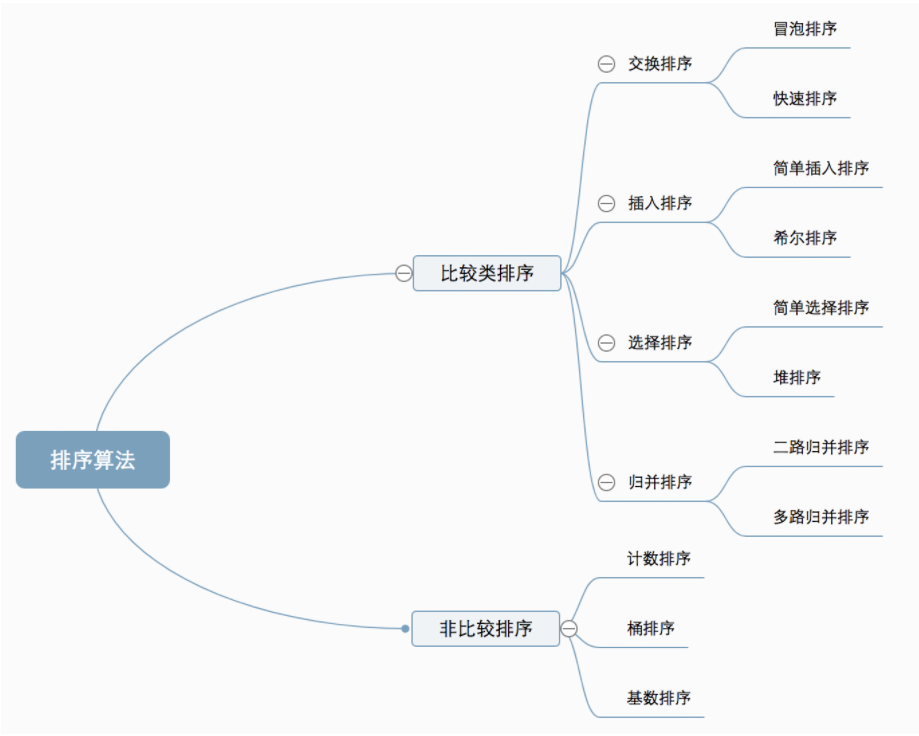
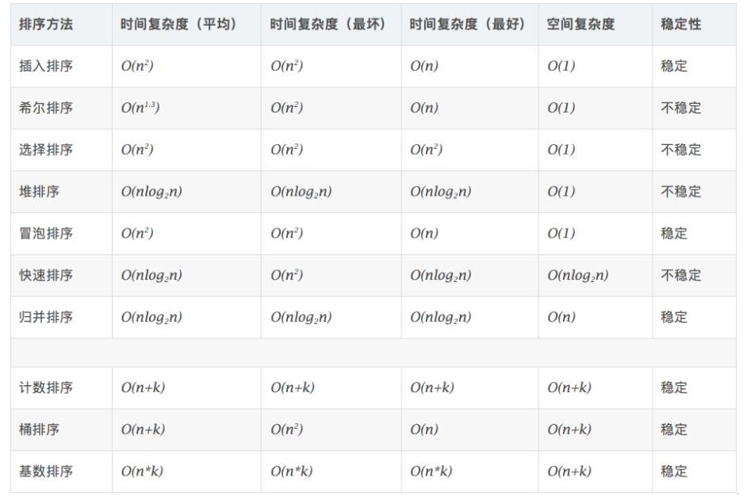
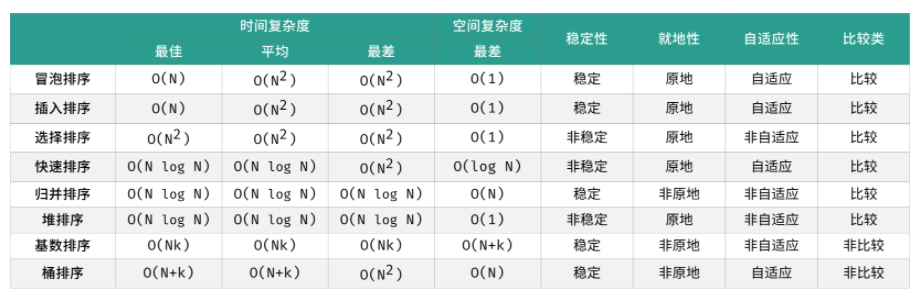

<center><span style="font-size:2rem;font-weight:bold;">十大排序算法简介</span></center>

<div style="page-break-after: always;"></div>

[toc]

<div style="page-break-after: always;"></div>

# 算法分类

十种常见排序算法可以分为两大类：

- **比较类排序**：通过比较来决定元素间的相对次序，由于其时间复杂度不能突破O(nlogn)，因此也称为非线性时间比较类排序。
- **非比较类排序**：不通过比较来决定元素间的相对次序，它可以突破基于比较排序的时间下界，以线性时间运行，因此也称为线性时间非比较类排序。 

    

## 算法复杂度

   

     

- **稳定**：如果a原本在b前面，而a=b，排序之后a仍然在b的前面。
- **不稳定**：如果a原本在b的前面，而a=b，排序之后 a 可能会出现在 b 的后面。
- **时间复杂度**：对排序数据的总的操作次数。反映当n变化时，操作次数呈现什么规律。
- **空间复杂度：**是指算法在计算机

# 算法介绍

## 冒泡算法

冒泡排序是一种简单的排序算法。它重复地走访过要排序的数列，一次比较两个元素，如果它们的顺序错误就把它们交换过来。走访数列的工作是重复地进行直到没有再需要交换，也就是说该数列已经排序完成。这个算法的名字由来是因为越小的元素会经由交换慢慢“浮”到数列的顶端。 

### 算法描述

- 比较相邻的元素。如果第一个比第二个大，就交换它们两个；
- 对每一对相邻元素作同样的工作，从开始第一对到结尾的最后一对，这样在最后的元素应该会是最大的数；
- 针对所有的元素重复以上的步骤，除了最后一个；
- 重复步骤1~3，直到排序完成。

   

### 稳定性

时间复杂度：`O(n^2)`,空间复杂度`O(1)`，稳定，自适应，原地排序

### 代码

```C++
int i = 0,j=0;
for(int i = 0;i<n-1;++i){
    flag = false;
    for(int j = 0;j<n-i-1;++j){
        if(nums[j]>nums[j+1]){
            swap(nums[j],nums[j+1]);
            flag = true;
        }
    }
    if(!flag) break;
}
```

## 快速排序

快速排序的基本思想：通过一趟排序将待排记录分隔成独立的两部分，其中一部分记录的关键字均比另一部分的关键字小，则可分别对这两部分记录继续进行排序，以达到整个序列有序。

### 算法描述

快速排序使用分治法来把一个串（list）分为两个子串（sub-lists）。具体算法描述如下：

- 从数列中挑出一个元素，称为 “基准”（pivot）；
- 重新排序数列，所有元素比基准值小的摆放在基准前面，所有元素比基准值大的摆在基准的后面（相同的数可以到任一边）。在这个分区退出之后，该基准就处于数列的中间位置。这个称为分区（partition）操作；
- 递归地（recursive）把小于基准值元素的子数列和大于基准值元素的子数列排序。

   

### 复杂度

* 时间复杂度：`O(NlogN)`
* 空间复杂度：`O(logN)`
* 不稳定
* 原地
* 自适应

### 代码

```C++
int partion(vector<int>& nums,int l ,int r){
    int i =l,j=r;
    while(i<j){
        while(i<j&&nums[j]>=nums[l]) j--;
        while(i<j&&nums[i]<=nums[l]) i++;
        swap(nums[i],nums[l]);
    }
    return i;
}
void quick_sort(vector<int>& nums,int l,int r){
    if(l>=r) return;
    int i = partion(nums,l,r);
    quick_sort(nums,l,i-1);
    quick_sort(nums,i+1,r);
}
```

## 简单插入排序

插入排序（Insertion-Sort）的算法描述是一种简单直观的排序算法。它的工作原理是通过构建有序序列，对于未排序数据，在已排序序列中从后向前扫描，找到相应位置并插入。

### 算法描述

一般来说，插入排序都采用in-place在数组上实现。具体算法描述如下：

- 从第一个元素开始，该元素可以认为已经被排序；
- 取出下一个元素，在已经排序的元素序列中从后向前扫描；
- 如果该元素（已排序）大于新元素，将该元素移到下一位置；
- 重复步骤3，直到找到已排序的元素小于或者等于新元素的位置；
- 将新元素插入到该位置后；
- 重复步骤2~5。

   

### 复杂度

* 时间复杂度：`O(N^2)`
* 空间复杂度：`O(1)`
* 稳定
* 原地
* 非自适应

### 代码

```C++
int n =nums.size();
for(int i =1;i<n;++i){
    int pre_index = i-1;
    current = nums[i];
    while(pre_index >= 0 && current < nums[pre_index]){
        nums[pre_index+1] = nums[pre_index];
        pre_index--;
    }
    nums[pre_index+1] = current;
}
return nums;
```

## 希尔排序

959年Shell发明，第一个突破O(n2)的排序算法，是简单插入排序的改进版。它与插入排序的不同之处在于，它会优先比较距离较远的元素。希尔排序又叫**缩小增量排序**。

### 算法描述

先将整个待排序的记录序列分割成为若干子序列分别进行直接插入排序，具体算法描述：

- 选择一个增量序列t1，t2，…，tk，其中ti>tj，tk=1；
- 按增量序列个数k，对序列进行k 趟排序；
- 每趟排序，根据对应的增量ti，将待排序列分割成若干长度为m 的子序列，分别对各子表进行直接插入排序。仅增量因子为1 时，整个序列作为一个表来处理，表长度即为整个序列的长度。

   

### 复杂度

* 时间复杂度：`O(NlogN)`
* 空间复杂度：`O(1)`
* 不稳定
* 自适应

### 代码

```C++
int n =nums.size();
for(int gap = n/2;gap>0;gap=gap/2){
    for(int i = gap;i<n;++i){
        int j = i;
        int current = nums[i];
        while(j-gap>=0&&curent<nums[j-gap]){
            nums[j] = nums[j-gap];
            j = j-gap;
        }
        nums[j] = current;
    }
}
return nums;
```

## 归并排序

归并排序是建立在归并操作上的一种有效的排序算法。该算法是采用分治法（Divide and Conquer）的一个非常典型的应用。将已有序的子序列合并，得到完全有序的序列；即先使每个子序列有序，再使子序列段间有序。若将两个有序表合并成一个有序表，称为2-路归并。 

### 算法描述

- 把长度为n的输入序列分成两个长度为n/2的子序列；
- 对这两个子序列分别采用归并排序；
- 将两个排序好的子序列合并成一个最终的排序序列。

   

### 复杂度

* 时间复杂度：`O(NlogN)`
* 空间复杂度：`O(N)`
* 稳定
* 非自适应
* 非原地

### 代码

```C++
vector<int> merge(vector<int> left, vector<int> right){
    int m = left.size();
    int n = right.size();
    
    int i = 0,j=0,k=0;
    vector<int> res(m+n,0);
    while(i<m&&j<n){
        if(left[i]<=right[j]){
            res[k] = left[i];
            i++,k++;
        }
        else{
            res[k] = right[j];
            j++,k++;
        }
    }
    if(i!=m) res.insert(res.end()+k,left.begin()+i,left.end());
    if(j!=n) res.insert(res.end()+k,right.begin()+j,right.end());
}

vector<int> merge_sort(vector<int>& nums){
    int n = nums.size();
    if(n<2) return nums;
    int m = n/2;
    vector<int> left,right;
    left.assign(nums.begin(),nums.begin()+m);
    right.assign(nums.begin()+m,right.end());
    vector<int> res;
    res = merge(merge_sort(left),merge_sort(right));
    return res;
}
```

## 选择排序

选择排序(Selection-sort)是一种简单直观的排序算法。它的工作原理：首先在未排序序列中找到最小（大）元素，存放到排序序列的起始位置，然后，再从剩余未排序元素中继续寻找最小（大）元素，然后放到已排序序列的末尾。以此类推，直到所有元素均排序完毕。 

### 算法描述

n个记录的直接选择排序可经过n-1趟直接选择排序得到有序结果。具体算法描述如下：

- 初始状态：无序区为R[1..n]，有序区为空；
- 第i趟排序(i=1,2,3…n-1)开始时，当前有序区和无序区分别为R[1..i-1]和R(i..n）。该趟排序从当前无序区中-选出关键字最小的记录 R[k]，将它与无序区的第1个记录R交换，使R[1..i]和R[i+1..n)分别变为记录个数增加1个的新有序区和记录个数减少1个的新无序区；
- n-1趟结束，数组有序化了。

### 复杂度

* 时间复杂度：`O(N^2)`
* 空间复杂度：`O(1)`
* 不稳定
* 非自适应
* 原地

    

### 代码

```C++
void select_sort(vector<int>& nums){
    int n = nums.size();
    int min_index;
    for(int i = 0;i<n-1;++i){
        min_index = i;
        for(int j = i+1;j<n;j++){
            if(nums[j]<nums[min_index]){
                min_index = j;
            }
        }
        swap(nums[i],nums[min_index]);
    }
}
```

## 堆排序

堆排序（Heapsort）是指利用堆这种数据结构所设计的一种排序算法。堆积是一个近似完全二叉树的结构，并同时满足堆积的性质：即子结点的键值或索引总是小于（或者大于）它的父节点。

### 算法描述

- 将初始待排序关键字序列(R1,R2….Rn)构建成大顶堆，此堆为初始的无序区；
- 将堆顶元素R[1]与最后一个元素R[n]交换，此时得到新的无序区(R1,R2,……Rn-1)和新的有序区(Rn),且满足R[1,2…n-1]<=R[n]；
- 由于交换后新的堆顶R[1]可能违反堆的性质，因此需要对当前无序区(R1,R2,……Rn-1)调整为新堆，然后再次将R[1]与无序区最后一个元素交换，得到新的无序区(R1,R2….Rn-2)和新的有序区(Rn-1,Rn)。不断重复此过程直到有序区的元素个数为n-1，则整个排序过程完成。

   

### 复杂度

* 时间复杂度：`O(NlogN)`
* 空间复杂度：`O(1)`
* 不稳定

### 代码

```C++
void heap_adjust(vector<int>&nums , int index,int heap_size){
    int left = index*2+1;
    while(left<heap_size){
        int largest = ((left+1)<heap_size && nums[left+1]>nums[left]) ? left+1 : left;
        if(nums[index]<nums[largest]){
            swap(nums[index],nums[largest]);
            index = largest;
            left = 2*largest+1;
        }
        else{
            break;
        }
    }
}

void heap_sort(vector<int>& nums,int size){
    for(int i = (size/2-1);i>=0;--i){
        heap_adjust(nums,i,size);
    }
    for(int i = size-1;i>0;-i){
        swap(nums[i],nums[0]);
        heap_adjust(nums,0,i);
    }
}
```

## 计数排序

计数排序不是基于比较的排序算法，其核心在于将输入的数据值转化为键存储在额外开辟的数组空间中。 作为一种线性时间复杂度的排序，计数排序要求输入的数据必须是有确定范围的整数。

### 算法描述

- 找出待排序的数组中最大和最小的元素；
- 统计数组中每个值为i的元素出现的次数，存入数组C的第i项；
- 对所有的计数累加（从C中的第一个元素开始，每一项和前一项相加）；
- 反向填充目标数组：将每个元素i放在新数组的第C(i)项，每放一个元素就将C(i)减去1。

   

### 复杂度

* 时间复杂度：`O(n+k)`
* 空间复杂度：`O(n+k)`
* 稳定

### 代码

```matlab
function countingSort(arr, maxValue) {
    var bucket = new Array(maxValue + 1),
        sortedIndex = 0;
        arrLen = arr.length,
        bucketLen = maxValue + 1;
 
    for (var i = 0; i < arrLen; i++) {
        if (!bucket[arr[i]]) {
            bucket[arr[i]] = 0;
        }
        bucket[arr[i]]++;
    }
 
    for (var j = 0; j < bucketLen; j++) {
        while(bucket[j] > 0) {
            arr[sortedIndex++] = j;
            bucket[j]--;
        }
    }
    return arr;
}
```

## 桶排序

桶排序是计数排序的升级版。它利用了函数的映射关系，高效与否的关键就在于这个映射函数的确定。桶排序 (Bucket sort)的工作的原理：假设输入数据服从均匀分布，将数据分到有限数量的桶里，每个桶再分别排序（有可能再使用别的排序算法或是以递归方式继续使用桶排序进行排）。

### 算法描述

- 设置一个定量的数组当作空桶；
- 遍历输入数据，并且把数据一个一个放到对应的桶里去；
- 对每个不是空的桶进行排序；
- 从不是空的桶里把排好序的数据拼接起来。 

   

### 复杂度

* 时间复杂度：`O(n+M)`
* 空间复杂度：`O(n+M)`
* 稳定

### 代码

```C++
public static void bucketSort(int[] arr){
    
    // 计算最大值与最小值
    int max = Integer.MIN_VALUE;
    int min = Integer.MAX_VALUE;
    for(int i = 0; i < arr.length; i++){
        max = Math.max(max, arr[i]);
        min = Math.min(min, arr[i]);
    }
    
    // 计算桶的数量
    int bucketNum = (max - min) / arr.length + 1;
    ArrayList<ArrayList<Integer>> bucketArr = new ArrayList<>(bucketNum);
    for(int i = 0; i < bucketNum; i++){
        bucketArr.add(new ArrayList<Integer>());
    }
    
    // 将每个元素放入桶
    for(int i = 0; i < arr.length; i++){
        int num = (arr[i] - min) / (arr.length);
        bucketArr.get(num).add(arr[i]);
    }
    
    // 对每个桶进行排序
    for(int i = 0; i < bucketArr.size(); i++){
        Collections.sort(bucketArr.get(i));
    }
    
    // 将桶中的元素赋值到原序列
	int index = 0;
	for(int i = 0; i < bucketArr.size(); i++){
		for(int j = 0; j < bucketArr.get(i).size(); j++){
			arr[index++] = bucketArr.get(i).get(j);
		}
	}  
}
```

## 基数排序

基数排序是按照低位先排序，然后收集；再按照高位排序，然后再收集；依次类推，直到最高位。有时候有些属性是有优先级顺序的，先按低优先级排序，再按高优先级排序。最后的次序就是高优先级高的在前，高优先级相同的低优先级高的在前。

### 算法描述

- 取得数组中的最大数，并取得位数；
- arr为原始数组，从最低位开始取每个位组成radix数组；
- 对radix进行计数排序（利用计数排序适用于小范围数的特点）；

   

### 复杂度

* 时间复杂度：`O(n+k)`
* 空间复杂度：`O(n)`
* 稳定

### 代码

```C++
var counter = [];
function radixSort(arr, maxDigit) {
    var mod = 10;
    var dev = 1;
    for (var i = 0; i < maxDigit; i++, dev *= 10, mod *= 10) {
        for(var j = 0; j < arr.length; j++) {
            var bucket = parseInt((arr[j] % mod) / dev);
            if(counter[bucket]==null) {
                counter[bucket] = [];
            }
            counter[bucket].push(arr[j]);
        }
        var pos = 0;
        for(var j = 0; j < counter.length; j++) {
            var value = null;
            if(counter[j]!=null) {
                while ((value = counter[j].shift()) != null) {
                      arr[pos++] = value;
                }
          }
        }
    }
    return arr;
}
```

