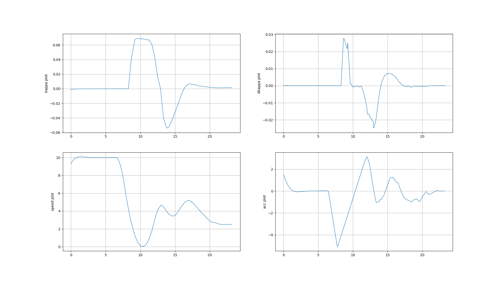
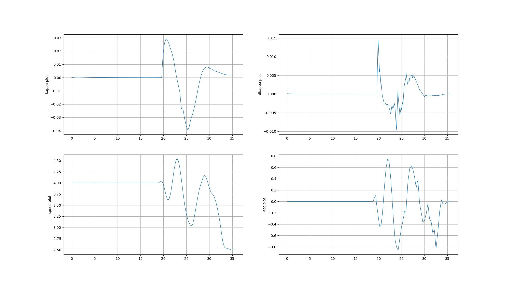
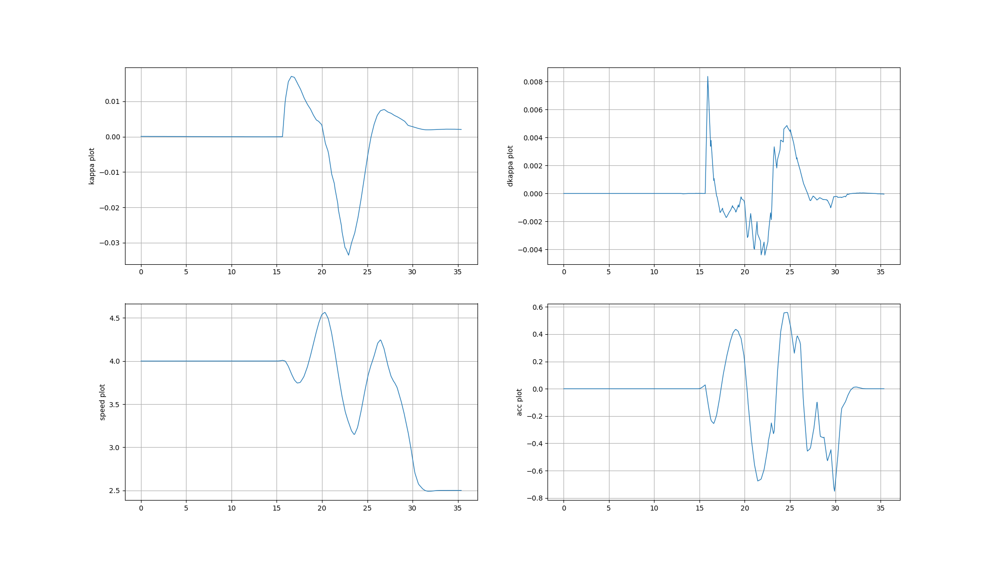
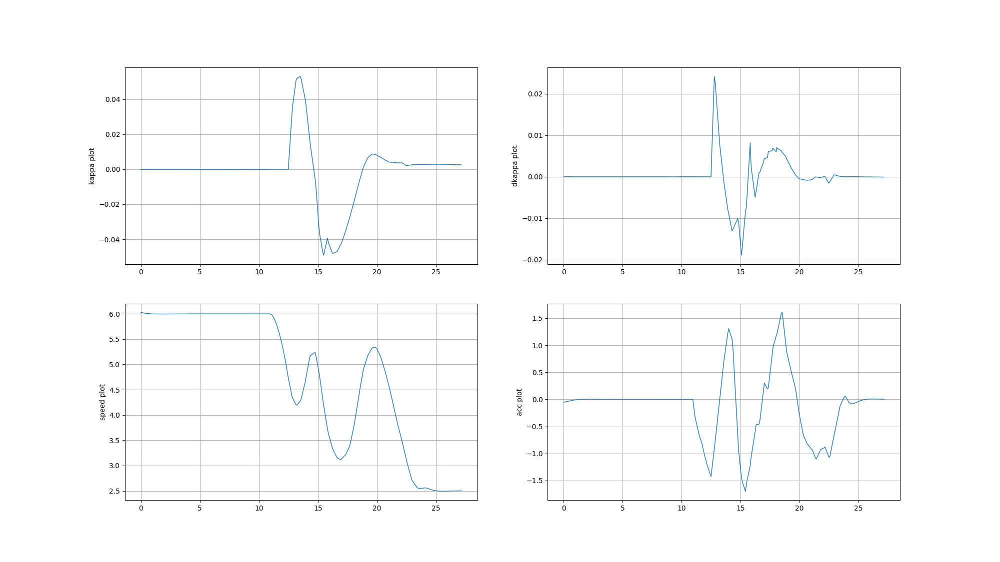
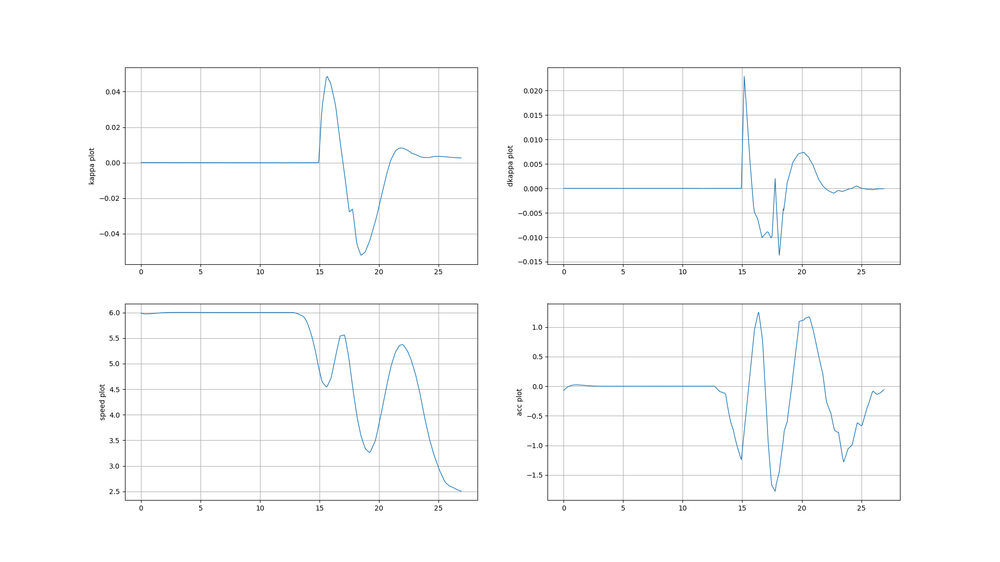
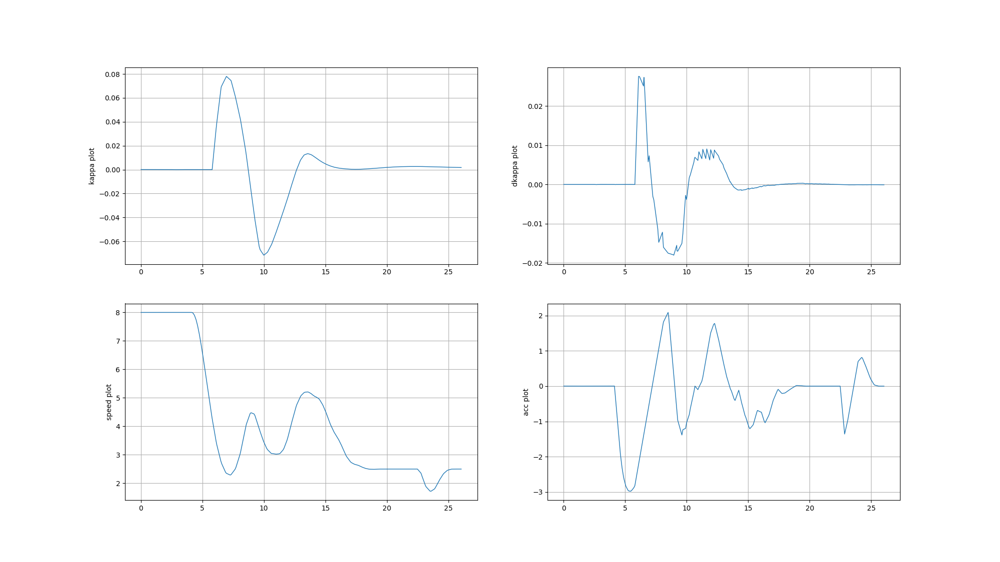
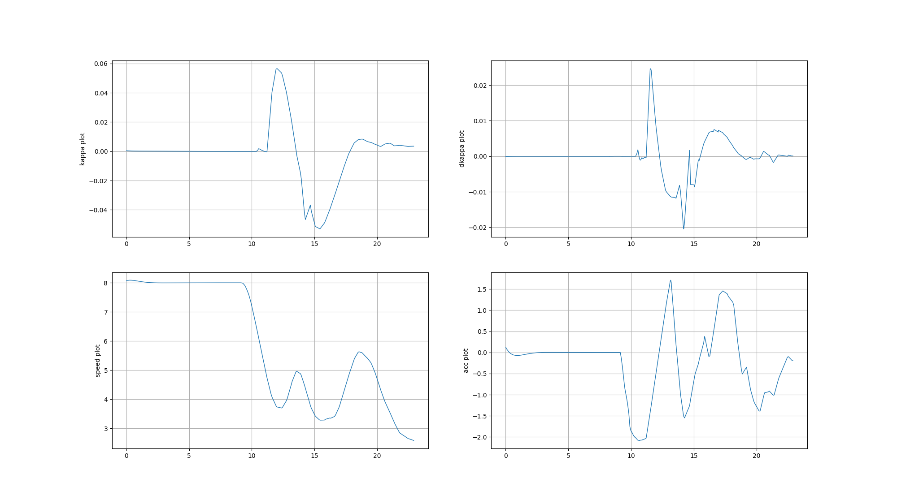
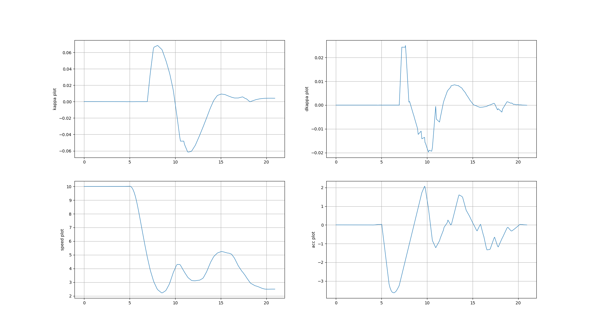

# 三个障碍物完全阻挡lane的场景
### 巡航速度为10m/s
 1. 当预测模块首次发出obs的信息时，此时根据channel通道的信息计算此时obs与adc之间的距离为**27m**

 2. 在规划模块中会将预测模块输出的障碍物计算sl_boundary等信息，将其添加到reference_line_info 中。但是在规划模块首次将obs添加到reference_info中时，obs与adc之间的距离为**20m**左右

 3. 首次检测到obs时，规划模块会检测该obs是否为阻挡引导线，若阻挡则将该obs的id记录，生成该obs的stop_wall(在obs之前**6-10m**范围构建)，此时后续速度规划模块会生成减速速度轨迹，通过与stop_wall的距离以及当前速度计算减速度。

 4. 之后在第二帧规划中，规划模块会判断此时adc速度是否小于**5m/s**（系统设置的最小的借道速度，为安全以及曲率平滑考虑），由于我们的速度为10m/s，因此目前不会触发借道。因此该帧会继续生成减速轨迹，直到速度小于5m/s。

 5. 在adc速度小于5m/s时，此时通过debug模式得出此时adc与obs之间的距离为**7m**，因为与obs距离过近导致优化时不符合设置的约束（大概率为dl约束不符），导致path优化失败。借道轨迹生成失败，无法借道，最终停止。

 # 一个障碍物阻挡lane的场景

 一个障碍物的场景在距离损失方面与三个障碍物相同，速度规划也与上相同，唯一不同的是当adc速度小于5m/s时，adc与obs距离仍为7m，但是此时lane中只有一个obs阻挡，阻挡范围较窄，可以满足path优化要求，因此可以生成借道轨迹。

 **但是由于规划模块在检测到obs时首先会以较大的减速度减速直至在obs的stop_wall前停止,因此在adc速度减至5m/s时，此时的加速度仍为-5m/s^2,此时满足借道条件，在速度规划中obs消失，速度开始提升，但是由于加速度连续变化，此时的加速度会逐渐从-5m/s^2提升至3m/s^2，因此adc的速度会逐渐减为0.**
 **速度较低时adc不会减速为 0的原因是，在计算减速度时规划模块会根据此时adc与obs的stop_wall的距离与此时巡航速度计算该有的减速度,公式如下：0^2 - V^2 =2ax**    
如下图所示：

# 当障碍物距离adc35m时出现

1. 首次发现障碍物阻挡lane时，adc与obs的距离为27m
2. 当满足借道条件时，adc与obs的距离为11m。

# 轨迹分析
## 借道距离分析
### obs30m触发时
1. 巡航速度4m/s 
   检测到障碍物时obs与adc之间的距离：22m
   当触发借道时obs与adc之间的距离：19m

2. 巡航速度6m/s
    检测到障碍物时obs与adc之间的距离：22m
    当触发借道时obs与adc之间的距离：13m

3. 巡航速度8m/s
    检测到障碍物时obs与adc之间的距离：21m
    触发借道时obs与 adc之间的距离：10m

4. 巡航速度10m/s
    检测到障碍物时obs与adc之间的距离：21m
    触发借道 时obs与adc之间测距离：7m

### obs35m触发时

1. 巡航速度4m/s 
   检测到障碍物时obs与adc之间的距离：27m
   当触发借道时obs与adc之间的距离：24m

2. 巡航速度6m/s
    检测到障碍物时obs与adc之间的距离：27m
    当触发借道时obs与adc之间的距离：14m

3. 巡航速度8m/s
    检测到障碍物时obs与adc之间的距离：26m
    触发借道时obs与 adc之间的距离：12m

4. 巡航速度10m/s
    检测到障碍物时obs与adc之间的距离：26m
    触发借道 时obs与adc之间测距离：10m

## 轨迹图分析
1. 巡航速度4m/s      

       
       

2. 巡航速度6m/s    
       
      

3. 巡航速度8m/s    
       
      

4. 巡航速度10m/s
      

# 综上所诉，在借道场景建议将距离设为35m,或者将借道的速度限制去掉。

# 结论
## 影响借道现象的主要有三点：   
1. 首先是规划模块检测到obs时，adc与obs之间的距离
2. 当开始触发借道模式时，adc与obs之间的距离
3. 借道过程中，规划轨迹的kappa与dkappa值

## 仿真现象分析 
1. 预测模块发出obs数据到规划模块检测到obs之间，两者的距离大该会损失7-8m（原因仍需探究）
2. 当adc速度超出借道最大起始速度时，adc首先会减速到该速度，在这个过程中adc与obs之间的距离会根据巡航速度有不同程度的缩减：   
4m/s: 缩减3m
6m/s：缩减9m
8m/s: 缩减11m
10m/s：缩减16m   
**当触发借道时若是adc与obs之间的距离不足8m时会造成path优化失败，不会触发借道 会停止**

3. 当触发借道时，若是adc与obs距离接近10m，则会导致借道轨迹的kappa值较大：   
    - 30m obs触发   
    4m/s: 22m; kappa: 0.03 - -0.04   
    6m/s: 13m; kappa: 0.05 - -0.05
    8m/s: 10m; kappa: 0.08 - -0.07

    - 35m obs触发
    4m/s: 24m; kappa: 0.015 - -0.03   
    6m/s: 14m; kappa: 0.045 - -0.045
    8m/s: 12m; kappa: 0.06 - -0.05
    10m/s: 10m; kappa:  0.065 - -0.06

4. 将借道起始速度提高时仿真现象，距离损失会缩小，kappa值也会减小。

## 总结
改善借道绕道太远现象有三种解决办法：
1. 最建议的是预测模块能够检测超过35m范围外的obs(即在仿真中当obs与adc距离大于35m(越大越好)时，预测模块开始发布obs信息)**建议使用该方法**
2. 修改借道最大起始速度：5m/s-8m/s（仿真时效果较好，实测时速度波动较大）
3. 修改obs纵向膨胀buf：3m - 1m(需要验证)
4. 增大速度的曲率约束（正在修改）

