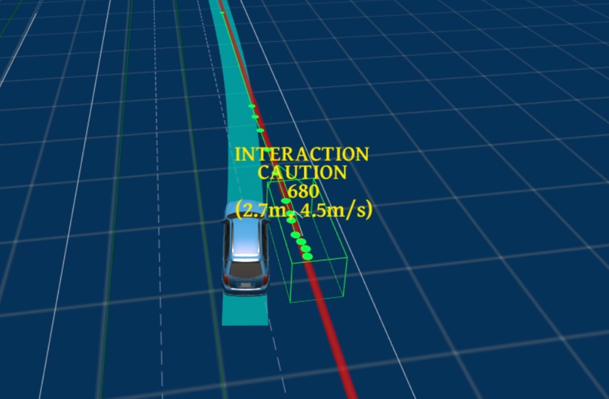
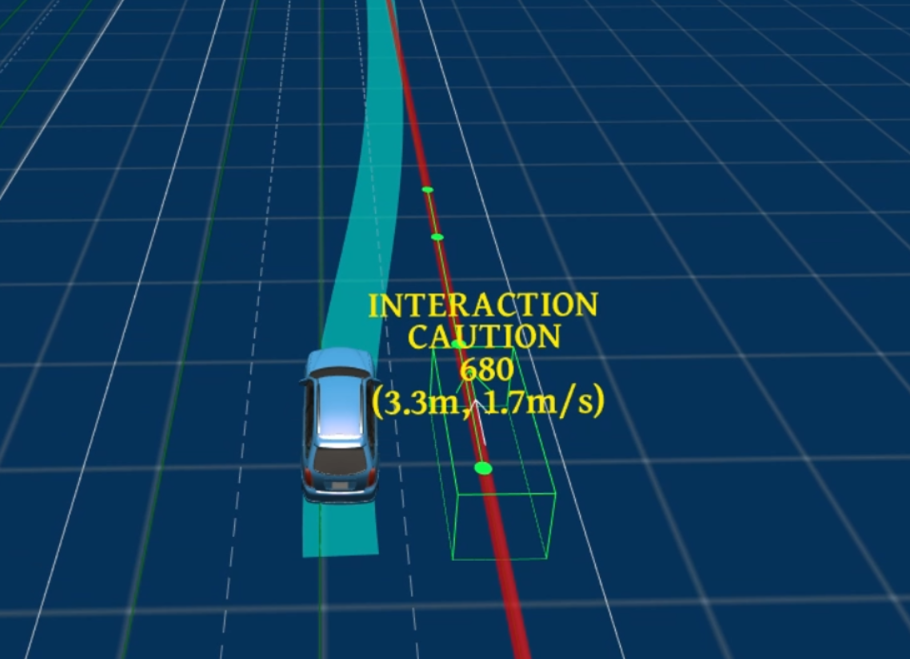
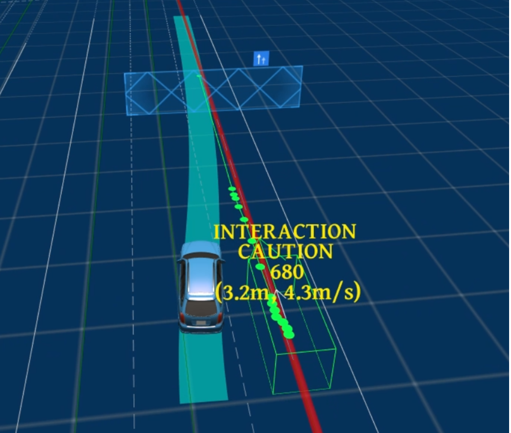
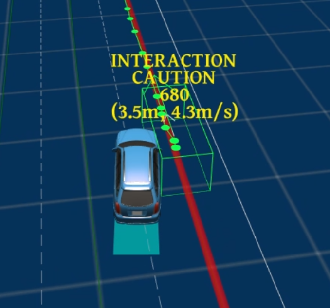
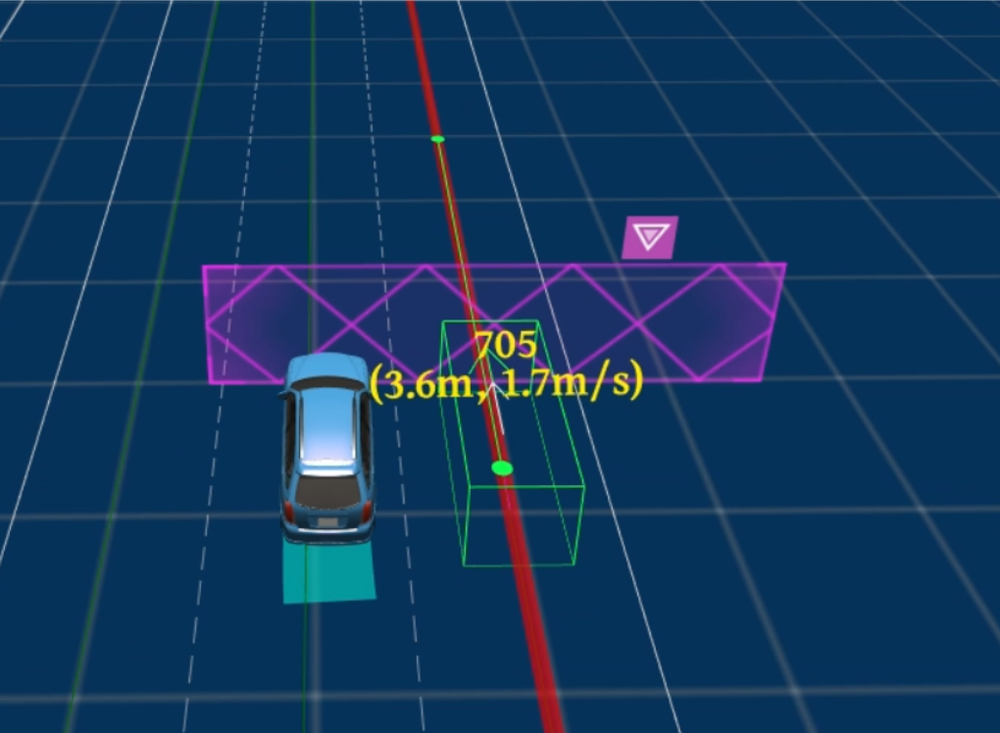
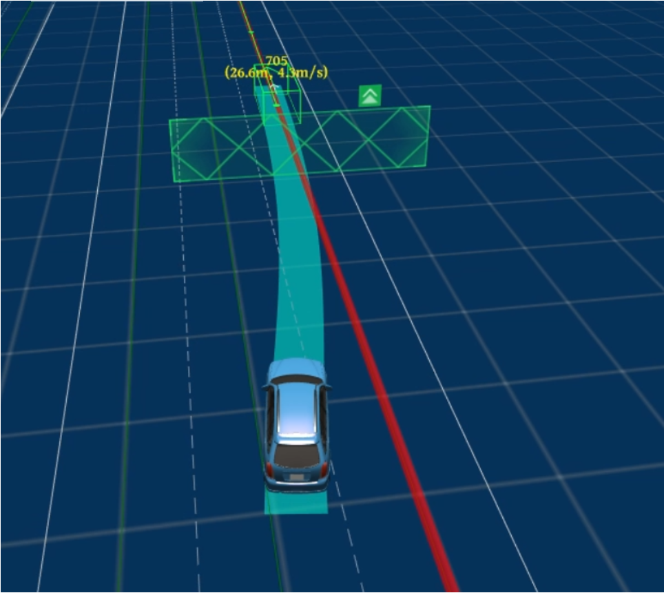

<center><span style="font-size:2rem;font-weight:bold;">744场景变道不完全issue解析</span></center>

<div style="page-break-after: always;"></div>

[toc]

<div style="page-break-after: always;"></div>

# 问题描述

# 问题复现
测试744stop_and_go场景，当测试车辆变道完成时，npc车辆会启动，此时测试车辆具有回到原车道的轨迹，因此有可能会与继续启动的npc车辆发生碰撞，如下图所示：

   

# 出现该问题的原因
在分析该问题是发现，测试车辆变道完成与npc车辆启动并不是同时发生，而是有一个延迟(与路测场景相似)，表现出来是当测试车辆在纵向位置上已经到达npc车辆的前方位置时，此时npc车辆开始启动，如下图所示：



此时由于npc车辆在测试车辆后方，因此会触发一个超车决策，我们会加速行驶至原车道，如下图所示：   
    
而npc车辆是加速行驶的，因此在很短的时间内，测试车辆会产生让行决策，此时会逐渐减速，但距离太近因此会产生碰撞风险，如下图所示：   


# 解决方法1
经过分析发现，可能发生碰撞的原因是由于npc车辆在测试车辆后方时加速，在npc加速初期，测试车辆形成超车决策，加速后期测试车辆行成让行决策，导致最后距离不够，因此碰撞。
## 目前的解决方法
对借道场景进性特别的处理，当测试车辆处于另一条车道上时，若此时后方来车，且会与测试车辆轨迹发生交集，此时强制测试车辆不产生超车决策，强制其对后方车辆进行让行决策。
* 修改位置：speed_decider中，当障碍物处于测试车辆后方时，当测试车辆在另一条车道时，强制产生让行决策。
```C++
          //when borrow lane,yield decision
          if(adc_sl_boundary_.start_l() > FLAGS_borrow_yield_dis || adc_sl_boundary_.end_l() < -FLAGS_borrow_yield_dis){
            ObjectDecisionType yield_decision;
            if (CreateYieldDecision(*mutable_obstacle, &yield_decision,&obs_flags)) {
              mutable_obstacle->AddLongitudinalDecision("dp_st_graph",
                                                      yield_decision);
                                                      }
          }
          else {// OVERTAKE decision
          ObjectDecisionType overtake_decision;
          if (CreateOvertakeDecision(*mutable_obstacle, &overtake_decision)) {
            mutable_obstacle->AddLongitudinalDecision("dp_st_graph/overtake",
                                                      overtake_decision);
          }
          }
```
## 该解决办法的应有表现
在测试车辆变道完成时，此时npc车辆启动，此时测试车辆会在旁边车道停车等待，直到npc车辆行驶在我们前方6m外，此时测试车辆逐渐启动，继续回到原车道对npc车辆执行跟随操作。如下图所示：
 

   

# 其他参数的修改

## 修改1 障碍物的横向buff：`obstacle_lat_buffer=1.0`
* 从原来的0.4修改到了1.0
* 修改原因：
由于744场景检验换道是否完成的标志是测试车辆车轮全部进入旁边车道，当buff值为`0.4`时，由于buf太小，测试车辆不会完全进入旁边车道，因此不会触发仿真场景中的npc，npc车辆静止不动。因此将其加大，使在仿真场景中测试车辆变道时能够完全换到另一条车道上。
* 带来的隐患：
在实车测试时724场景时，当设置横向buf为`1.0`的时候会加大换道范围，在实车测试中会导致测试车辆冲出旁边车道。
**因此建议在仿真测试时将该值改为`1.0`,在实车测试时先将其置为0.4，若是变道不完全则逐渐加大**

## 修改2 加大速度的曲率约束 ：` max_centric_acceleration_limit: 0.3`
* 从原来的2.0修改到0.3
* 修改原因：
之前在实测724场景时，当设置buf为`0.4`时，测试车辆换道时会贴近外车道线，有出车道线的风险，经分析，是由于在变道时由于曲率对速度的约束太小，导致在换道时测试车辆会加速，因此导致换道范围较大，因此需要加强曲率对速度的约束。
* 改为0.3的原因：
将换道类比转弯场景，转弯场景的限速是2.5m/s，经过之前的测试在换道时最大的kappa能达到0.08，因此将最大kappa值的速度也限制在2.5m/s,通过公式计算得到0.3
```
    const double speed_limit_from_centripetal_acc =
        std::sqrt(speed_bounds_config_.max_centric_acceleration_limit() /
                  std::fmax(std::fabs(discretized_path.at(i).kappa()),
                            speed_bounds_config_.minimal_kappa()));
```
# 测试建议：
在仿真测试时先将横向buf设置为1.0；   
在实测时，先将横向buf设置为0.4,若是换道范围不够的话，逐渐加大。
## 修改代码分支：pnc/sit/HIL_scenario_test/pangminghui
commit_id:185098efde21b076d61ac9c525eb6cc2c3127e15      

# 解决方法2
修改744场景策略
之前744_stop_and_go的通过策略是npc车辆停止时，测试车辆绕道行驶，现在修改为测试车辆继续跟随npc车辆。

## 修改代码分支：pnc/sit/HIL_scenario_test/pangminghui
commit_id:1ffb82a49bda6d9d30b55d4a5b5b36caeafe3274      
@fuwencheng @wangchen @lihaoxiang