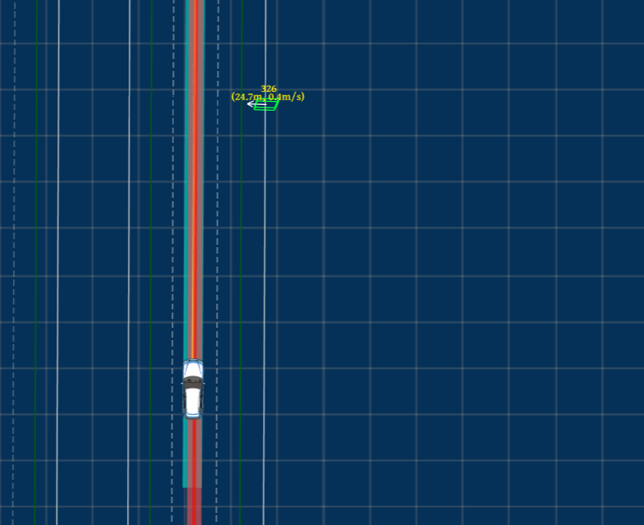
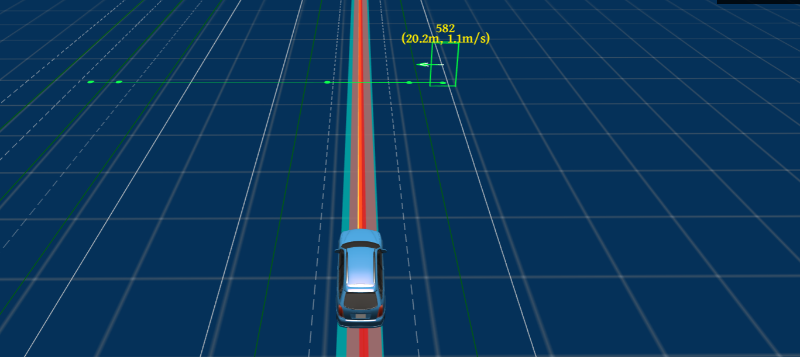
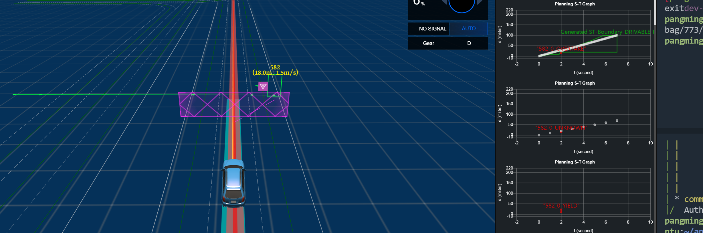
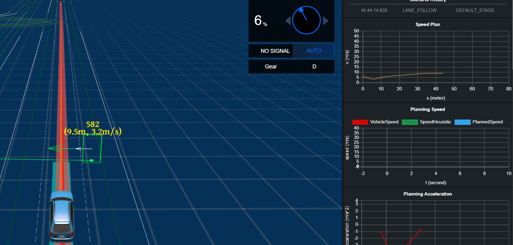

# 774 自行车横穿马路场景分析
     
## 场景实现分析   
首先测试车以10m/s的巡航速度行驶，当测试车距离预计碰撞点还有4.0s时，自行车开始横穿马路，并在碰撞点停止，此时车应该逐渐减速停下，等待自行车离去，测试车加速行驶至目标点。
## 774仿真场景现象   
     初始时测试车与自行车之间距离为60m,开启自动驾驶模式，测试车逐渐加速到巡航速度(10m/s)；当两者之间的距离为24m时自行车开始有初速度（0.5m/s），但是此时自行车轨迹并没有生成;当自行车速度达到1.1m/s时，自行车轨迹出现，此时两者距离仅为20m; 当测试车路径与自行车轨迹有交互时两者之间的距离只有18m,此时测试车的速度为10m/s;测试车开始减速，但是由于距离太近，会导致规划模块DP规划失败，使用fallcack轨迹开始减速，减速距离较大，出现与自行车碰撞的现象。  

## 现象产生原因    
### 仿真中碰撞点与测试车之间的距离太近    
    仿真场景中，碰撞点与测试车的初始距离为60m,而测试车需要一定的加速距离加速到巡航速度10m/s（经测试加速距离大概为40m）,由于仿真中触发自行车开始行走的条件是测试车距离碰撞点还有4s的距离，因此导致自行车开始有初速度时，两者之间的距离只有24m。     
    经仿真测试：当测试车加速到10m/s时，自行车与测试车之间的距离为26m,当自行车开始有速度（0.5m/s）时，两者之间的距离为24m,但是此时自行车并没有轨迹产生，因此不会与测试车的path产生交互，因此规划模块不会对其处理，当自行车速度为1.1m/s时开始有轨迹生成，此时两者之间的距离为18m,规划模块开始生成yield决策，此时测试车速度仍为10m/s，此时由于距离太近导致速度规划中的DP规划失败，使用fallback生成减速轨迹，速度减速至0时，仍会与自行车产生碰撞。

### 仿真中自行车速度产生延迟较大
    仿真场景中按照实现原理，应该在测试车与自行车之间的距离为40m时，自行车开始有初速度，但是实际上在24m时才会有初速度，速度产生延迟较严重，导致两者轨迹发生交互时，距离较近，容易碰撞，产生类似于“鬼探头”效果。    

### 预测模块自行车的轨迹出现较慢
    预测模块输出自行车障碍物时，当自行车的速度达到1.1m/s时，预测模块才会输出自行车的预测轨迹，此时两者距离非常近。

### 测试车与障碍物距离较近时，DP规划与速度优化会失败，因此会使用fallback速度轨迹减速
    当测试车与障碍物之间距离较近时，DP规划由于st_driveable区间处于障碍物的st_boundary内，因此会导致DP搜索失败。此时规划模块调用speed-fallback生成减速轨迹，但是减速距离较长，会导致与自行车碰撞。
### 在预测模块输出的自行车障碍物的类型是vehicle，与实际类型不符         
## 仿真结果展示 
### 10m/s的巡航速度
1. 自行车有初速度时与测试车之间的距离：

2. 自行车产生轨迹时与自行车的距离

3. 两者轨迹交互时与自行车的距离

4. 测试车速度DP失败，生成fallback轨迹
     

### 4m/s的巡航速度
设置4m/s的巡航速度时，以上问题的影响会显示的更为清晰。    
bag位置：/data/workspace/home/pangminghui/apollo_dt/apollo/data/bag/774/24.00000     
播放命令：cyber_recorder play -f data/bag/774/24.00000 -s 10 -e "2022-08-31 21:41:55" -l

## 可采取的解决措施    
### 修改仿真触发条件    
1. 修改测试车与碰撞点之间的初始距离，使测试车先加速至巡航速度，测试将初始距离设置为90m时，测试车会在自行车前停下（10m/测试可以，4/6/8均不行）；
2. 修改自行车的初速度触发方式，在仿真中当检测到测试车与预计碰撞点还有4s时，自行车直接给一个较大初速度，使当两者的轨迹开始有交互时，两者之间的距离足够减速。（经测试可以停止）
### 修改规划中各个模块的最大减速度    
1. 修改st_bounds_decider中的最大减速度为7(初始为5)    
(修改位置：modules/planning/tasks/deciders/st_bounds_decider/st_bounds_decider.cc：119行)
2. 修改dp的最大减速度(modules/planning/conf/planning_config.pb.txt中修改)    
将dp规划中的最大减速度从-3改到-7.0，DP规划失败较少，但是速度优化仍会失败，还会使用fallback轨迹。
3. 修改fallback的最大减速度(-4.0,改为-7.0，修改位置：planning.conf中修改)    
**注：这种修改方法在4m/s,6m/s时停车时与自行车较近，且在8m/s与10m/s的巡航速度时需要将初始距离修改为90m**

## 综合以上分析，建议修改仿真触发条件

## 最终采取的解决措施   
修改仿真触发条件 ：    
1. 将初始距离设置为90m
2. 当开始触发时直接给到自行车一个初速度，使两者轨迹交互时距离较远  

