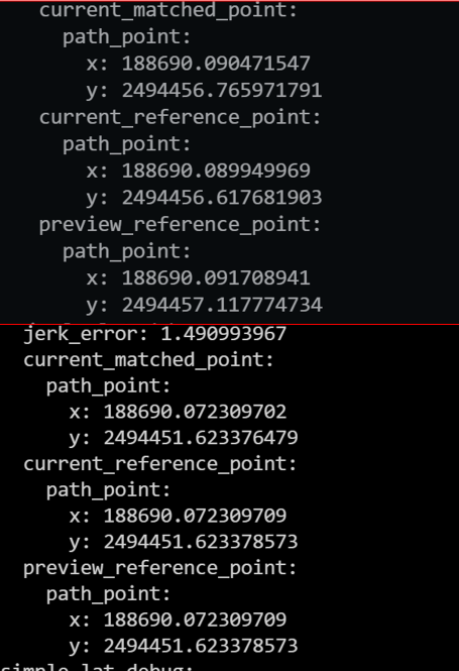
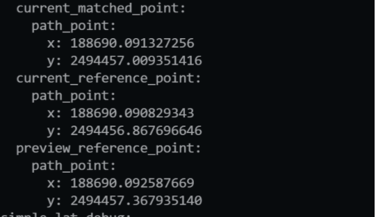
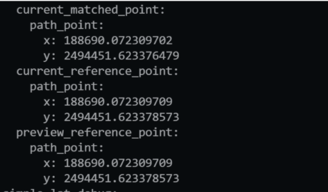
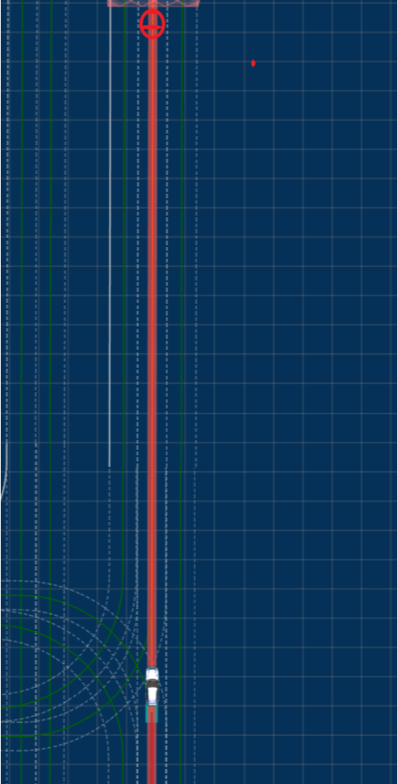
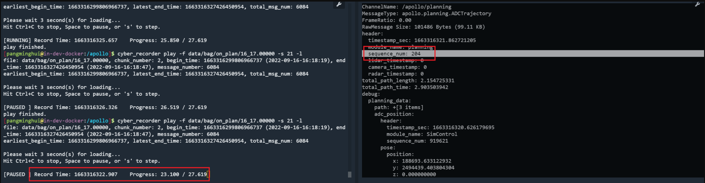
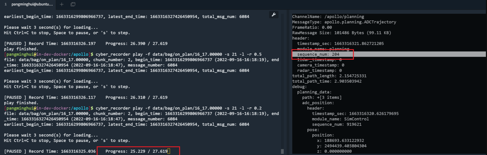
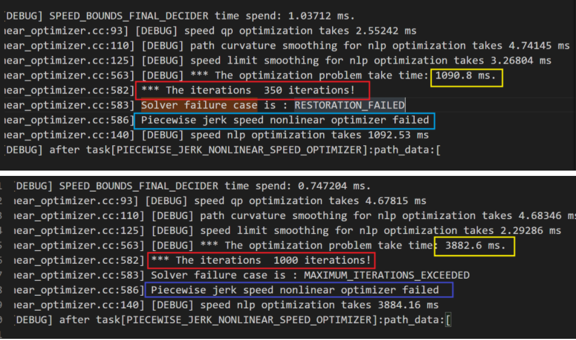
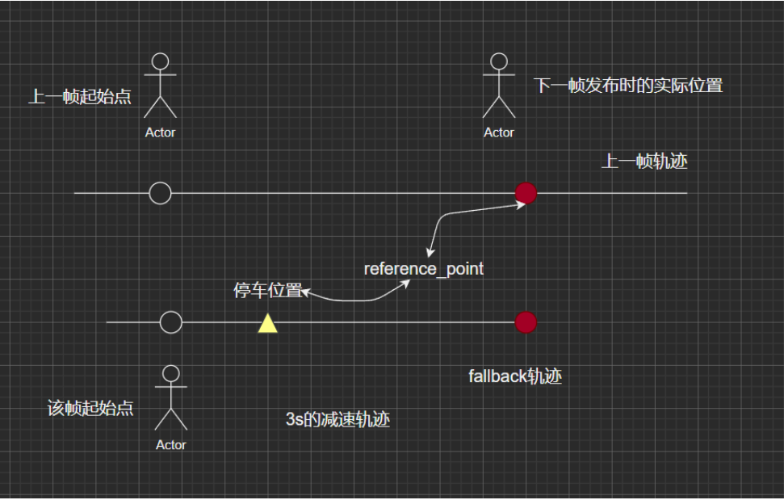

轨迹发送延迟太大

[toc]

* [x] **问题描述**  
  时间：2022-09-15

  0915 测试定点减速时，过深湾四路路口时规划未下发新轨迹，导致车辆前行过程误差波动，随后的某一时刻下发新轨迹，车辆匹配点随之突然后移，纵向误差突增，控制输出加速度增大，接着发生重规划，加速度响应减小。

  *代码分支：pnc/feat/pid_LQR_tuing/syb   
  节点：87203f5a78e9c5efc7378c825ace8f491e598c5c 
  环境：实车环境*

  使用地图为：Shenwan Stop，此地图中无路口 
  录制数据包位置（109服务器）：/media/share1/pnc-share/20220915/11_37_brake_10.00000
  
  此时刻前后位置对比图如下： 

     
  
  具体的，跳变前后帧的匹配点、参考点：
  | 前                                                           | 后                                                           |
  | ------------------------------------------------------------ | ------------------------------------------------------------ |
  |  |  |

# 问题复现    
该问题的实质是规划模块延迟较大，在sim_control仿真下也可以复现。   
场景：shanwanall    
代码分支：pnc/sit/hil_scenario_test/pangminghui     
问题复现步骤：
该问题具有偶然现象需要多试几次。
在仿真场景中将目标点设置在junction后面，测试车辆开启启动，当其到达junction区域时由于该区域存在限速2.5m/s,在该阶段会减速。
此时测试车辆就有可能发生规划延迟较大的现象。

如下图所示：

# 问题定位    
## 核心原因
该问题出现的原因在规划模块中的piecewise_jerk_speed_nonlinear_optimizer在对速度曲线进行NLP优化时，在失败的情况下耗时较长，达到了1000ms,甚至可以达到3880ms,将近4s的时间，因此在发布的planning话题中表现出规划延迟的现象。    
问题定位由log文件得出：   
右下图可以看到，在进行NLP优化速度曲线时，NLP优化失败，且由于NLP每一次迭代的耗时较长，而失败时的迭代次数第一在350此，第二次达到迭代次数最大值1000此。
在迭代350次时，优化耗时1000ms即1s,在迭代次数达到1000次时，优化耗时达到3880ms，将近4s的时间。该模块耗时较长导致规划延迟较大，是控制不连续的一个原因。 
   

 ## 控制误差跳变原因
当优化失败时，规划模块采用fallback轨迹进行速度规划，即生成以光滑的减速轨迹，但是由于该帧规划延迟较大，导致在该帧规划结果(减速轨迹)发布出去的时候，测试车辆已经行驶了较长时间，且减速轨迹在该时间内规划距离较短，因此在控制模块选择引导点时会出现引导线向后的现象。    

# 解决方案   
## 优化失败原因还不清楚，因此解决优化问题继续研究    
## 解决规划延迟问题   
经过调查发现，正常情况下NLP优化的迭代次数在30次以内，因此将最大的迭代次数缩小，设为50，使其最大耗时不超过100ms。   
当规划失败时使用fallback轨迹。保持规划轨迹光滑。