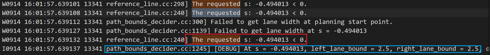
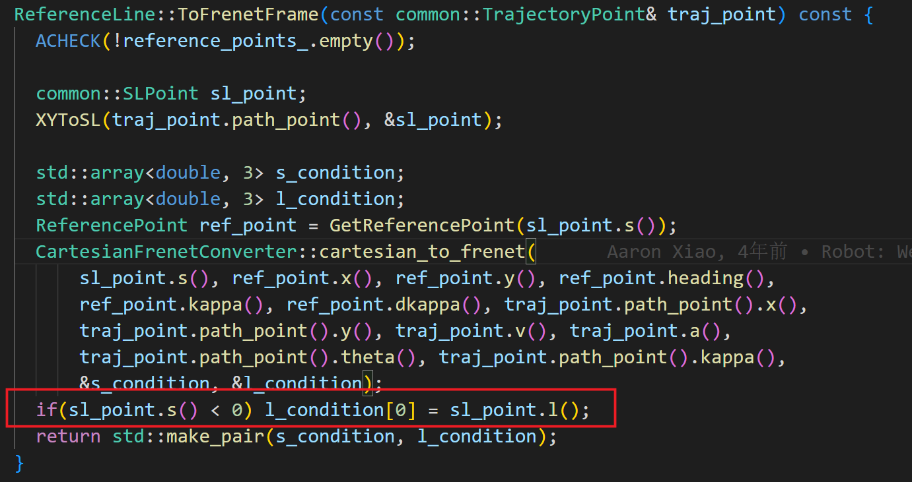

avpnc_issue12原因分析及解决方案

[toc]

# 问题描述

2022年9月14日出车测试左转时，在测试车辆的起步阶段发现规划模块生成的path存在一个突变的情况。如下图所示：
  

     

# 问题定位

## 问题产生诱因

该问题表现出来的结果是：在执行阶段规划模块规划的path发生突变，经过对record包的分析，发现规划的path的起始点与该帧规划的起始点`planning_start_point`结果不一致。如下图所示：
path的起始点：
   

`planning_start_point`

## 具体分析

**由以上两个数据可以看出，规划出的path在纵向超前0.5m,在横向上偏移0.4m左右，该问题导致规划轨迹出现突变**

### 纵向分析

进一步分析该问题，通过日志进行分析，出现规划path超前的原因是，在计算`path_boudary`时，起始点在引导线上的投影值`S`是负值，因此优化出来的第一个点的s值也是负值，而在赋值`path`时，如果`s`值为负数，则会将引导线的起始点作为投影点，计算其笛卡尔坐标系，而`path_boudary`的分辨率为`0.5m`，因此表现出纵向超前`0.5m`左右。

* 日志信息如下：

* path赋值函数如下：

  首先根据`path_boundary`信息优化`path`得出最有`L`,`DL`;
  之后计算离散后的`Frent`坐标系下的`path`点：`Frenetpath`;
  将计算好的`Frenetpath`转换成离散的笛卡尔坐标下的点。

计算`Frenet_path`代码如下：

将`Frenet_path`转换为笛卡尔坐标代码如下：

 获取引导线代码如下：

### 横向分析

在对path进行优化时，会将`planning_start_point`转换为`frent`坐标，并将其作为初始状态：`init_state`，初始状态作为优化的约束项，使path连续。而在该问题中，由于`planning_start_point`对应的投影值s小于0，导致其计算的`init_state`的`L`值较大。计算方法如下：

以上第三张图中的第二个红框可以表明，当投影值S为负值时，ref_point为对应引导线的初始点，而`L`值的计算为planning_start_point与ref_point之间的距离，因此导致初始点的L值较大，使得规划的path有了一个突变的现象。

## 核心原因

根据以上分析可知，该现象产生的主要原因有两个：

### 核心原因1

以上问题表现出来的第一个问题是，当起始点在引导线上的投影值S为负数时，此时Apollo中将起始点由笛卡尔坐标系转换为`frent`坐标的方式不再合适。

如下所示：

正常转换的关系图：

     

当投影值`S`小于0时的转换关系：

针对该问题，由于起始点的投影值`S=-0.49`，因此以原来的方式计算初始状态的L值时，由于`dl`差很小，因此计算的`L`值为`0.5`左右，与实际的l值相差太远,导致规划轨迹突变。

### 核心原因2

该原因是导致出现该现象的主要原因，**即理论上起始点在引导线上的投影值不会为负值**，因为在生成引导线时，会根据此时车的位置对引导线进行扩展，扩展距离为**测试车辆后方50m--测试车辆前方180m的距离。**

在分析中发现，在`shenwanall`地图中，规划模块生成的引导线在到达一个新的lane时会收缩到该lane的起始点，与系统逻辑不符。如下图所示：

   

在向后扩展引导线时，会根据此时测试车辆所在lane的id获取其presceeor_lane的id,即其父节点的lane,之后根据扩展长度将该lane放入routesegment中，最后优化生成光滑引导线，代码如下所示：

然而在`shanwanall`地图中，每个`lane`均没有设置`predecessor_lane`，因此导致引导线扩展时出现会不正常收缩，导致起始点在引导线的投影值`S`为负值。

# 解决方法

## 解决方法1

在地图中将每个lane对应的的`predecessor_lane`放入地图`xml`文件中，使引导线扩展正常。

目前状态：地图修改后，引导线扩展正常。

## 解决方法2

修改起始点从笛卡尔坐标系转换值`Frent`坐标系的方法。

  

该解决方法对规划模块的影响需要评估，因此优先采取解决办法1。