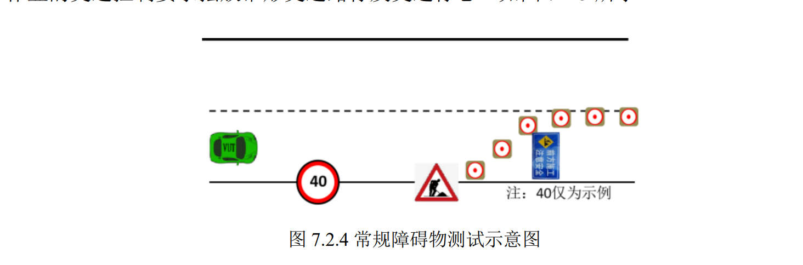
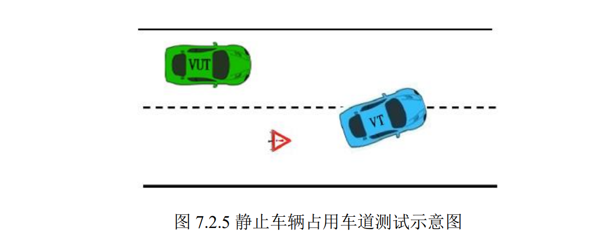
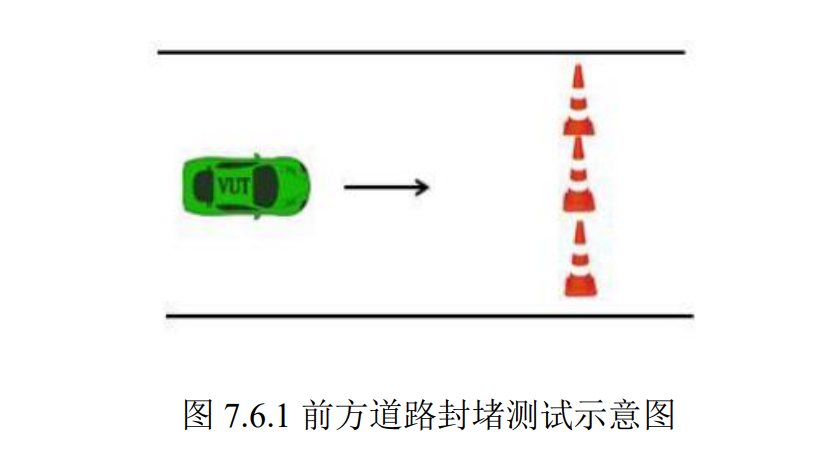

# emergency_light 触发条件记录

## 触发场景要求：
1. 724常规障碍物场景
2. 725静止车辆阻挡场景
3. 761道路封堵场景

## 场景判断标志：
1. 724常规障碍物场景   
     
**724常规障碍物场景设定是前方存在施工路牌阻挡，且旁边存在可变道的车道，通过要求为：**    
- 若是测试车辆具有变道能力，则可变道通过该场景；   
- 若是不具有变道能力，在在施工路牌前停下，且在15s内发出人工接管信号    
2. 725静止车辆占用车道场景   
     
**725静止车辆占用车道场景设定：测试车辆前方右侧车道存在静止车辆，并占据本车道1-1.2m，通过要求：**  
- 不与目标车辆碰撞；   
- 在停下15s内发出人工接管信号。
3. 761前方道路封堵场景    
     
**761前方道路封堵场景设定：测试车辆行驶在单一车道，且该车道被封堵，通过要求：**   
- 不与障碍物发生碰撞；   
- 在停下15s内发出人工接管信号。   

## 目前设置的触发条件    
1. 首先设置模式约束：当测试车辆的模式为自动驾驶模式时才可以触发emergency_light;
2. 当测试车辆速度小于0.5(停止时)且与stop_wall之间的距离小于0.5m时，满足触发条件，此时对触发场景进行判断；
3. 若是停车的原因是障碍物在前方堵路：
- 则判断该障碍物的类型是否为行人或者是自行车，若是行人或者自行车则说明是暂时停车，不需要接管，等待行人或者自行车离去即可。     
- 若是有障碍物阻挡，且此时属于非借道路径，则说明前方障碍物可能为725障碍车辆或者761道路封堵情况或者是堵车的情况。   
- 此时通过path_lane_borrow判断不可以借道的原因，若是由于障碍车辆前方也有其他障碍物阻挡导致不能变道，则说明此时是堵车的情况，因此不需要触发emergency_light。
- 若不是堵车情况则说明需要触发，但是还有一个场景是772紧急停车的场景，该场景不可以触发emergency_light，因此需要设置一个触发时延，设定10s，防止在该场景中误触发。
4. 此时判定符合emergency_light触发条件，记录开始触发的时间；
5. 当时延符合要求时，将emergency_light赋为true，红色接管灯开始闪烁；
6. 当驾驶员接管时，将其复位，红灯停止闪烁。 

## 关联的场景 
**724常规障碍物场景**         
应有表现：绕道或者在停车10s后发出接管信号，目前策略为绕道。      
**725静止车辆占用车道场景**           
应有表现：在停车10s后发出接管信号。     
**744目标车辆走停场景**        
应有变现：先跟随目标车辆，当目标车辆停下来是，测试车辆也跟着停车，此时接管信号并不触发，若是10s内目标车辆启动，测试车辆继续跟随，不会触发接管信号；若是10后目标车辆仍静止，此时触发接管信号。        
**761前方道路封堵场景**          
应有表现：在停车10s后发出接管信号。     
**772前方车辆紧急制动场景**        
应有变现：先跟随目标车辆，当目标车辆停下来是，测试车辆也跟着停车，此时接管信号并不触发，若是10s内目标车辆启动，测试车辆继续跟随，不会触发接管信号；若是10后目标车辆仍静止，此时触发接管信号。     
**773行人横穿马路场景**     
应有表现：当行人开始横穿马路时，测试车辆停车，一直等待，直到行人离去，不会触发接管信号。     
**774 自行车横穿马路**        
应有表现：当自行车开始横穿马路时，测试车辆停车，一直等待，直到行人离去，不会触发接管信号。     

## 目前状态   
已开发完成，待实车测试。

