<center><span style="font-size:2rem;font-weight:bold;">path优化：piecewise_jerk_path_optimizer</span></center>

<div style="page-break-after: always;"></div>

[toc]

<div style="page-break-after: always;"></div>

# 优化准备知识

path优化的总体介绍

path 优化的是每个frenet坐标系下的点，优化变量是对应path_boundary中每个s点的l值。

优化变量：

每个s点的
$$
l,l',l''
$$

## 使用的优化器：[OSQP](https://osqp.org)

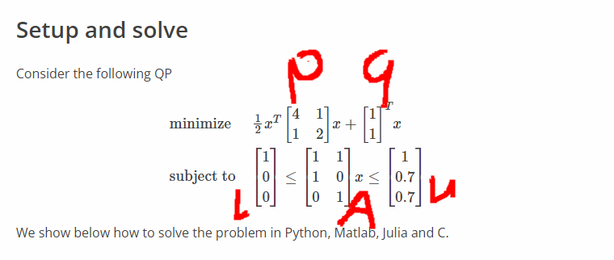   

C++例子：求解过程

```C++
#include "osqp.h"

int main(int argc, char **argv) {
    // Load problem data
    c_float P_x[3] = {4.0, 1.0, 2.0, };//P矩阵的每个值
    c_int P_nnz = 3;//P矩阵中值的个数
    c_int P_i[3] = {0, 0, 1, };//P矩阵中每个值对应的函数
    c_int P_p[3] = {0, 1, 3, };//P矩阵中每列之前有效值的个数，第一个值一定是0
    c_float q[2] = {1.0, 1.0, };//q矩阵
    c_float A_x[4] = {1.0, 1.0, 1.0, 1.0, };///同P矩阵
    c_int A_nnz = 4;
    c_int A_i[4] = {0, 1, 0, 2, };
    c_int A_p[3] = {0, 2, 4, };
    c_float l[3] = {1.0, 0.0, 0.0, };
    c_float u[3] = {1.0, 0.7, 0.7, };
    c_int n = 2;
    c_int m = 3;

    // Exitflag
    c_int exitflag = 0;

    // Workspace structures
    OSQPWorkspace *work;
    OSQPSettings  *settings = (OSQPSettings *)c_malloc(sizeof(OSQPSettings));
    OSQPData      *data     = (OSQPData *)c_malloc(sizeof(OSQPData));

    // Populate data
    if (data) {
        data->n = n;
        data->m = m;
        data->P = csc_matrix(data->n, data->n, P_nnz, P_x, P_i, P_p);
        data->q = q;
        data->A = csc_matrix(data->m, data->n, A_nnz, A_x, A_i, A_p);
        data->l = l;
        data->u = u;
    }

    // Define solver settings as default
    if (settings) {
        osqp_set_default_settings(settings);
        settings->alpha = 1.0; // Change alpha parameter
    }

    // Setup workspace
    exitflag = osqp_setup(&work, data, settings);

    // Solve Problem
    osqp_solve(work);

    // Cleanup
    osqp_cleanup(work);
    if (data) {
        if (data->A) c_free(data->A);
        if (data->P) c_free(data->P);
        c_free(data);
    }
    if (settings) c_free(settings);

    return exitflag;
};
```

## apollo中的path优化理论知识

### 目标函数

目标函数由三个部分构成，**平滑项，道路偏移项，终点约束项**

#### 平滑项

apollo中使用每个点的横向位移的平方项构成，如下所示：

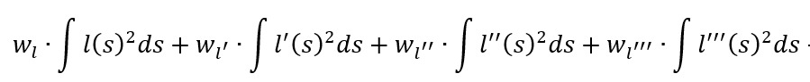        

由于我们的优化变量只有$l,l',l''$ ，因此需要对三阶导进行额外的处理，使其与优化变量产生联系，公式如下：

   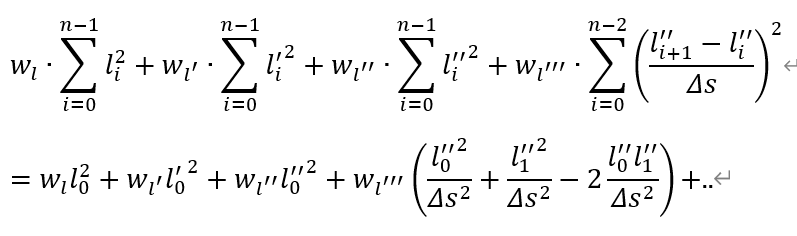

**注意：最后一个点的三阶导数平方忽略，因为无法计算**

#### 道路偏移项

apollo中，path的生成总是希望能够靠近道路引导线，因此目标函数存在道路偏移项。、

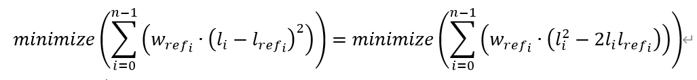   

#### 终点约束项

apollo中存在靠边停车场景，在靠边停车场景中，end_state 的值不为0,因此需要加入终点约束

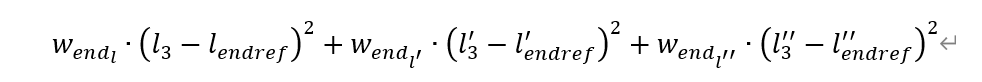   

### 约束函数

path优化中的约束函数有三个部分：bound约束、初始点约束、连续性约束

#### bound约束

L的边界由前面path_boundary得出，dL的取值边界为Flag设定为2.0，ddL的取值边界计算为：

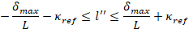

公式推导：

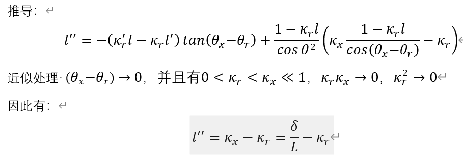   

  $l,l',l''$约束公式如下

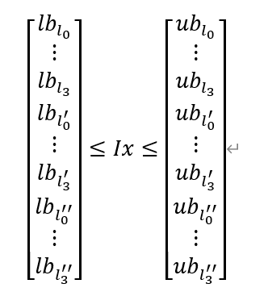

#### 初始点约束

为了使得优化出的path与上一帧轨迹连续，因此需要对初始点进行约束，即初始点的状态不可以改变，上下边界均为起始点状态，公式如下
$$
l_{init}\le l\le l_{init}
$$

$$
l'_{init}\le l'\le l'_{init}
$$

$$
l''_{init}\le l''\le l''_{init}
$$

#### 连续性约束

1. 首先是每个$l$的二阶导连续

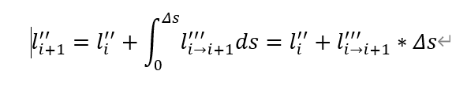   

其中三阶导jerk的近似值为：

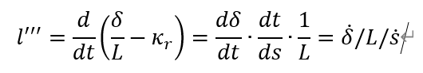   

因此针对二阶导连续的约束条件为

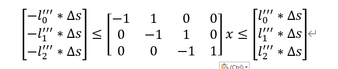   

2. 之后是每个$l$的一阶导连续

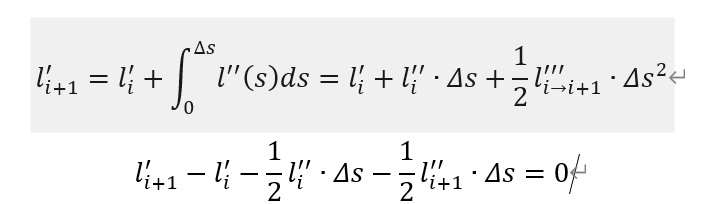   

矩阵形式

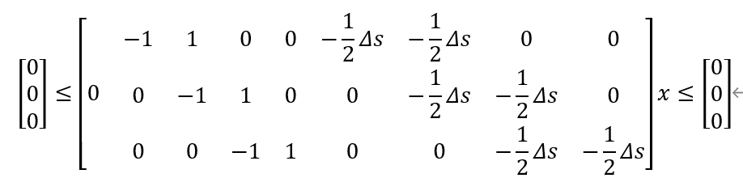   

3. 最后是每个$l$连续

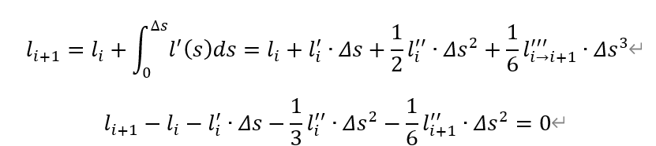   

矩阵形式

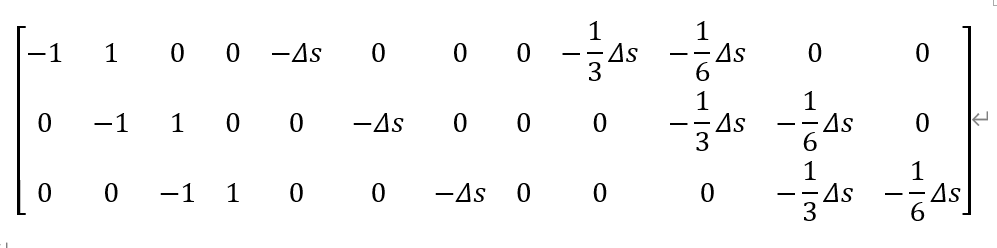   

# 函数具体操作

## 首先将其实点坐标准换至frenet坐标系

```C++
  const auto init_frenet_state =
      reference_line.ToFrenetFrame(planning_start_point);//投影至frenet坐标系
```

## 之后获取config中的优化参数

```C++
  const auto& config = reference_line_info_->IsChangeLanePath()
                           ? config_.piecewise_jerk_path_optimizer_config()
                                 .lane_change_path_config()
                           : config_.piecewise_jerk_path_optimizer_config()
                                 .default_path_config();
```

## 之后设置权重数组w

里面存储的是$l,l',l'',l''',l''''$的权重

```C++
  std::array<double, 5> w = {
      config.l_weight(),//1.0
      config.dl_weight() *
          std::fmax(init_frenet_state.first[1] * init_frenet_state.first[1],
                    5.0),//
      config.ddl_weight(), config.dddl_weight(), 0.0};
      //1000,50000
```

## 赋值path_boundary

```C++
  const auto& path_boundaries =
      reference_line_info_->GetCandidatePathBoundaries();
  ADEBUG << "There are " << path_boundaries.size() << " path boundaries.";
  //上一周期该引导线的path_data
  const auto& reference_path_data = reference_line_info_->path_data();

```

## 遍历每个path_boundary生成优化轨迹

* 首先定义优化变量

```C++
    std::vector<double> opt_l;
    std::vector<double> opt_dl;
    std::vector<double> opt_ddl;
```

* 设置引导线值

```C++
    std::vector<double> path_reference_l(path_boundary_size, 0.0);//bound中s的个数形成的向量
```

* 根据汽车参数计算$l''$的bound

```C++
    const auto& veh_param =
        common::VehicleConfigHelper::GetConfig().vehicle_param();
    const double lat_acc_bound =
        std::tan(veh_param.max_steer_angle() / veh_param.steer_ratio()) /
        veh_param.wheel_base();
    std::vector<std::pair<double, double>> ddl_bounds;
    for (size_t i = 0; i < path_boundary_size; ++i) {
      double s = static_cast<double>(i) * path_boundary.delta_s() +
                 path_boundary.start_s();
      double kappa = reference_line.GetNearestReferencePoint(s).kappa();
      ddl_bounds.emplace_back(-lat_acc_bound - kappa, lat_acc_bound - kappa);
    }
```

* 前提bound，与权重准备就绪，开始进入优化函数
  ```C++
      bool res_opt = OptimizePath(
          init_frenet_state, end_state, std::move(path_reference_l),
          path_reference_size, path_boundary.delta_s(), is_valid_path_reference,
          path_boundary.boundary(), ddl_bounds, w, max_iter, &opt_l, &opt_dl,
          &opt_ddl);
  ```

  `OptimizePath`函数

  * 首先获得节点数量

  ```C++
    const size_t kNumKnots = lat_boundaries.size();//即节点数量就是boundary的数量
  ```

  * 之后根据节点数量，起始点s值，与起始点实例化优化类

  ```C++
    PiecewiseJerkPathProblem piecewise_jerk_problem(kNumKnots, delta_s,
                                                    init_state.second);
    //调用构造函数初始化约束，x_bound,dx_bound,ddx_bound,weight_x_ref_vec_
  ```

  ```C++
  PiecewiseJerkProblem::PiecewiseJerkProblem(
      const size_t num_of_knots, const double delta_s,
      const std::array<double, 3>& x_init) {
    CHECK_GE(num_of_knots, 2U);
    num_of_knots_ = num_of_knots;
  
    x_init_ = x_init;
  
    delta_s_ = delta_s;
  
    x_bounds_.resize(num_of_knots_,
                     std::make_pair(-kMaxVariableRange, kMaxVariableRange));
  
    dx_bounds_.resize(num_of_knots_,
                      std::make_pair(-kMaxVariableRange, kMaxVariableRange));
  
    ddx_bounds_.resize(num_of_knots_,
                       std::make_pair(-kMaxVariableRange, kMaxVariableRange));
  
    weight_x_ref_vec_ = std::vector<double>(num_of_knots_, 0.0);
  }
  ```

  * 设置目标点与目标点的权重

  ```C++
    piecewise_jerk_problem.set_end_state_ref({1000.0, 0.0, 0.0}, end_state);//设置目标点约束
  ```

  ```C++
  void PiecewiseJerkProblem::set_end_state_ref(
      const std::array<double, 3>& weight_end_state,
      const std::array<double, 3>& end_state_ref) {
    weight_end_state_ = weight_end_state;
    end_state_ref_ = end_state_ref;
    has_end_state_ref_ = true;
  }
  ```

  * 如果是pull_over则重新设置x_ref与ref的权重

  ```C++
    if (is_valid_path_reference) {//false
      // for non-path-reference part
      // weight_x_ref is set to default value, where
      // l weight = weight_x_ + weight_x_ref_ = (1.0 + 0.0)
      std::vector<double> weight_x_ref_vec(kNumKnots, 0.0);//设置L的权重
      // increase l weight for path reference part only
  
      const double peak_value = config_.piecewise_jerk_path_optimizer_config()
                                    .path_reference_l_weight();
      const double peak_value_x =
          0.5 * static_cast<double>(path_reference_size) * delta_s;//长度的一半
      for (size_t i = 0; i < path_reference_size; ++i) {
        // Gaussian weighting
        const double x = static_cast<double>(i) * delta_s;//该点的s值
        weight_x_ref_vec.at(i) = GaussianWeighting(x, peak_value, peak_value_x);//通过高斯方程设置该点的权重
        ADEBUG << "i: " << i << ", weight: " << weight_x_ref_vec.at(i);
      }
      piecewise_jerk_problem.set_x_ref(std::move(weight_x_ref_vec),
                                       std::move(path_reference_l_ref));//权重，引导线
    }
  ```

  * 设置$l,l',l'',l'''$的权重

  ```C++
   piecewise_jerk_problem.set_weight_x(w[0]);
    piecewise_jerk_problem.set_weight_dx(w[1]);
    piecewise_jerk_problem.set_weight_ddx(w[2]);
    piecewise_jerk_problem.set_weight_dddx(w[3]);
  ```

  * 设置$l,l',l''$的bound，并计算$l'''$的bound

  ```C++
   piecewise_jerk_problem.set_x_bounds(lat_boundaries);
    piecewise_jerk_problem.set_dx_bounds(-FLAGS_lateral_derivative_bound_default,
                                         FLAGS_lateral_derivative_bound_default);
    piecewise_jerk_problem.set_ddx_bounds(ddl_bounds);
  
    // Estimate lat_acc and jerk boundary from vehicle_params
    const auto& veh_param =
        common::VehicleConfigHelper::GetConfig().vehicle_param();
    const double axis_distance = veh_param.wheel_base();
    const double max_yaw_rate =
        veh_param.max_steer_angle_rate() / veh_param.steer_ratio() / 2.0;
    const double jerk_bound = EstimateJerkBoundary(
        std::fmax(init_state.first[1], 1.0), axis_distance, max_yaw_rate);
    piecewise_jerk_problem.set_dddx_bound(jerk_bound);//根据汽车参数计算dddlbounary
  ```

  * 开始进入OSQP优化，设置相应参数

  ```c++
    bool success = piecewise_jerk_problem.Optimize(max_iter);
  ```

  ```C++
  bool PiecewiseJerkProblem::Optimize(const int max_iter) {
    OSQPData* data = FormulateProblem();
  
    OSQPSettings* settings = SolverDefaultSettings();
    settings->max_iter = max_iter;
  
    OSQPWorkspace* osqp_work = nullptr;
    osqp_work = osqp_setup(data, settings);
    // osqp_setup(&osqp_work, data, settings);
  
    osqp_solve(osqp_work);
  
    auto status = osqp_work->info->status_val;
  
    if (status < 0 || (status != 1 && status != 2)) {
      AERROR << "failed optimization status:\t" << osqp_work->info->status;
      osqp_cleanup(osqp_work);
      FreeData(data);
      c_free(settings);
      return false;
    } else if (osqp_work->solution == nullptr) {
      AERROR << "The solution from OSQP is nullptr";
      osqp_cleanup(osqp_work);
      FreeData(data);
      c_free(settings);
      return false;
    }
  
    // extract primal results
    x_.resize(num_of_knots_);
    dx_.resize(num_of_knots_);
    ddx_.resize(num_of_knots_);
    for (size_t i = 0; i < num_of_knots_; ++i) {
      x_.at(i) = osqp_work->solution->x[i] / scale_factor_[0];
      dx_.at(i) = osqp_work->solution->x[i + num_of_knots_] / scale_factor_[1];
      ddx_.at(i) =
          osqp_work->solution->x[i + 2 * num_of_knots_] / scale_factor_[2];
    }
  
    // Cleanup
    osqp_cleanup(osqp_work);
    FreeData(data);
    c_free(settings);
    return true;
  }
  ```

  * 将优化后的变量赋值

  ```C++
    *x = piecewise_jerk_problem.opt_x();
    *dx = piecewise_jerk_problem.opt_dx();
    *ddx = piecewise_jerk_problem.opt_ddx();
  ```

* 根据分辨率1.0计算frenetpath

```C++
      auto frenet_frame_path =
          ToPiecewiseJerkPath(opt_l, opt_dl, opt_ddl, path_boundary.delta_s(),
                              path_boundary.start_s());//返回s,l轨迹（s,l,dl,ddl,dddl）
```

* 将frenet的path转换为笛卡尔坐标的path

```C++
  path_data.SetReferenceLine(&reference_line);//给ref_info的path_data赋值
      path_data.SetFrenetPath(std::move(frenet_frame_path));
```

```C++
bool PathData::SetFrenetPath(FrenetFramePath frenet_path) {
  if (reference_line_ == nullptr) {
    AERROR << "Should NOT set frenet path when reference line is nullptr. "
              "Please set reference line first.";
    return false;
  }
  frenet_path_ = std::move(frenet_path);
  if (!SLToXY(frenet_path_, &discretized_path_)) {
    AERROR << "Fail to transfer frenet path to discretized path.";
    return false;
  }
  DCHECK_EQ(discretized_path_.size(), frenet_path_.size());
  return true;
}
```

```c++
bool PathData::SLToXY(const FrenetFramePath &frenet_path,
                      DiscretizedPath *const discretized_path) {
  std::vector<common::PathPoint> path_points;
  for (const common::FrenetFramePoint &frenet_point : frenet_path) {
    const common::SLPoint sl_point =
        PointFactory::ToSLPoint(frenet_point.s(), frenet_point.l());
    common::math::Vec2d cartesian_point;
    if (!reference_line_->SLToXY(sl_point, &cartesian_point)) {
      AERROR << "Fail to convert sl point to xy point";
      return false;
    }
    const ReferencePoint ref_point =
        reference_line_->GetReferencePoint(frenet_point.s());
    const double theta = CartesianFrenetConverter::CalculateTheta(
        ref_point.heading(), ref_point.kappa(), frenet_point.l(),
        frenet_point.dl());
    ADEBUG << "frenet_point: " << frenet_point.ShortDebugString();
    const double kappa = CartesianFrenetConverter::CalculateKappa(
        ref_point.kappa(), ref_point.dkappa(), frenet_point.l(),
        frenet_point.dl(), frenet_point.ddl());

    double s = 0.0;
    double dkappa = 0.0;
    if (!path_points.empty()) {
      common::math::Vec2d last = PointFactory::ToVec2d(path_points.back());
      const double distance = (last - cartesian_point).Length();
      s = path_points.back().s() + distance;
      dkappa = (kappa - path_points.back().kappa()) / distance;
    }
    path_points.push_back(PointFactory::ToPathPoint(cartesian_point.x(),
                                                    cartesian_point.y(), 0.0, s,
                                                    theta, kappa, dkappa));
  }
  *discretized_path = DiscretizedPath(std::move(path_points));

  return true;
}
```

* path生成结束，将其设置label，并放入候选path_data中

```C++
  reference_line_info_->SetCandidatePathData(std::move(candidate_path_data));
  return Status::OK();
```

