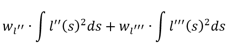
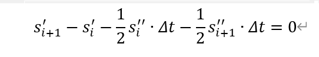

<center><span style="font-size:2rem;font-weight:bold;">piecewise_jerk_speed_nonlinear_optimizer解析</span></center>

<div style="page-break-after: always;"></div>

[toc]

<div style="page-break-after: always;"></div>

# 优化准备知识

## 使用的优化器：[OSQP](https://osqp.org)

   

C++例子：求解过程

```C++
#include "osqp.h"

int main(int argc, char **argv) {
    // Load problem data
    c_float P_x[3] = {4.0, 1.0, 2.0, };//P矩阵的每个值
    c_int P_nnz = 3;//P矩阵中值的个数
    c_int P_i[3] = {0, 0, 1, };//P矩阵中每个值对应的函数
    c_int P_p[3] = {0, 1, 3, };//P矩阵中每列之前有效值的个数，第一个值一定是0
    c_float q[2] = {1.0, 1.0, };//q矩阵
    c_float A_x[4] = {1.0, 1.0, 1.0, 1.0, };///同P矩阵
    c_int A_nnz = 4;
    c_int A_i[4] = {0, 1, 0, 2, };
    c_int A_p[3] = {0, 2, 4, };
    c_float l[3] = {1.0, 0.0, 0.0, };
    c_float u[3] = {1.0, 0.7, 0.7, };
    c_int n = 2;
    c_int m = 3;

    // Exitflag
    c_int exitflag = 0;

    // Workspace structures
    OSQPWorkspace *work;
    OSQPSettings  *settings = (OSQPSettings *)c_malloc(sizeof(OSQPSettings));
    OSQPData      *data     = (OSQPData *)c_malloc(sizeof(OSQPData));

    // Populate data
    if (data) {
        data->n = n;
        data->m = m;
        data->P = csc_matrix(data->n, data->n, P_nnz, P_x, P_i, P_p);
        data->q = q;
        data->A = csc_matrix(data->m, data->n, A_nnz, A_x, A_i, A_p);
        data->l = l;
        data->u = u;
    }

    // Define solver settings as default
    if (settings) {
        osqp_set_default_settings(settings);
        settings->alpha = 1.0; // Change alpha parameter
    }

    // Setup workspace
    exitflag = osqp_setup(&work, data, settings);

    // Solve Problem
    osqp_solve(work);

    // Cleanup
    osqp_cleanup(work);
    if (data) {
        if (data->A) c_free(data->A);
        if (data->P) c_free(data->P);
        c_free(data);
    }
    if (settings) c_free(settings);

    return exitflag;
};
```

## 使用的优化器：NLP(非线性优化器)


## speed_QP优化理论知识

### 目标函数

目标函数由三个部分构成，**平滑项，DP引导线，终点约束项**

#### 平滑项

速度QP优化中使用加速度与jerk的平方作为光滑项，如下所示：

               

由于我们的优化变量只有$s,s',s''$ ，因此需要对三阶导进行额外的处理，使其与优化变量产生联系，公式如下：

   

**注意：最后一个点的三阶导数平方忽略，因为无法计算**

#### DP引导线项

速度QP优化总是希望能够靠近DP搜索到的路径，因此目标函数存在引导线项。、

      

#### 终点约束项

对DP搜索到的终点有约束

      

### 约束函数

path优化中的约束函数有三个部分：**bound约束、初始点约束、连续性约束**

#### bound约束

s的边界由障碍物的st_boundary得出

  $s'$约束公式为[0-config中的最大速度]

​    $s''$约束公式为[-4-5.75] 

#### 初始点约束

为了使得优化出的speed与上一帧轨迹连续，因此需要对初始点进行约束，即初始点的状态不可以改变，上下边界均为起始点状态，公式如下
$$
s_{init}\le s\le s_{init}
$$

$$
s'_{init}\le s'\le s'_{init}
$$

$$
s''_{init}\le s''\le s''_{init}
$$

#### 连续性约束

1. 首先是每个$s$的二阶导连续

  

其中三阶导jerk的近似值为：

    

因此针对二阶导连续的约束条件为

     

2. 之后是每个$s$的一阶导连续


     

矩阵形式

     

3. 最后是每个$s$连续


     

矩阵形式

   

## speed曲率优化理论知识

步骤与path相同，不同的是x_weight等于0,以0.5m为分辨率加入kappa的ref优化项


## speed_limit优化理论知识

步骤与path相同，不同的是x_weight等于0,以2m为分辨率加入speed_limit的ref优化项

## NLP优化理论知识

加入速度约束，加入曲率约束


# 函数具体操作

## 求解初始状态以及节点数量与$s,s',s'',s'''$的约束

```C++
  const auto problem_setups_status =
      SetUpStatesAndBounds(path_data, *speed_data);//设置每个时间点t（分辨率0.1）对应的s边界，以及获得速度限制与巡航速度
  if (!problem_setups_status.ok()) {
    speed_data->clear();
    return problem_setups_status;
  }
```

SetUpStatesAndBounds函数

* 首先根据st_graph_data求解t的分辨率以及nums等信息

```C++
  delta_t_ = 0.1;
  total_length_ = st_graph_data.path_length();
  total_time_ = st_graph_data.total_time_by_conf();
  num_of_knots_ = static_cast<int>(total_time_ / delta_t_) + 1;
```

* 计算初始状态

```C++
  s_init_ = 0.0;
  s_dot_init_ = st_graph_data.init_point().v();
  s_ddot_init_ = st_graph_data.init_point().a();
```

* 计算$s',s'',s'''$的bound

```C++
  // Set s_dot bounary，设置最大的速度
  s_dot_max_ = std::fmax(FLAGS_planning_upper_speed_limit,//20
                         st_graph_data.init_point().v());

  // Set s_ddot boundary加速度
  const auto& veh_param =
      common::VehicleConfigHelper::GetConfig().vehicle_param();
  s_ddot_max_ = veh_param.max_acceleration();//5.75
  s_ddot_min_ = -1.0 * std::abs(veh_param.max_deceleration());

  // Set s_dddot boundary,jerk
  // TODO(Jinyun): allow the setting of jerk_lower_bound and move jerk config to
  // a better place
  s_dddot_min_ = -std::abs(FLAGS_longitudinal_jerk_lower_bound); //-4
  s_dddot_max_ = FLAGS_longitudinal_jerk_upper_bound; //-4
```

* 遍历每个障碍物的st_boundary,并根据boundary的type求解时刻t时的可用上下界

```C++
 for (int i = 0; i < num_of_knots_; ++i) {
      double curr_t = i * delta_t_;
      double s_lower_bound = 0.0;
      double s_upper_bound = total_length_;
      double s_soft_lower_bound = 0.0;
      double s_soft_upper_bound = total_length_;
      for (const STBoundary* boundary : st_graph_data.st_boundaries()) {//遍历所有障碍物的st_boundarys，选择最好的当前时刻的上下边界
        double s_lower = 0.0;
        double s_upper = 0.0;
        if (!boundary->GetUnblockSRange(curr_t, &s_upper, &s_lower)) {
          continue;
        }//根据该障碍物的boundary的type计算该时刻的上下边界
        SpeedPoint sp;
        switch (boundary->boundary_type()) {
          case STBoundary::BoundaryType::STOP:
          case STBoundary::BoundaryType::YIELD:
            s_upper_bound = std::fmin(s_upper_bound, s_upper);
            s_soft_upper_bound = std::fmin(s_soft_upper_bound, s_upper);
            break;
          case STBoundary::BoundaryType::FOLLOW:
            s_upper_bound =
                std::fmin(s_upper_bound, s_upper - FLAGS_follow_min_distance);//3
            if (!speed_data.EvaluateByTime(curr_t, &sp)) {
              const std::string msg =
                  "rough speed profile estimation for soft follow fence failed";
              AERROR << msg;
              return Status(ErrorCode::PLANNING_ERROR, msg);
            }
            s_soft_upper_bound =
                std::fmin(s_soft_upper_bound,
                          s_upper - FLAGS_follow_min_distance -
                              std::min(7.0, FLAGS_follow_time_buffer * sp.v()));//2.5
            break;
          case STBoundary::BoundaryType::OVERTAKE:
            s_lower_bound = std::fmax(s_lower_bound, s_lower);
            s_soft_lower_bound = std::fmax(s_soft_lower_bound, s_lower + 10.0);
            break;
          default:
            break;
        }
      }//障碍物遍历结束，
      if (s_lower_bound > s_upper_bound) {
        const std::string msg =
            "s_lower_bound larger than s_upper_bound on STGraph";
        AERROR << msg;
        return Status(ErrorCode::PLANNING_ERROR, msg);
      }
      s_soft_bounds_.emplace_back(s_soft_lower_bound, s_soft_upper_bound);
      s_bounds_.emplace_back(s_lower_bound, s_upper_bound);
    }
```

## 开始QP优化

```C++
  const auto qp_smooth_status =
      OptimizeByQP(speed_data, &distance, &velocity, &acceleration);
```

OptimizeByQP函数

* 首先实例化优化类

```C++
 PiecewiseJerkSpeedProblem piecewise_jerk_problem(num_of_knots_, delta_t_,
                                                   init_states);//调用piecewise_jerk_problem的构造函数，
                                                   //初始化初始值，x,dx，ddx,的边界[num_of_knots_]（-oo-+oo）,以及weight_x_ref_vec_的权重，全设为0
```

* 设置$s,s',s'',s'''$的约束

```C++
  piecewise_jerk_problem.set_dx_bounds(
      0.0, std::fmax(FLAGS_planning_upper_speed_limit, init_states[1]));//最小速度为0-（当前速度与限速的最大值）
  piecewise_jerk_problem.set_ddx_bounds(s_ddot_min_, s_ddot_max_);//根据conf设置
  piecewise_jerk_problem.set_dddx_bound(s_dddot_min_, s_dddot_max_);
  piecewise_jerk_problem.set_x_bounds(s_bounds_);//setup中设计算得到
```

* 根据DP结果以0.1为分辨率插值计算引导线,并设置权重

```C++
  std::vector<double> x_ref;
  for (int i = 0; i < num_of_knots_; ++i) {//每个0.1s计算引导线
    const double curr_t = i * delta_t_;
    // get path_s
    SpeedPoint sp;
    speed_data->EvaluateByTime(curr_t, &sp);
    x_ref.emplace_back(sp.s());
  }
  piecewise_jerk_problem.set_x_ref(config.ref_s_weight(), std::move(x_ref));//设置引导线的权重为100
```

* 开始优化,并得到优化结果

```
  if (!piecewise_jerk_problem.Optimize()) {
    const std::string msg =
        "Speed Optimization by Quadratic Programming failed. "
        "st boundary is infeasible.";
    AERROR << msg;
    return Status(ErrorCode::PLANNING_ERROR, msg);
  }

  *distance = piecewise_jerk_problem.opt_x();
  *velocity = piecewise_jerk_problem.opt_dx();
  *acceleration = piecewise_jerk_problem.opt_ddx();
```

## 检查优化后的第一个点是否满足限速要求

```C++
  const bool speed_limit_check_status = CheckSpeedLimitFeasibility();//检查第一个点的速度限制是否符合要求
```

CheckSpeedLimitFeasibility函数

```C++
  static constexpr double kEpsilon = 1e-6;
  const double init_speed_limit = speed_limit_.GetSpeedLimitByS(s_init_);
  if (init_speed_limit + kEpsilon < s_dot_init_) {
    AERROR << "speed limit [" << init_speed_limit
           << "] lower than initial speed[" << s_dot_init_ << "]";
    return false;
  }
  return true;
}
```

## 若是满足要求，则开始优化path的曲率

```C++
    const auto curvature_smooth_start = std::chrono::system_clock::now();

    const auto path_curvature_smooth_status = SmoothPathCurvature(path_data);

    const auto curvature_smooth_end = std::chrono::system_clock::now();
    std::chrono::duration<double> curvature_smooth_diff =
        curvature_smooth_end - curvature_smooth_start;
    ADEBUG << "path curvature smoothing for nlp optimization takes "
           << curvature_smooth_diff.count() * 1000.0 << " ms";

    if (!path_curvature_smooth_status.ok()) {
      speed_data->clear();
      return path_curvature_smooth_status;
    }
```

SmoothPathCurvature函数

```C++
Status PiecewiseJerkSpeedNonlinearOptimizer::SmoothPathCurvature(
    const PathData& path_data) {
  // using piecewise_jerk_path to fit a curve of path kappa profile
  // TODO(Jinyun): move smooth configs to gflags
  const auto& cartesian_path = path_data.discretized_path();
  const double delta_s = 0.5;
  std::vector<double> path_curvature;
  //每个0.5s取一个kappa值
  for (double path_s = cartesian_path.front().s();
       path_s < cartesian_path.back().s() + delta_s; path_s += delta_s) {
    const auto& path_point = cartesian_path.Evaluate(path_s);
    path_curvature.push_back(path_point.kappa());
  }
  const auto& path_init_point = cartesian_path.front();
  std::array<double, 3> init_state = {path_init_point.kappa(),
                                      path_init_point.dkappa(),
                                      path_init_point.ddkappa()};
  PiecewiseJerkPathProblem piecewise_jerk_problem(path_curvature.size(),
                                                  delta_s, init_state);
  piecewise_jerk_problem.set_x_bounds(-1.0, 1.0);
  piecewise_jerk_problem.set_dx_bounds(-10.0, 10.0);
  piecewise_jerk_problem.set_ddx_bounds(-10.0, 10.0);
  piecewise_jerk_problem.set_dddx_bound(-10.0, 10.0);

  piecewise_jerk_problem.set_weight_x(0.0);
  piecewise_jerk_problem.set_weight_dx(10.0);
  piecewise_jerk_problem.set_weight_ddx(10.0);
  piecewise_jerk_problem.set_weight_dddx(10.0);

  piecewise_jerk_problem.set_x_ref(10.0, std::move(path_curvature));

  if (!piecewise_jerk_problem.Optimize(1000)) {
    const std::string msg = "Smoothing path curvature failed";
    AERROR << msg;
    return Status(ErrorCode::PLANNING_ERROR, msg);
  }

  std::vector<double> opt_x;
  std::vector<double> opt_dx;
  std::vector<double> opt_ddx;

  opt_x = piecewise_jerk_problem.opt_x();
  opt_dx = piecewise_jerk_problem.opt_dx();
  opt_ddx = piecewise_jerk_problem.opt_ddx();

  PiecewiseJerkTrajectory1d smoothed_path_curvature(
      opt_x.front(), opt_dx.front(), opt_ddx.front());

  for (size_t i = 1; i < opt_ddx.size(); ++i) {
    double j = (opt_ddx[i] - opt_ddx[i - 1]) / delta_s;
    smoothed_path_curvature.AppendSegment(j, delta_s);
  }

  smoothed_path_curvature_ = smoothed_path_curvature;

  return Status::OK();
}
```

## 优化限速点

```C++
const auto speed_limit_smooth_start = std::chrono::system_clock::now();

    const auto speed_limit_smooth_status = SmoothSpeedLimit();

    const auto speed_limit_smooth_end = std::chrono::system_clock::now();
    std::chrono::duration<double> speed_limit_smooth_diff =
        speed_limit_smooth_end - speed_limit_smooth_start;
    ADEBUG << "speed limit smoothing for nlp optimization takes "
           << speed_limit_smooth_diff.count() * 1000.0 << " ms";

    if (!speed_limit_smooth_status.ok()) {
      speed_data->clear();
      return speed_limit_smooth_status;
    }
```

SmoothSpeedLimit函数

```C++
    const auto speed_limit_smooth_start = std::chrono::system_clock::now();

    const auto speed_limit_smooth_status = SmoothSpeedLimit();

    const auto speed_limit_smooth_end = std::chrono::system_clock::now();
    std::chrono::duration<double> speed_limit_smooth_diff =
        speed_limit_smooth_end - speed_limit_smooth_start;
    ADEBUG << "speed limit smoothing for nlp optimization takes "
           << speed_limit_smooth_diff.count() * 1000.0 << " ms";

    if (!speed_limit_smooth_status.ok()) {
      speed_data->clear();
      return speed_limit_smooth_status;
    }
```

```c++
Status PiecewiseJerkSpeedNonlinearOptimizer::SmoothSpeedLimit() {
  // using piecewise_jerk_path to fit a curve of speed_ref
  // TODO(Hongyi): move smooth configs to gflags
  double delta_s = 2.0;
  std::vector<double> speed_ref;
  for (int i = 0; i < 100; ++i) {//每个2m取一个点的限速
    double path_s = i * delta_s;
    double limit = speed_limit_.GetSpeedLimitByS(path_s);
    speed_ref.emplace_back(limit);
  }
  std::array<double, 3> init_state = {speed_ref[0], 0.0, 0.0};
  PiecewiseJerkPathProblem piecewise_jerk_problem(speed_ref.size(), delta_s,
                                                  init_state);
  piecewise_jerk_problem.set_x_bounds(0.0, 50.0);
  piecewise_jerk_problem.set_dx_bounds(-10.0, 10.0);
  piecewise_jerk_problem.set_ddx_bounds(-10.0, 10.0);
  piecewise_jerk_problem.set_dddx_bound(-10.0, 10.0);

  piecewise_jerk_problem.set_weight_x(0.0);
  piecewise_jerk_problem.set_weight_dx(10.0);
  piecewise_jerk_problem.set_weight_ddx(10.0);
  piecewise_jerk_problem.set_weight_dddx(10.0);

  piecewise_jerk_problem.set_x_ref(10.0, std::move(speed_ref));

  if (!piecewise_jerk_problem.Optimize(4000)) {
    const std::string msg = "Smoothing speed limit failed";
    AERROR << msg;
    return Status(ErrorCode::PLANNING_ERROR, msg);
  }

  std::vector<double> opt_x;
  std::vector<double> opt_dx;
  std::vector<double> opt_ddx;

  opt_x = piecewise_jerk_problem.opt_x();
  opt_dx = piecewise_jerk_problem.opt_dx();
  opt_ddx = piecewise_jerk_problem.opt_ddx();
  PiecewiseJerkTrajectory1d smoothed_speed_limit(opt_x.front(), opt_dx.front(),
                                                 opt_ddx.front());

  for (size_t i = 1; i < opt_ddx.size(); ++i) {
    double j = (opt_ddx[i] - opt_ddx[i - 1]) / delta_s;
    smoothed_speed_limit.AppendSegment(j, delta_s);
  }

  smoothed_speed_limit_ = smoothed_speed_limit;

  return Status::OK();
}
```

## NLP优化

```C++
 const auto nlp_start = std::chrono::system_clock::now();

    const auto nlp_smooth_status =
        OptimizeByNLP(&distance, &velocity, &acceleration);

    const auto nlp_end = std::chrono::system_clock::now();
    std::chrono::duration<double> nlp_diff = nlp_end - nlp_start;
    ADEBUG << "speed nlp optimization takes " << nlp_diff.count() * 1000.0
           << " ms";

    if (!nlp_smooth_status.ok()) {
      speed_data->clear();
      return nlp_smooth_status;
    }

    // Record speed_constraint，将速度限制信息放入mutable_st_graph_data->mutable_st_graph_debug()->mutable_speed_constraint()
    StGraphData* st_graph_data = reference_line_info_->mutable_st_graph_data();
    auto* speed_constraint =
        st_graph_data->mutable_st_graph_debug()->mutable_speed_constraint();
    for (int i = 0; i < num_of_knots_; ++i) {
      double t = i * delta_t_;
      speed_constraint->add_t(t);
      speed_constraint->add_upper_bound(
          smoothed_speed_limit_.Evaluate(0, distance[i]));
    }
  }

  speed_data->clear();
  speed_data->AppendSpeedPoint(distance[0], 0.0, velocity[0], acceleration[0],
                               0.0);
  for (int i = 1; i < num_of_knots_; ++i) {
    // Avoid the very last points when already stopped
    if (velocity[i] < 0.0) {
      break;
    }
    speed_data->AppendSpeedPoint(
        distance[i], delta_t_ * i, velocity[i], acceleration[i],
        (acceleration[i] - acceleration[i - 1]) / delta_t_);
  }
  SpeedProfileGenerator::FillEnoughSpeedPoints(speed_data);//对轨迹小于3s的速度轨迹添加

  StGraphData* st_graph_data = reference_line_info_->mutable_st_graph_data();
  RecordDebugInfo(*speed_data, st_graph_data->mutable_st_graph_debug());
```

