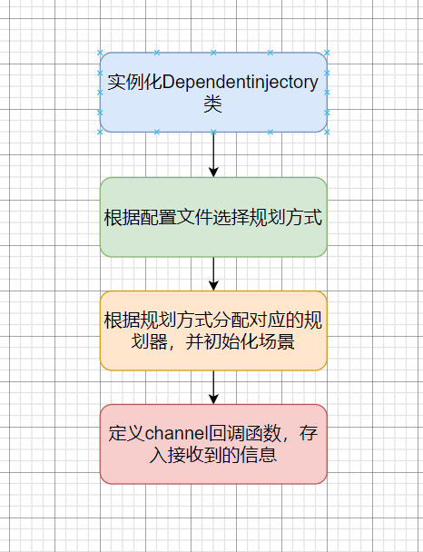
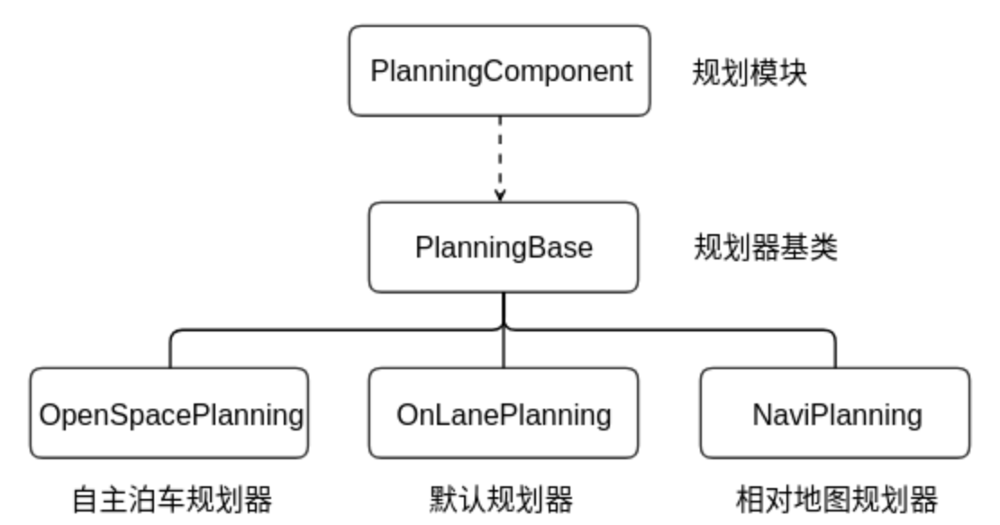
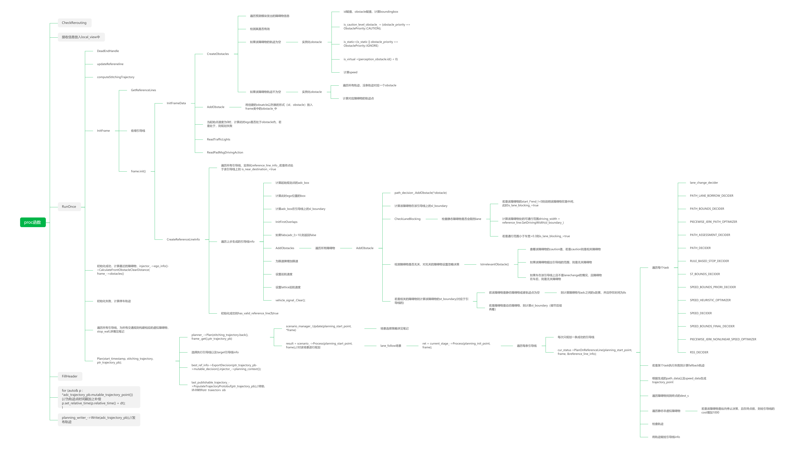

<center><span style="font-size:2rem;font-weight:bold;">规划模块流程解析</span></center>

<div style="page-break-after: always;"></div>

[toc]

<div style="page-break-after: always;"></div>

# 总览

规划模块由apollo中的组件component构成，与其他component一样分为init函数与proc函数。

init函数用来处理一些参数、配置、类、引导线生成线程的初始化工作

proc则是通过接收定义的channel运行相应函数。

component组件的使用教程➡ [跳转](...)
**注：本文档只介绍整体流程，其中具体的代码细节，请点击跳转链接查看**

# `Init`函数

## 流程图

   


## 执行步骤

### 首先是实例化`DependencyInjector`，==>injector_;

**注：该类中存储的是规划的状态，是连通规划模块多个框架之间的全局变量**

该类的具体构造见[跳转]()

### 之后是根据配置文件中的`config:dag`文件，选择规划模块采用哪种规划方式，即`planningbase`类的实例化；

```C++
  if (FLAGS_use_navigation_mode) {//具体的设定值在conf文件中，为false
    planning_base_ = std::make_unique<NaviPlanning>(injector_);//相对地图规划
  } else {
    planning_base_ = std::make_unique<OnLanePlanning>(injector_);//开放道路规划，默认配置，类的实例化（涉及到子类虚函数的指向）
  }
  //此时planning_base_指向OnLanePlanning子类
 //planning_base_在实例化时，父类构造函数planning_base.cc中将injector_赋值jnjector，
 //子类的构造函数即实例化planner_dispatcher_，并将其指向OnLanePlannerDispatcher
 //OnLanePlannerDispatcherd与其父类均无构造函数
```

该类存储的是规划方式的规划函数接口
该类在Apollo中有两个子类，分别表示两种不同的规划方式：

* NaviPlanning------->相对道路的规划
* OnlanePlanning-------->开放道路的规划，主要应用于开放道路的自动驾驶功能



####     **planning_base类的构造函数：**

* OnLanePlanning类的父类时planning_base因此会先执行父类的构造函数

* planningbase的构造函数值是将injector类的指针赋值
  ```C++
  PlanningBase::PlanningBase(const std::shared_ptr<DependencyInjector>& injector)
      : injector_(injector) {}
  ```

* 之后调用OnlanePlanning的构造函数：实例化规划器分发类：OnlanePlannerDispatcher

  ```c++
    explicit OnLanePlanning(const std::shared_ptr<DependencyInjector>& injector)
        : PlanningBase(injector) {
      planner_dispatcher_ = std::make_unique<OnLanePlannerDispatcher>();//实例化planner_dispatcher_
    }
  ```

* OnLanePlannerDispatcher无构造函数，该类主要用来分配规划器：planner。
  一共存在5个规划器：

  * **rtk** - 根据录制的轨迹来规划行车路线
  * **public_road** - 开放道路的轨迹规划器
  * **lattice** - 基于网格算法的轨迹规划器
  * **navi** - 基于实时相对地图的规划器
  * **open_space** - 自主泊车规划器

### 从dag文件中获取配置文件

```C++
  ACHECK(ComponentBase::GetProtoConfig(&config_))//获取配置文件，看dag文件，mainboard命令输入的路径
      << "failed to load planning config file "
      << ComponentBase::ConfigFilePath();
```

### 调用OnLanePlanning的初始化函数Init函数

```C++
  planning_base_->Init(config_);
  //对应的是onlaneplanning.cc的Init函数
  //（注册各种规划状态的决策与优化器，并分配规划器（public_road）,并注册各种场景，默认场景为车道线保持）
  //分发规划器：public_road，开启引导线生成线程，注册场景，并load所有场景的config将其保存到config_map中，
  //实例化lane_follow场景
```

* 检查规划器的配置文件

  ```C++
    config_ = config;
    if (!CheckPlanningConfig(config_)) { //检查dag对应的配置文件
      return Status(ErrorCode::PLANNING_ERROR,
                    "planning config error: " + config_.DebugString());
    }
  ```

* 调用父类的初始化函数Init函数
  ```C++
    PlanningBase::Init(config_);//执行父类的初始化，
    //注册对应的规划状态的决策与优化器，对应具体的task的路径规划决策与优化的创建，与config中的task列表对应
  ```

  * 实例化task中的decider与optimaizer

    ```C++
    Status PlanningBase::Init(const PlanningConfig& config) {
      injector_->planning_context()->Init();//空语句
      TaskFactory::Init(config, injector_);//注册任务决策器与优化器（初始化），
      //主要是注册对应的规划状态的决策与优化器，对应具体的task的路径规划决策与优化
      return Status::OK();
    }
    ```

* 调用规划器分发类的初始化函数

  ```C++
    planner_dispatcher_->Init();
    //planner_dispatcher_在on_lane_planning的构造函数中指向OnLanePlannerDispatcher
    //OnLanePlannerDispatcher的构造函数：设置具体planner，PUBLIC_ROAD规划器
    //执行的是planner_dispatcher_的init函数，是其父类的初始化函数：
    //注册对应的规划器，即初始化四种类型的规划器（RTK，navi,lattice，public_road）
  ```

  * 调用其父类的初始化函数，实例化多个规划器

    ```C++
      virtual common::Status Init() {
        RegisterPlanners();
        return common::Status::OK();
      }
    ```

* 提取高清地图文件
  ```C++
    hdmap_ = HDMapUtil::BaseMapPtr();//load高清地图
    ACHECK(hdmap_) << "Failed to load map";//hdmap_
  ```

* 实例化引导线提供器类与开启引导线生成的线程
  ```C++
    reference_line_provider_ = std::make_unique<ReferenceLineProvider>(
        injector_->vehicle_state(), hdmap_);
    //根据汽车状态以及高清地图实例化参考线规划器
   //将hdmap_赋值到pnc_map，并分配对应的smoother,指向为discrete_points_reference_line_smoother，并设置config
   //pnc_map就是hdmap与planning模块的中间层，用来处理routing结果，将routing的每个路由段转换为reference_lin的数据形式
  
    reference_line_provider_->Start();//开启参考线线程，根据routing结果生成reference_lines
  ```

  **注：引导线生成的代码见[跳转]()**

* 分配具体的规划器
  ```C++
    planner_ = planner_dispatcher_->DispatchPlanner(config_, injector_);
    //根据配置为onlane_planning设置规划器，
    //默认为PUBLIC_ROAD,构造函数是将injector_赋值到它的父类中，PlannerWithReferenceLine
    //PlannerWithReferenceLine的构造函数将injector赋值它的父类Planner中，
    //planner构造函数，使用injector调用ScenarioManager的构造函数：将injector赋值
    //（有PUBLIC_ROAD（开放道路的轨迹规划器），RTK（根据录制的轨迹来规划行车路线）,LATTIC（基于网格算法的轨迹规划器）,NAVI（基于实时相对地图的规划器））
  ```

  * 实例化public_road类
    ```C++
    std::unique_ptr<Planner> OnLanePlannerDispatcher::DispatchPlanner(
        const PlanningConfig& planning_config,
        const std::shared_ptr<DependencyInjector>& injector) {
      return planner_factory_.CreateObject(
          planning_config.standard_planning_config().planner_type(0), injector);
          //设置具体planner，只有PUBLIC_ROAD规划器
    }
    ```

* 之后调用public_road规划器的init函数
  ```C++
    start_time_ = Clock::NowInSeconds();//开始时间
    return planner_->Init(config_);
    //public_road_planner中无构造函数，
    //根据配置文件注册各种场景，并将所有场景的config放入config_map中
    //之后实例化lane_follow场景
  ```

  * 注册多个场景并初始化场景为lane_follow

  ```C++
  Status PublicRoadPlanner::Init(const PlanningConfig& config) {//根据配置文件注册场景管理
    config_ = config;
    scenario_manager_.Init(config);
    //根据配置文件注册各种场景，
    //并创建初始场景为车道线保持（lane follow）,将每个场景的config load下来
    //并将lane_follow实例化，
    return Status::OK();
  }
  ```

  * scenario_manager_的初始化函数

    ```C++
    bool ScenarioManager::Init(const PlanningConfig& planning_config) {
      planning_config_.CopyFrom(planning_config);
      RegisterScenarios();//注册场景，并将其对应的config放入config_map中
      default_scenario_type_ = ScenarioConfig::LANE_FOLLOW;//默认类型为车道线保持
      current_scenario_ = CreateScenario(default_scenario_type_);//根据默认类型创建当前的场景
      //构造相应的场景，首先执行父类的构造函数，Scenario：将config等赋值并得到场景名字
      //子类LaneFollowScenario构造函数为空
      //根据场景初始化，调用Scenario::Init()创建对应场景的stage
      //之后在Scenario::Init()函数中对stage进行实例化，调用stage.cc构造函数对task进行初始化
      return true;
    }
    ```

### 创建chanel接收器，并定义回调函数，接收channel数据

```C++
  routing_reader_ = node_->CreateReader<RoutingResponse>(
      config_.topic_config().routing_response_topic(),
      [this](const std::shared_ptr<RoutingResponse>& routing) {
        AINFO << "Received routing data: run routing callback."
              << routing->header().DebugString();
        std::lock_guard<std::mutex> lock(mutex_);
        routing_.CopyFrom(*routing);
      });//初始化routing模块的话题信息以及回调函数，将接收到的导航信息保存在routing_中

  traffic_light_reader_ = node_->CreateReader<TrafficLightDetection>(
      config_.topic_config().traffic_light_detection_topic(),
      [this](const std::shared_ptr<TrafficLightDetection>& traffic_light) {
        ADEBUG << "Received traffic light data: run traffic light callback.";
        std::lock_guard<std::mutex> lock(mutex_);
        traffic_light_.CopyFrom(*traffic_light);
      });//同上，交通灯信息保存在traffic_light_中

  pad_msg_reader_ = node_->CreateReader<PadMessage>(//驾驶员动作
      config_.topic_config().planning_pad_topic(),
      [this](const std::shared_ptr<PadMessage>& pad_msg) {
        ADEBUG << "Received pad data: run pad callback.";
        std::lock_guard<std::mutex> lock(mutex_);
        pad_msg_.CopyFrom(*pad_msg);
      });

  story_telling_reader_ = node_->CreateReader<Stories>(//调试信息
      config_.topic_config().story_telling_topic(),
      [this](const std::shared_ptr<Stories>& stories) {
        ADEBUG << "Received story_telling data: run story_telling callback.";
        std::lock_guard<std::mutex> lock(mutex_);
        stories_.CopyFrom(*stories);
      });

  if (FLAGS_use_navigation_mode) {//使用相对地图
    relative_map_reader_ = node_->CreateReader<MapMsg>(
        config_.topic_config().relative_map_topic(),
        [this](const std::shared_ptr<MapMsg>& map_message) {
          ADEBUG << "Received relative map data: run relative map callback.";
          std::lock_guard<std::mutex> lock(mutex_);
          relative_map_.CopyFrom(*map_message);
        });
  }
```

### 创建发布channel的writer

```C++
  planning_writer_ = node_->CreateWriter<ADCTrajectory>(
      config_.topic_config().planning_trajectory_topic());//发布轨迹的话题信息

  rerouting_writer_ = node_->CreateWriter<RoutingRequest>(
      config_.topic_config().routing_request_topic());//发布重新规划导航信息的请求信息

  planning_learning_data_writer_ = node_->CreateWriter<PlanningLearningData>(
      config_.topic_config().planning_learning_data_topic());
```

# `Proc`函数

## 流程图



## 执行步骤

### 首先检查是否需要rerouting

```C++
  CheckRerouting();//检查是否需要重新规划导航信息
```

```c++
void PlanningComponent::CheckRerouting() {
  auto* rerouting = injector_->planning_context()
                        ->mutable_planning_status()
                        ->mutable_rerouting();//根据场景判断是否需要rerouting
  if (!rerouting->need_rerouting()) {//若是不需要重新规划导航，则返回即可，如何检查
    return;
  }
  common::util::FillHeader(node_->Name(), rerouting->mutable_routing_request());
  rerouting->set_need_rerouting(false);
  rerouting_writer_->Write(rerouting->routing_request());//若需要重新规划导航，发送重新导航请求
}
```

### 将接收到的信息放入local_view中

```C++
  local_view_.prediction_obstacles = prediction_obstacles;
  local_view_.chassis = chassis;
  local_view_.localization_estimate = localization_estimate;
  {
    std::lock_guard<std::mutex> lock(mutex_);
    if (!local_view_.routing ||
        hdmap::PncMap::IsNewRouting(*local_view_.routing, routing_)) {
      local_view_.routing =
          std::make_shared<routing::RoutingResponse>(routing_);
    }
  }//首先更新为最新的导航信息
  {
    std::lock_guard<std::mutex> lock(mutex_);
    local_view_.traffic_light =
        std::make_shared<TrafficLightDetection>(traffic_light_);
    local_view_.relative_map = std::make_shared<MapMsg>(relative_map_);
  }//得到信号灯与相对地图信息
  {
    std::lock_guard<std::mutex> lock(mutex_);
    local_view_.pad_msg = std::make_shared<PadMessage>(pad_msg_);
  }
  {
    std::lock_guard<std::mutex> lock(mutex_);
    local_view_.stories = std::make_shared<Stories>(stories_);
  }
```

### 检查接收到的信息是否合法

```C++
  if (!CheckInput()) {
    AERROR << "Input check failed";
    return false;
  }
```

CheckInput()函数

```C++
bool PlanningComponent::CheckInput() {
  ADCTrajectory trajectory_pb;
  auto* not_ready = trajectory_pb.mutable_decision()
                        ->mutable_main_decision()
                        ->mutable_not_ready();

  if (local_view_.localization_estimate == nullptr) {
    not_ready->set_reason("localization not ready");
  } else if (local_view_.chassis == nullptr) {
    not_ready->set_reason("chassis not ready");
  } else if (HDMapUtil::BaseMapPtr() == nullptr) {
    not_ready->set_reason("map not ready");
  } else {
    // nothing
  }

  if (FLAGS_use_navigation_mode) {
    if (!local_view_.relative_map->has_header()) {
      not_ready->set_reason("relative map not ready");
    }
  } else {
    if (!local_view_.routing->has_header()) {
      not_ready->set_reason("routing not ready");
    }
  }

  if (not_ready->has_reason()) {
    AERROR << not_ready->reason() << "; skip the planning cycle.";
    common::util::FillHeader(node_->Name(), &trajectory_pb);
    planning_writer_->Write(trajectory_pb);
    return false;
  }
  return true;
}
```

### 规划轨迹

```C++
  planning_base_->RunOnce(local_view_, &adc_trajectory_pb);//计算轨迹，转到onlane_palnning
```

* 首先根据定位信息与底盘信息更新汽车的state
  ```C++
    Status status = injector_->vehicle_state()->Update(
        *local_view_.localization_estimate, *local_view_.chassis);
  ```

* 如果state更新失败则生成stop轨迹

  ```C++
    if (!status.ok() || !util::IsVehicleStateValid(vehicle_state)) {
      const std::string msg =
          "Update VehicleStateProvider failed "
          "or the vehicle state is out dated.";
      AERROR << msg;
      ptr_trajectory_pb->mutable_decision()
          ->mutable_main_decision()
          ->mutable_not_ready()
          ->set_reason(msg);
      status.Save(ptr_trajectory_pb->mutable_header()->mutable_status());
      // TODO(all): integrate reverse gear
      ptr_trajectory_pb->set_gear(canbus::Chassis::GEAR_DRIVE);//什么意思
      FillPlanningPb(start_timestamp, ptr_trajectory_pb);//设置head
  //根据设定的时间，将车目前的位置设为终点，不断为该位置叠加dt，直到3s后，实现3s的强制停车
      GenerateStopTrajectory(ptr_trajectory_pb);
      return;
    }
  ```

  GenerateStopTrajectory函数

  ```C++
  void OnLanePlanning::GenerateStopTrajectory(ADCTrajectory* ptr_trajectory_pb) {
    ptr_trajectory_pb->clear_trajectory_point();//清除轨迹点
  
    const auto& vehicle_state = injector_->vehicle_state()->vehicle_state();//获得目前车辆状态
    const double max_t = FLAGS_fallback_total_time;//最大时间，3.0
    const double unit_t = FLAGS_fallback_time_unit;//时间间隔，0.1
  
    TrajectoryPoint tp;
    auto* path_point = tp.mutable_path_point();//将车的位置设置为轨迹的第一个点
    path_point->set_x(vehicle_state.x());
    path_point->set_y(vehicle_state.y());
    path_point->set_theta(vehicle_state.heading());
    path_point->set_s(0.0);
    tp.set_v(0.0);
    tp.set_a(0.0);
    for (double t = 0.0; t < max_t; t += unit_t) {//以车的位置不断叠加relative_time,但位置不变
      tp.set_relative_time(t);
      auto next_point = ptr_trajectory_pb->add_trajectory_point();
      next_point->CopyFrom(tp);
    }
  }
  ```

* 