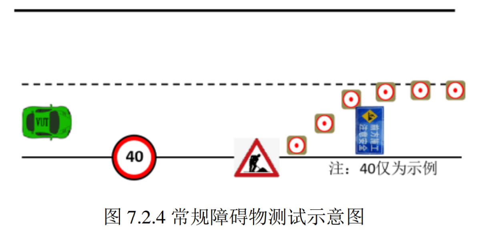
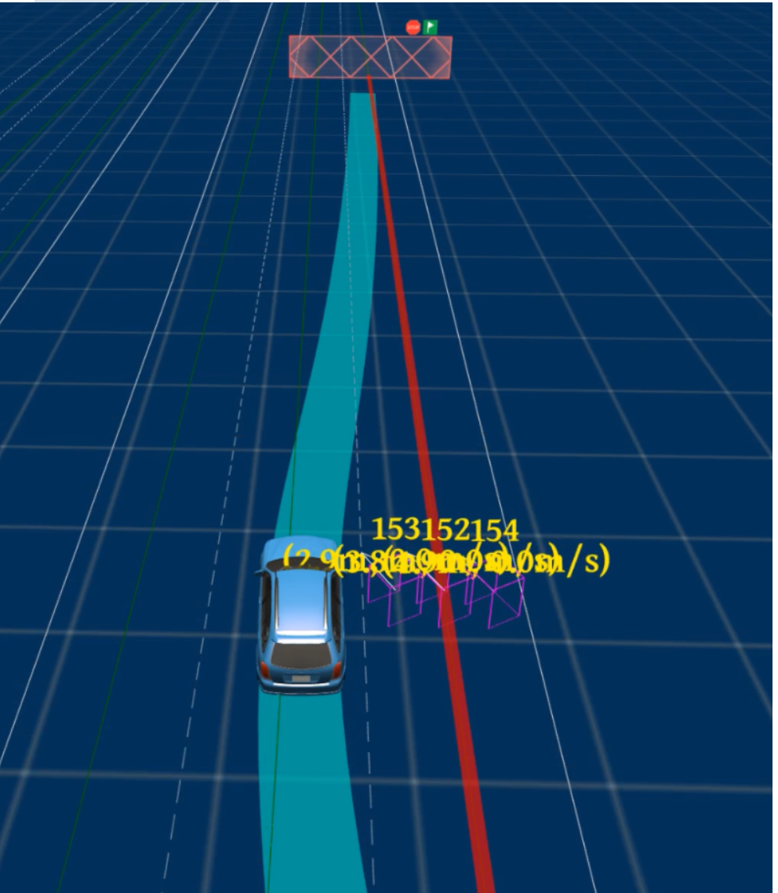
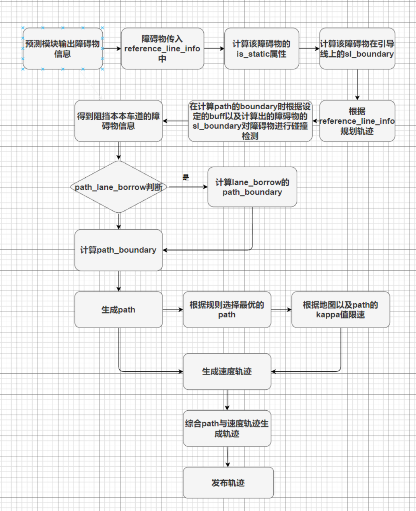
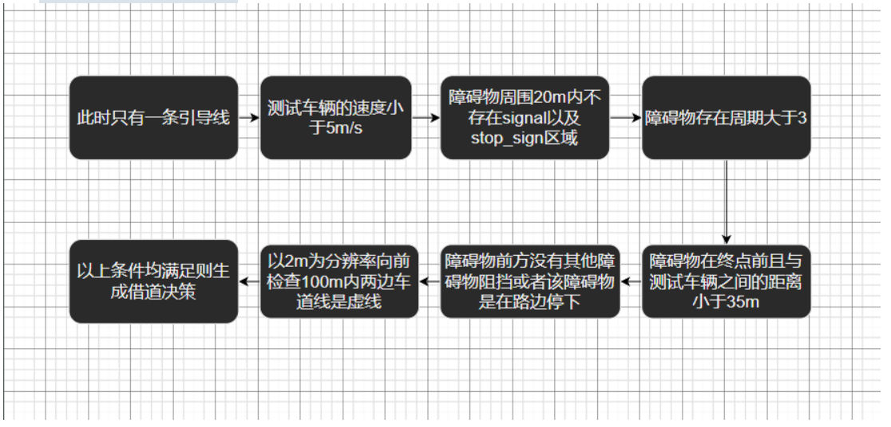
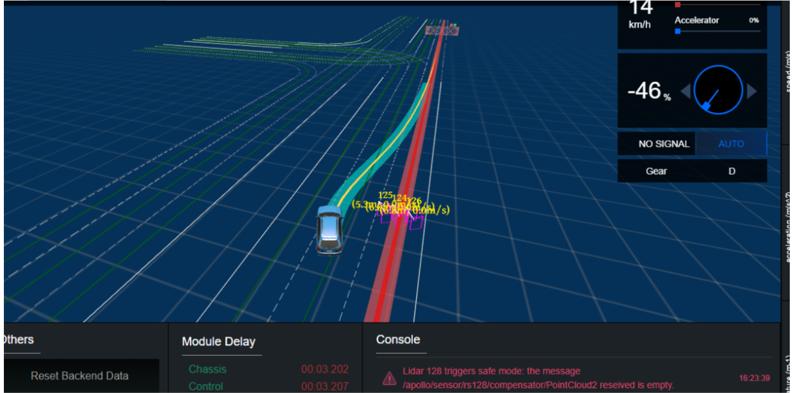
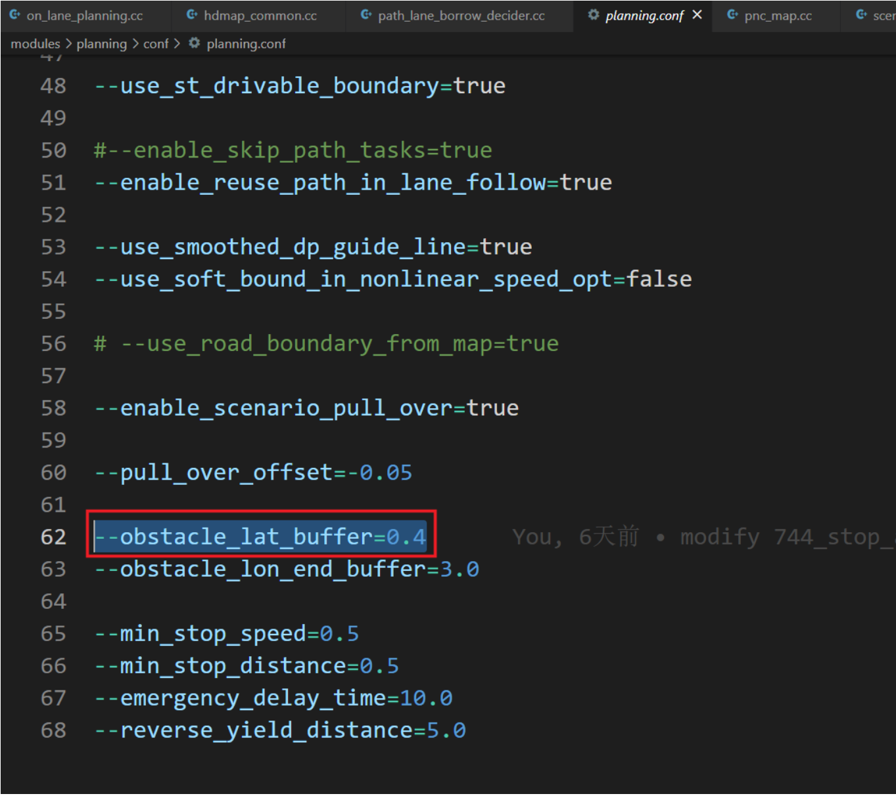
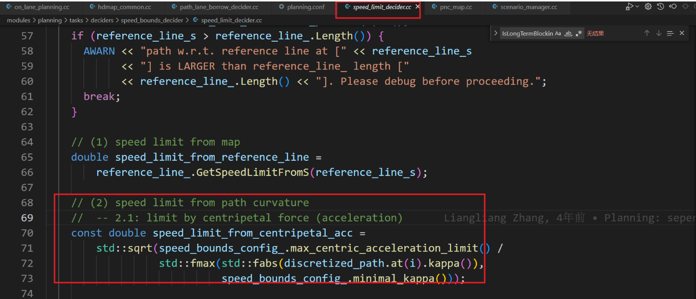
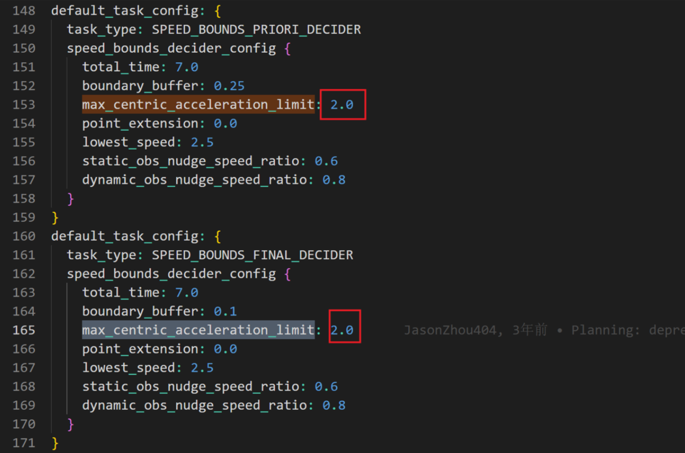

724常规障碍物测试技术文档

| 版本   | 日期       | 作者   | 备注                  |
| ------ | ---------- | ------ | --------------------- |
| V1.0.0 | 2022.09.15 | 庞明慧 | 724常规障碍物技术文档 |

[toc]

# 724场景描述

测试道路为至少包含两条车道的长直道，中间车道线为白色虚线。在车道内依据道路养护作业的交通控制要求摆放锥形交通路标及交通标志。
如下图所示：

# 通过要求

## 通过方式一

若是测试车辆不具备换道行驶功能，则测试车辆应该在本车道内停止且不与障碍物发生碰撞，在车减速时或者**车辆静止后`15s`内发出超出设计运行范围提示信息**。

## 通过方式二

若测试车辆具备换道行驶功能，则测试车辆应该采用**变更车道**绕行方式通过该场景。

# 方案选择

我们的测试车辆具备换道功能（代码中为borrow_lane）,因为采用变更车道绕行方式通过该场景。如下图所示：

# 技术流程

**724场景技术流程如下图所示：**

**path_lane_borrow触发条件：**

# 在`hil_scenario`测试时遇到的问题以及解决办法

## 遇到的问题

### 问题的现象

在进行`hil_scenario`测试724常规障碍物场景时，测试车辆对前方出现的障碍物的策略是绕道决策，但是在绕道时出现了绕道范围过大的现象，测试车辆绕道时超出旁边车道线，进入第三条车道线，且借道过程不平稳。如下图所示：

### 问题诱因

在仿真场景中测试724常规障碍物场景时，测试车辆在遇到障碍物进行绕道决策时会比较靠近障碍物，为安全考虑在仿真中将障碍物的横向膨胀buff加大

修改位置：`planning.conf`

**之前值为0.4，修改到了1.0**，这样的修改后在仿真环境中效果较好，能够在绕道的同时远离障碍物。

### 问题核心原因

但是在实际测试中,横向buff加大后导致规划轨迹的kappa值加大（具体分析见[issue31](https://gitlab.quyan.info/autocar/apollo/-/issues/31)），使控制模块较难跟踪，且在借道过程中由于path前方无障碍物阻挡因此会生成一个加速的speed轨迹，综合以上因素导致控制模块跟踪较难，跟踪误差较大，轨迹重规划，使测试车辆超出车道。

## 解决方法

### 解决办法一

将之前修改的横向膨胀buff值改回0.4

### 解决办法二

在速度规划模块中，可以根据path的kappa值对速度轨迹进行限速，但是之前的kappa对速度的约束较小，因此加大该约束。

速度规划限速约束代码如下：

**初始时该值为2.0，限速约束较小，将其修改为0.5**

# 目前状态

[解决办法一](# 解决办法一)已经通过测试，但是借道时车靠近外侧，有出线的风险，需要调优(调优方案：解决方法二)

[解决方法二](# 解决方法二)，代码修改完毕，仿真测试通过，需要实车测试验收。