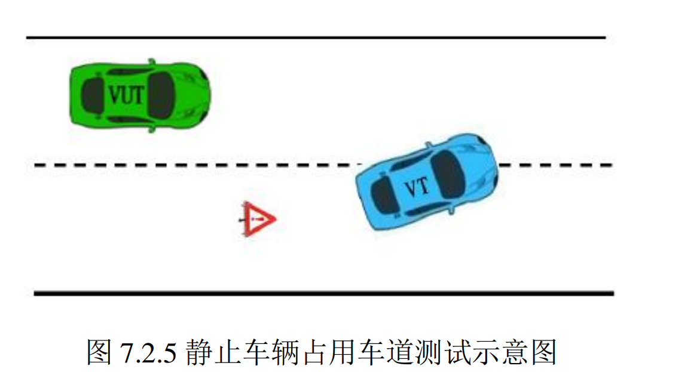
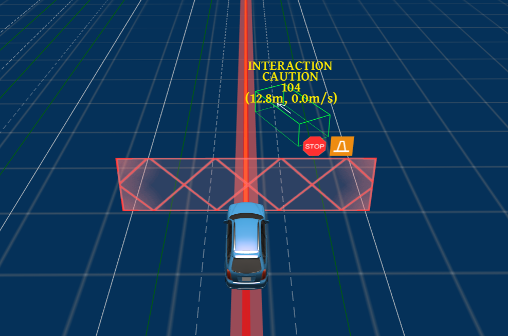
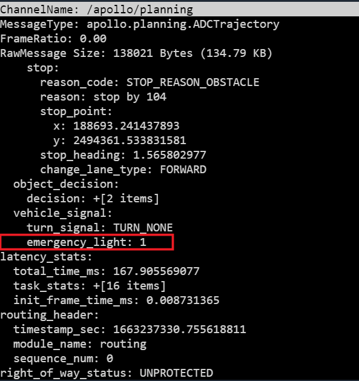
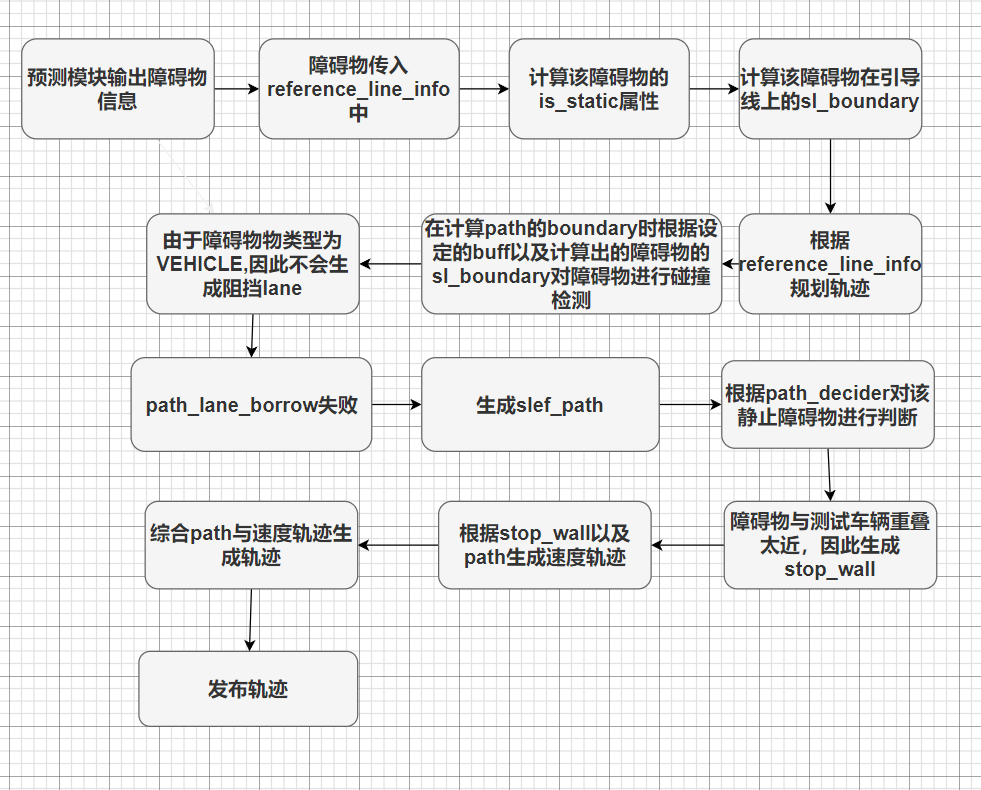

725静止车辆占用车道测试技术文档

| 版本   | 日期       | 作者   | 备注                            |
| ------ | ---------- | ------ | ------------------------------- |
| V1.0.0 | 2022.09.15 | 庞明慧 | 725静止车辆占用车道测试技术文档 |

[toc]

# 725场景描述

测试道路为包含两条行车道的长直道，中间车道线为白色虚线。在右侧车道存在静止目 标车辆且目标车辆占用测试车辆行驶车道横向距离为 1 m-1.2 m，目标车辆与中间车道线夹 角不大于 30°。如下图所示：

# 通过要求

* 测试车辆**不与目标车辆发生碰撞**；
* 若测试车辆停止与本车道内，在车辆减速时或者**车辆静止后`15s`内应发出超出设计运行范围的提示。**

# 通过方案

本场景通过方案只有一种，即测试车辆在目标车辆前6m左右停下，并在停下9s左右发出人工接管信号，表现为接管灯闪烁，在channel中为：

`emergency_light : 1`

如下图所示：
![image-20220915182036243](725静止车辆占用车道技术文档.assets/image-20220915182036243.png

# 技术流程

**725场景技术流程如下图所示：**

# 目前状态

实测已经通过验收。