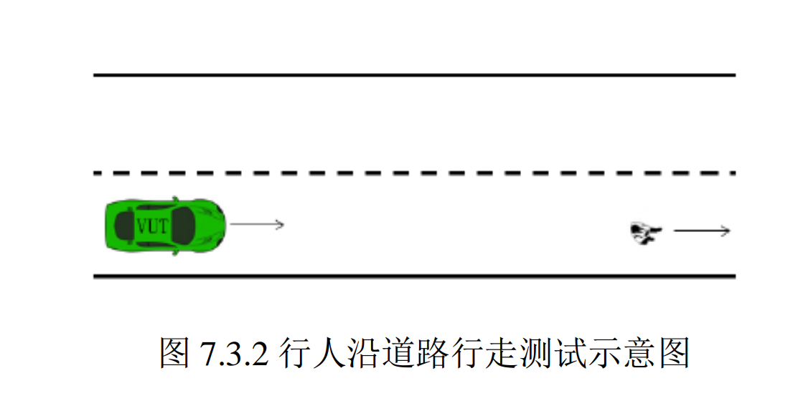
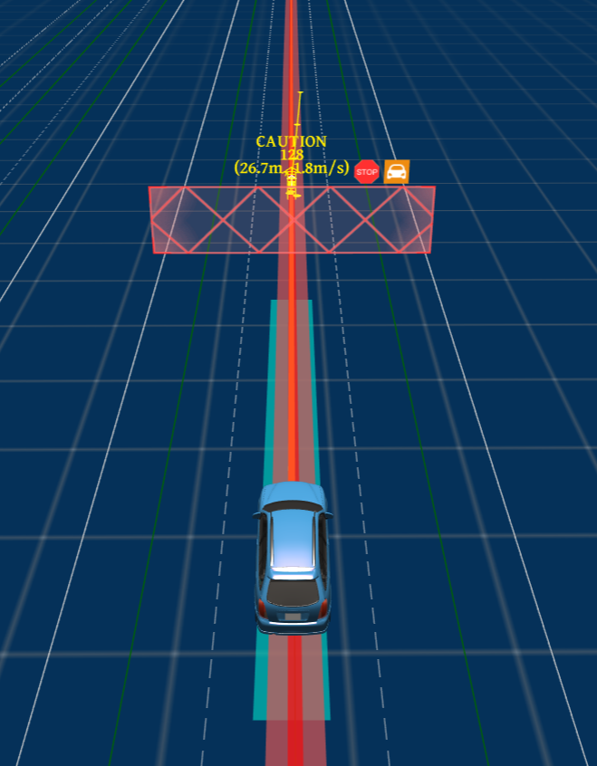

732行人沿道路行走测试技术文档

| 版本   | 日期       | 作者   | 备注                          |
| ------ | ---------- | ------ | ----------------------------- |
| V1.0.0 | 2022.09.15 | 庞明慧 | 732行人沿道路行走测试技术文档 |

[toc]

# 732场景描述

测试道路为至少包含两条车道的长直道，中间车道线为白色虚线。行人以 5km/h 至 6.5km/h 的速度于距离本车道右侧车道线内侧 1m 至 2.5m 范围内沿道路行走。如下图所示：

# 通过要求

## 通过要求一

**若采用跟随的方式通过该场景，测试车辆应不与行人发生碰撞，并在行人离开本车道后加速行驶**。跟随过程中，车辆可发出超出设计运行范围的提示信息，当发出提示信息后，测试车辆在行人离开本车道后不可执行加速行驶。

## 通过要求二

若采用绕行的方式通过该场景，**测试车辆应完成超越且不与行人发生碰撞。**

# 通过方案

本场景选择跟随的方式通过，具体表现为：首先车会以低速的方式跟随行人，当行人离开本车道后，测试车辆加速行驶。过程如下所示：

# 技术流程

## 决策流程图

针对行人是否生成stop_wall的决策：

## 决策具体分析

* 行人在行走时，预测模块将其认为是动态障碍物，对于动态障碍物，path模块不进行考虑;
* 在速度规划模找中首先是st_bounds_decider的处理，根据行人预测的轨迹与生成的path计算两者的相交处，作为st_boundary
* 在生成st_boundary后，由于障碍物为行人，因此在speed_decider中会针对行人生成stop_wall
  **注：当动态障碍物为行人时，一定会生成停车决策**
* 生成停车决策后，speed_bound_decider会根据该决策信息生成一个st_bound,根据该bound优化速度轨迹。如下图所示：
  

# 目前状态

实测已经通过验收。