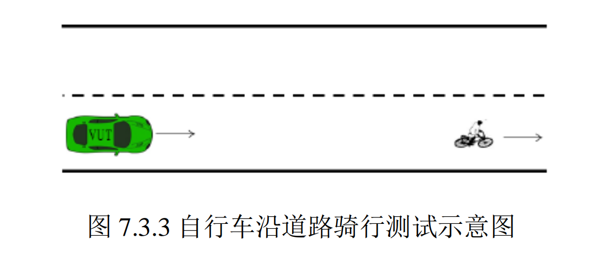

733自行车沿道路行走测试技术文档

| 版本   | 日期       | 作者   | 备注                            |
| ------ | ---------- | ------ | ------------------------------- |
| V1.0.0 | 2022.09.15 | 庞明慧 | 733自行车沿道路行走测试技术文档 |

[toc]

# 733场景描述

测试道路为至少包含两条车道的长直道且中间车道线为虚线。自行车以 10km/h 至 20km/h 之间任意速度于距离本车道右侧车道线内侧 1m 至 2.5m 范围内沿道路骑行。如下图所示：

# 通过要求

## 测试方法

测试车辆在车道内驶向自行车。若跟随自行车行驶，当测试车辆速度不大于 20km/h 持 续时间超过 3s 后，自行车从车道右侧离开当前车道。进行 3 次测试。

## 通过要求一

若采用跟随方式通过该场景，测试车辆应不与自行车发生碰撞，并在自行车离开本 车道后加速行驶。跟随过程中，车辆可发出超出设计运行范围的提示信息，当发出提示信息 后，测试车辆在自行车离开本车道后可不执行加速行驶。

## 通过要求二

若采用绕行方式通过该场景，**测试车辆应完成超越且不与自行车发生碰撞。**

# 通过方案

本场景选择跟随的方式通过，具体表现为：首先车会以低速的方式跟随自行车，当自行车离开本车道后，测试车辆加速行驶。过程如下所示：

# 技术流程

## 决策流程图

跟随判断决策：

## 决策具体分析

* 自行车在行走时，预测模块将其认为是动态障碍物，对于动态障碍物，path模块不进行考虑;
* 在速度规划模找中首先是st_bounds_decider的处理，根据自行车预测的轨迹与生成的path计算两者的相交处，作为st_boundary；
* 在speed_decider中判断根据自行车与测试车辆的位置判断是否满足自行车follow条件，若是满足则生成follow决策；
* 生成停车决策后，speed_bound_decider会根据该决策信息生成一个st_bound,根据该bound优化速度轨迹。如下图所示：
  

# 目前状态

实测已经通过验收。