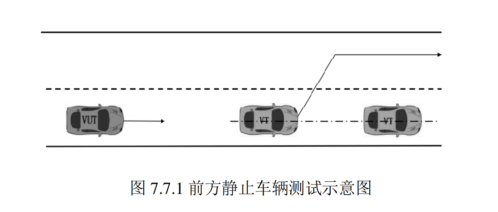
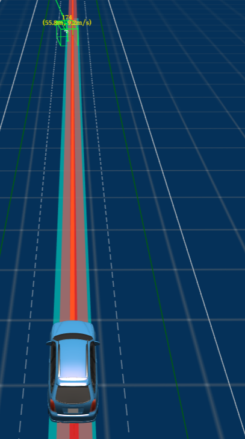
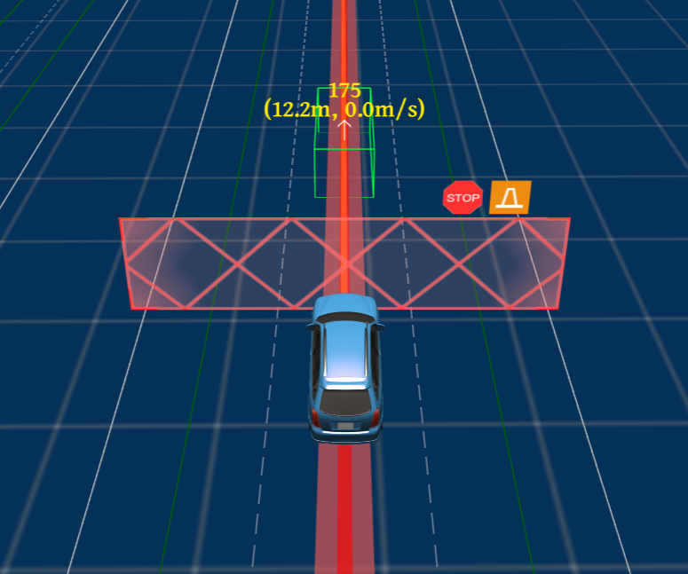
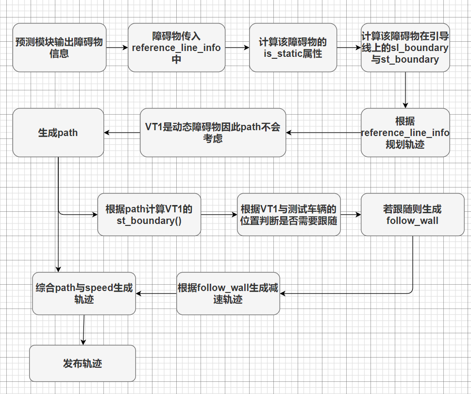
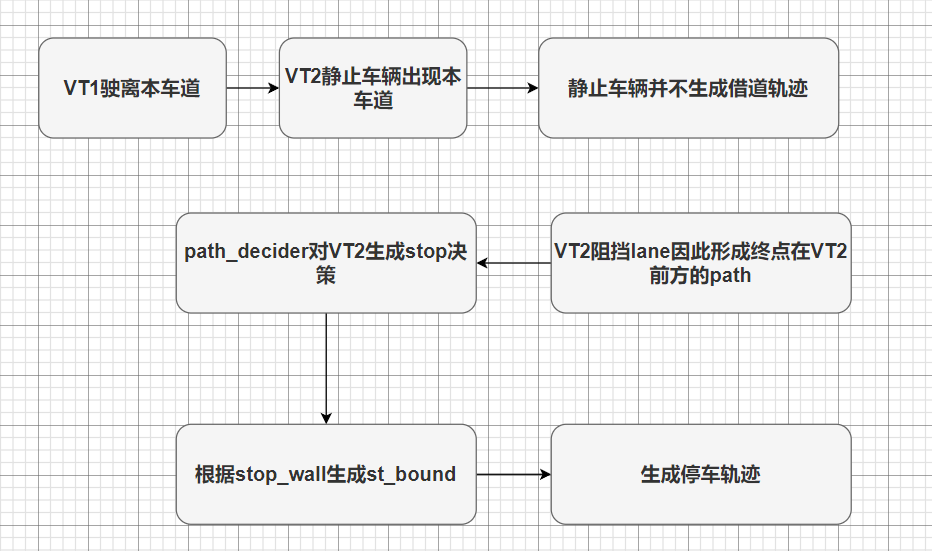

771前方静止车辆测试技术文档

| 版本   | 日期       | 作者   | 备注                        |
| ------ | ---------- | ------ | --------------------------- |
| V1.0.0 | 2022.09.15 | 庞明慧 | 771前方静止车辆测试技术文档 |

[toc]

# 771场景描述

测试道路为至少包含两条车道的长直道，中间车道线为白色虚线。相同车道内存在两辆 目标车辆（VT1 和 VT2），其中 VT1 以预设速度驶向静止状态 VT2，两辆目标车辆的中心 线偏差不超过 0.5m。如下图所示：

# 通过要求

## 测试方法

测试车辆在自动驾驶模式下稳定跟随 VT1 在相同车道内行驶，VT1 以 40±2km/h 的速 度驶向 VT2，当 VT1 距离 VT2 预计碰撞时间到达 4s 时 VT1 从本车道切出至相邻车道，完 成换道时间小于 3s。进行 3 次测试。

## 通过要求

测试车辆不应与静止目标车辆 VT2 发生碰撞。

# 通过方案

本场景先选择跟随的方式跟随VT1车辆，当VT1车辆驶离后，VT2车辆出现。测试车辆会在VT2车前停车。过程如下所示：

# 技术流程

## 决策流程图

VT1在测试车辆前方行驶决策：

VT1驶离车道，VT2静止车辆出现决策

## 决策具体分析

* 首先VT1在测试车辆前方行驶，此时生成跟随决策，因此测试车辆会跟随前方VT1车辆行驶；
* 当VT1驶离本车道时，前方出现VT2静止车辆，此时场景为前方出现静态障碍物；
* 由于该障碍物类型为VEHICLE,因此不会生成借道决策，因此在path_decider中形成stop决策，并生成stop_wall；
* speed_bound_decider根据stop_wall生成st_bound，根据该bound优化速度轨迹，生成停车轨迹。

# 目前状态

实测已经通过验收。