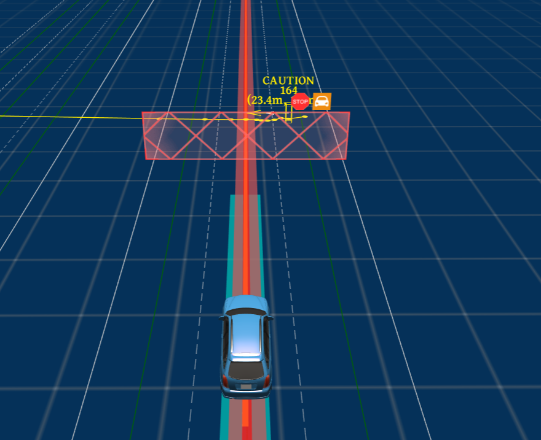

773行人横穿马路测试技术文档

| 版本   | 日期       | 作者   | 备注                        |
| ------ | ---------- | ------ | --------------------------- |
| V1.0.0 | 2022.09.15 | 庞明慧 | 773行人横穿马路测试技术文档 |

[toc]

# 773场景描述

测试车道为至少包含一条车道的长直道，存在行人横穿测试道路。若测试车辆最高设计 运行速度大于等于 60km/h 该路段限速 60km/h；若车辆最高设计运行速度小于 40km/h 该路 段限速 40km/h。如下图所示：

# 通过要求

## 测试方法

测试车辆在第二条车道内行驶。当测试车辆首次预碰撞位置时间为 4.5s 后 1s 内，行人 自测试车辆左侧以 6.5km/h 速度横穿道路并停止于道路中间，待车辆静止后继续行走通过该 路口。进行 3 次测试。

## 通过要求一

测试车辆不应与行人发生碰撞。

# 通过方案

本场景选择的方案是当行人开始出现且在7s内与测试车辆path发生交集时，测试车辆逐渐减速，当行人在路中停下时，测试车辆在行人前停车。如下图所示：

# 技术流程

## 决策流程图

决策流程图与733场景类似，当行人停下时有微小差别。如下所示：
行人行走时：

行人在路中停下时：

## 决策具体分析

* 行人在行走时，预测模块将其认为是动态障碍物，对于动态障碍物，path模块不进行考虑;
* 在速度规划模找中首先是st_bounds_decider的处理，根据行人预测的轨迹与生成的path计算两者的相交处，作为st_boundary；
* 在speed_decider中针对行人生成stop_wall；
* 当行人停下来时，行人为静态障碍物，此时需要在path中考虑，在path_decider中生成stop决策；
* 在speed_bound_decider中根据stop_决策生成st_bound，生成减速轨迹，逐渐停车。

# 遇到的问题

## 测试车辆会与行人相撞

### 原因

1. 当行人出现在道路中时，行人的is_static=1,规划模块认定其为静态障碍物，但是此时行人并没有出现在测试车所在车道，因此规划模块判定此时行人不会与测试车发生碰撞，因此不会产生停车现象；
2. 当行人出现在测试车所在车道并停下时，两者距离太近，此时测试车辆速度为10m/s，两者距离已经不够停车；

### 解决措施

目前该种情况只有重新启动预测模块时会发生，因此在实测时先跑一遍，第二遍即不会发生，核心解决方法正在讨论。

## 测试车辆会选择绕道

初 始 时 测 试 车 与 行 人 之 间 距 离 60m,开 启 自 动 驾 驶 模 式 ， 测 试 车 逐 渐 加 速 到 巡 航 速 度 (10m/s)； 当 两 者 之 间 的 距 离 为 36m时 行 人 开 始 有 初 速 度 （ 0.4m/s） 但 是 此 时 行 人 轨 迹 并 没 有 生 成 ;当 行 人 速 度 达 到 1.5m/s时 ， 行 人 轨 迹 出 现 ， 此 时 两 者 距 离 为 25m;此 时 规 划 开 始 构 建 虚 拟 stop-wall,测 试 车 开 始 减 速 ； 当 行 人 在 车 道 线 中 停 止 时 ， 测 试 车 选 择 向 旁 边 车 道 绕 行 ， 继 续 行 驶 。   

### 原因

预 测 模 块 发 出 的 行 人 障 碍 物 的 属 性 中 ： is_static == 1,因 此 apollo系 统 会 将 行 人 看 做 时 静 态 障 碍 物 ，  由 此 满 足 以 上 借 道 条 件 ， 因 此 会 产 生 借 道 的 决 策 。

### 解决措施

将 对 行 人 的 规 划 策 略 迁 移 到 速 度 规 划 中 ， 在 针 对 障 碍 物 调 整 path_boundary时 ， 若 是 该 障 碍 物 type是 行 人 (pedestrian),则 不 对 该 障 碍 物 进 行 处 理 ， 因 此 在 path_borrow_decide中 不 会 对 行 人 实 行 借 道 处 理 。 

# 目前状态

[问题1](# 测试车辆会与行人相撞)还未解决

[问题2](# 测试车辆会选择绕道)已解决并实测通过