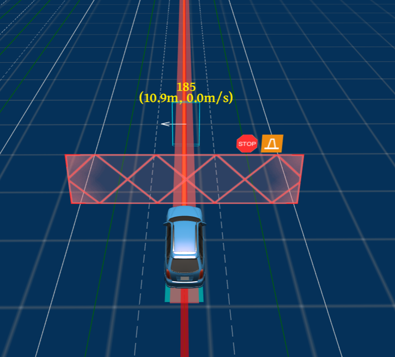

774自行车横穿马路测试技术文档

| 版本   | 日期       | 作者   | 备注                          |
| ------ | ---------- | ------ | ----------------------------- |
| V1.0.0 | 2022.09.15 | 庞明慧 | 774自行车横穿马路测试技术文档 |

[toc]

# 774场景描述

测试车道为至少包含一条车道的长直道，存在行人横穿测试道路。若测试车辆最高设计 运行速度大于等于 60km/h，该路段限速 60km/h；若车辆最高设计运行速度小于 40km/h，该 路段限速 40km/h。如下图所示：

# 通过要求

## 测试方法

测试车辆在第二条车道内行驶。当测试车辆首次距离预计碰撞时间达到 4s 后 1s 内，两 轮车自测试车辆左侧以 14km/h-16km/h 速度横穿马路并停止于测试车辆行驶车道中间，待车 辆静止后两轮车继续通过该路口。进行 3 次测试

## 通过要求

测试车辆不应与自行车发生碰撞。

# 通过方案

本场景选择的方案是当行人开始出现且在7s内与测试车辆path发生交集时，测试车辆逐渐减速，当行人在路中停下时，测试车辆在行人前停车。如下图所示：

# 技术流程

## 决策流程图

自行车行走时：

自行车在路中停下时：

## 决策具体分析

* 自行车在行走时，预测模块将其认为是动态障碍物，对于动态障碍物，path模块不进行考虑;
* 在速度规划模找中首先是st_bounds_decider的处理，根据自行车预测的轨迹与生成的path计算两者的相交处，作为st_boundary；
* 在speed_decider中根据自行车与测试车辆的位置形成follow决策；
* 当自行车停下来时，自行车为静态障碍物，此时需要在path中考虑，在path_decider中生成stop决策；
* 在speed_bound_decider中根据stop_决策生成st_bound，生成减速轨迹，逐渐停车。

# 目前状态

实测通过