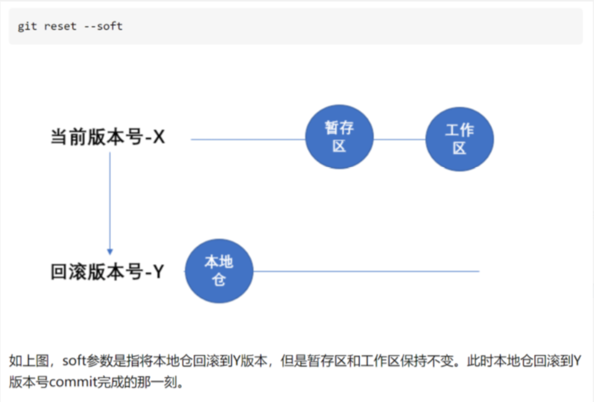
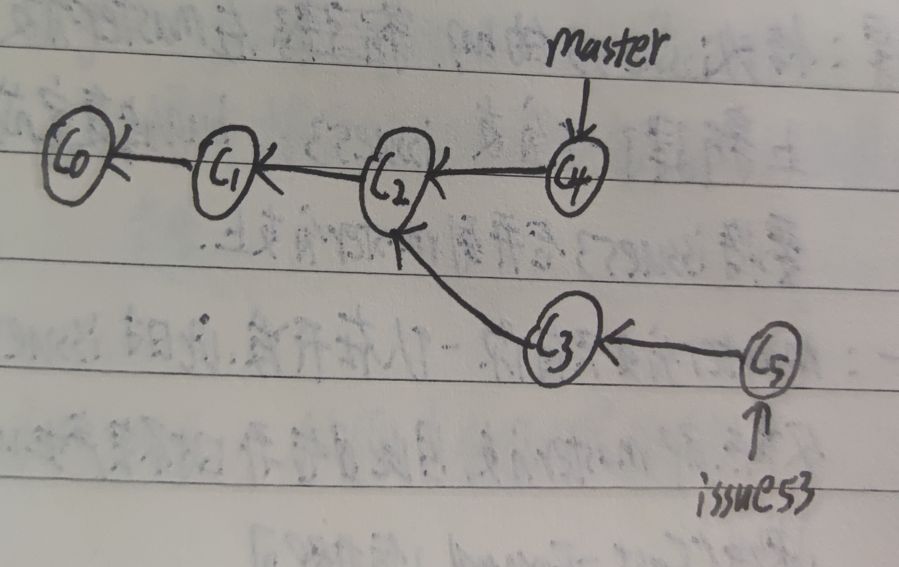

<center><span style="font-size:2rem;font-weight:bold;">git学习笔记</span></center>

<div style="page-break-after: always;"></div>

[toc]

<div style="page-break-after: always;"></div>

# git介绍

介绍git前需要先引入版本控制系统的定义，因为git 就是一个非常方便快捷的分布式版本控制系统

## 版本控制

版本控制是一种记录一个或若干文件内容变化，以便将来查阅特定版本修订情况的系统。

### 本地版本控制系统

许多人习惯用复制整个项目目录的方式来保存不同的版本，或许还会改名加上备份时间以示区别。 这么做唯一 的好处就是简单，但是特别容易犯错。 有时候会混淆所在的工作目录，一不小心会写错文件或者覆盖意想外的 文件。

为了解决这个问题，人们很久以前就开发了许多种本地版本控制系统，大多都是采用某种简单的数据库来记录文 件的历次更新差异。

其中最流行的一种叫做 RCS，现今许多计算机系统上都还看得到它的踪影。 甚至在流行的 Mac OS X 系统上安装 了开发者工具包之后，也可以使用 rcs 命令。 它的**工作原理是在硬盘上保存补丁集（补丁是指文件修订前后的 变化）；通过应用所有的补丁，可以重新计算出各个版本的文件内容。**

### 集中化的版本控制系统

接下来人们又遇到一个问题，如何让在不同系统上的开发者协同工作？ 

于是，集中化的版本控制系统 （Centralized Version Control Systems，简称 CVCS）应运而生。 

这类系统，诸如 CVS、Subversion 以及 Perforce 等，都有一个单一的集中管理的服务器，保存所有文件的修订版本，而协同工作的人们都通过客户端 连到这台服务器，取出最新的文件或者提交更新。 

多年以来，这已成为版本控制系统的标准做法。

这种做法带来了许多好处，特别是相较于老式的本地 VCS 来说。 现在，每个人都可以在一定程度上看到项目中 的其他人正在做些什么。 而管理员也可以轻松掌控每个开发者的权限，并且管理一个 CVCS 要远比在各个客户端 上维护本地数据库来得轻松容易。 事分两面，有好有坏。 这么做最显而易见的缺点是中央服务器的单点故障。 如果宕机一小时，那么在这一小时 内，谁都无法提交更新，也就无法协同工作。 如果中心数据库所在的磁盘发生损坏，又没有做恰当备份，毫无 疑问你将丢失所有数据——包括项目的整个变更历史，只剩下人们在各自机器上保留的单独快照。 本地版本控制 系统也存在类似问题，只要整个项目的历史记录被保存在单一位置，就有丢失所有历史更新记录的风险。

### 分布式版本控制系统

于是分布式版本控制系统（Distributed Version Control System，简称 DVCS）面世了。 在这类系统中，像 Git、Mercurial、Bazaar 以及 Darcs 等，客户端并不只提取最新版本的文件快照，而是把代码仓库完整地镜像 下来。 这么一来，任何一处协同工作用的服务器发生故障，事后都可以用任何一个镜像出来的本地仓库恢复。 因为每一次的克隆操作，实际上都是一次对代码仓库的完整备份。

更进一步，许多这类系统都可以指定和若干不同的远端代码仓库进行交互。籍此，你就可以在同一个项目中，分 别和不同工作小组的人相互协作。 你可以根据需要设定不同的协作流程，比如层次模型式的工作流，而这在以 前的集中式系统中是无法实现的。

## Git介绍

Git 和其它版本控制系统（包括 Subversion 和近似工具）的主要差别在于 Git 对待数据的方法。 

概念上来区分，其它大部分系统以文件变更列表的方式存储信息。 这类系统（CVS、Subversion、Perforce、Bazaar 等 等）将它们保存的信息看作是一组基本文件和每个文件随时间逐步累积的差异。

Git 更像是把数据看作是对小型文件系统的一组快照。 每次你提交 更新，或在 Git 中保存项目状态时，它主要对当时的全部文件制作一个快照并保存这个快照的索引。

## git的三种状态

Git 有三种状态，你的文件可能处 于其中之一：

* 已提交（committed）
* 已修改（modified）
* 已暂存（staged ）。

**已提交表示数据已经安全的 保存在本地数据库中**。

 **已修改表示修改了文件，但还没保存到数据库中**。 

**已暂存表示对一个已修改文件的当前 版本做了标记，使之包含在下次提交的快照中**。

## git 的三个工作区域

由此引入 Git 项目的三个工作区域的概念：**Git 仓库、工作目录以及暂存区域**。

   

Git 仓库目录是 Git 用来保存项目的元数据和对象数据库的地方。 这是 Git 中最重要的部分，从其它计算机克隆 仓库时，拷贝的就是这里的数据。 

工作目录是对项目的某个版本独立提取出来的内容。 这些从 Git 仓库的压缩数据库中提取出来的文件，放在磁盘 上供你使用或修改。 

暂存区域是一个文件，保存了下次将提交的文件列表信息，一般在 Git 仓库目录中。 有时候也被称作`‘索 引’'，不过一般说法还是叫暂存区域。

## 基础工作流程

1. 在工作目录中修改文件。

2. 暂存文件，将文件的快照放入暂存区域。
3. 提交更新，找到暂存区域的文件，将快照永久性存储到 Git 仓库目录。

# git安装

## linux下安装

linux 一般会自动安装，若是没有自动安装则运行以下命令即可

```BASH
sudo apt-get install git
```

## windows下安装

在 Windows 上安装 Git 也有几种安装方法。 

官方版本可以在 Git 官方网站下载。 打开 http://git-scm.com/ download/win，下载会自动开始。 要注意这是一个名为 Git for Windows的项目（也叫做 msysGit），和 Git 是分别独立的项目；

更多信息请访问 http://msysgit.github.io/。

 另一个简单的方法是安装 GitHub for Windows。 该安装程序包含图形化和命令行版本的 Git。 它也能支持 Powershell，提供了稳定的凭证缓存和健全的 CRLF 设置。 稍后我们会对这方面有更多了解，现在只要一句话 就够了，这些都是你所需要的。

 你可以在 GitHub for Windows 网站下载，网址为 http://windows.github.com。

# git基础命令

## git配置

### 配置用户名与邮箱

```BASH	
git config --global user.name "John Doe"
git config --global user.email johndoe@example.co
```

### 配置文本编辑器

配置默认文本编辑器了，当 Git 需要你输入信息时会调用它。 如果未配 置，Git 会使用操作系统默认的文本编辑器，通常是 Vim。 如果你想使用不同的文本编辑器，例如 Emacs，可以 这样做：

```BASH
git config --global core.editor emac
git config --global core.editor vim
```

### 检查配置信息

```C++
git config --list
```

## 获取git仓库

获取一个git仓库有两种方法，第一种是自己在本地创建一个git仓库，第二种是在远程服务器(github,gitlab,gitee等开源托管服务器)上下载一个仓库

### 本地创建

```BASH
首先进入项目目录
打开git bash
git init
```

### 克隆现有仓库

```BASH
 git clone https://github.com/libgit2/libgit2              # 注意后面网址为仓库地址
 git clone https://github.com/libgit2/libgit2 mylibgit        #自定义本地仓库名称
```

## 查看当前仓库文件状态

```BASH 
git status
git status -s  
 M README       //出现在右边的 M 表示该文件被修改了但是还没放入暂存区
MM Rakefile     //在工作区被修改并提交到暂存区后又在工作区中被修改了
A lib/git.rb   //新添加到暂存区中的文件前面有 A 标记
M lib/simplegit.rb   //出现在靠左 边的 M 表示该文件被修改了并放入了暂存区
?? LICENSE.txt   //新添加的未跟踪文件前面有 ?? 标记
```

## 暂存文件

若是你已经对一个文件修改完成，要将其放置暂存区，则使用以下命令

```BASH 
git add filename
```

## 提交文件

当你将最新版本已经修改完成时，需要将其提交到git仓库中，则使用以下命令

```BASH 
git commit -m "添加此次提交的说明"
git commit -a -m "添加此次提交的说明"    #加上-a，则可以省略git add命令
git commit --amend -m "添加此次提交的说明"          #如果在以此提交后仍有修改，则可以在此次提交时加上--amend命令，将两次提交合并为以此提交
```

## 忽略文件

一般我们总会有些文件无需纳入 Git 的管理，也不希望它们总出现在未跟踪文件列表。 通常都是些自动生成的文 件，比如日志文件，或者编译过程中创建的临时文件等。 在这种情况下，我们可以创建一个名为 .gitignore 的文件，列出要忽略的文件模式。 来看一个实际的例子：

```BASH 
$ cat .gitignore
*.[oa]
*~
```

第一行告诉 Git 忽略所有以 .o 或 .a 结尾的文件。一般这类对象文件和存档文件都是编译过程中出现的。 第二 行告诉 Git 忽略所有以波浪符（~）结尾的文件，许多文本编辑软件（比如 Emacs）都用这样的文件名保存副 本。 此外，你可能还需要忽略 log，tmp 或者 pid 目录，以及自动生成的文档等等。 要养成一开始就设置好 .gitignore 文件的习惯，以免将来误提交这类无用的文件。

 文件 .gitignore 的格式规范如下： 

*  所有空行或者以 ＃ 开头的行都会被 Git 忽略。 •
*  可以使用标准的 glob 模式匹配。 • 
* 匹配模式可以以（/）开头防止递归。 •
*  匹配模式可以以（/）结尾指定目录。 •
*  要忽略指定模式以外的文件或目录，可以在模式前加上惊叹号（!）取反。 

所谓的 glob 模式是指 shell 所使用的简化了的正则表达式。 星号（*）匹配零个或多个任意字符；*

[abc] 匹配 25 任何一个列在方括号中的字符（这个例子要么匹配一个 a，要么匹配一个 b，要么匹配一个 c）；

*问号（? ）只匹配一个任意字符；

*如果在方括号中使用短划线分隔两个字符，表示所有在这两个字符范围内的都可以匹配 （比如 [0-9] 表示匹配所有 0 到 9 的数字）。 

*使用两个星号（**) 表示匹配任意中间目录，比如`a/**/z` 可以匹 配 a/z, a/b/z 或 `a/b/c/z`等。

例子

```BASH
# no .a files
*.a
# but do track lib.a, even though you're ignoring .a files above
!lib.a
# only ignore the TODO file in the current directory, not subdir/TODO
/TODO
# ignore all files in the build/ directory
build/
# ignore doc/notes.txt, but not doc/server/arch.txt
doc/*.txt
# ignore all .pdf files in the doc/ directory
doc/**/*.pd
```

## 查看提交历史

在提交了若干更新，又或者克隆了某个项目之后，你也许想回顾下提交历史。 完成这个任务最简单而又有效的 工具是 git log 命令。默认不用任何参数的话，git log 会按提交时间列出所有的更新，最近的更新排在最上面。

```BASH
git log                          #git log 会按提交时间列出所有的更新，最近的更新排在最上面
git log -p -2                    #用来显示每次提交的内容差异。 你也可以加上 -2 来仅显示最近两次提交
git log --stat                   # 想看到每次提交的简略的统计信息，你可以使用 --stat 选项：
git log --pretty=oneline         #这个选项可以指定使用不同于默认格式的方式展示提交历史。 这个选项有 一些内建的子选项供你使用。 比如用 oneline 将每个提交放在一行显示，查看的提交数很大时非常有用。另外 还有 short，full 和 fuller 可以用，展示的信息或多或少有些不同。
git reflog                       #查看命令历史，确定要回到未来的哪个版本中去（主要用于误回退的撤销操作）
```

## git diff命令的使用

git diff命令用来比较文件的不同，一般用来**比较文件在暂存区和工作区的差异**

### 查看工作区和版本库里最新版本的文件的区别

```BASH
git diff HEAD --readme.txt                       # 表示只查看readme.txt文件的区别
```

### 查看暂存区和工作区的差异

```BASH
git diff file
```

### 显示暂存区和上一次提交(commit)的差异

```BASH
git diff --cached file
或者：
git diff --stage file
```

### 显示两次分支之间的差异

```BASH
git diff first_branch second_branch
```

## git reset命令

版本回退命令

### git reset --soft commit_id

将本地仓库回滚到该commit_id所处的状态，但是工作区和暂存区内容会保留。

```BASH
git reset --soft commit_id
```

   

### git reset --mixed commit_id 或者 git reset commit_id

mixed是默认参数，因此加上--mixed与git reset命令意义一致。将本地仓库，暂存区都回滚到commit_id版本，工作区域保持不变。

  

### git reset --hard commit_id

将本地仓库，工作区，暂存区全部回滚到commit_id版本

  

### 例子

在版本回滚时，不仅可以使用commit_id来回滚也可以使用HEAD指向之前的几个版本。

将某个文件回滚到之前的版本

```BASH
git reset HEAD^ hello.cpp 
git reset HEAD~1 hello.cpp 
git reset commit_id hello.cpp
```

HEAD详解

HEAD 表示当前版本

HEAD^ 上一个版本

HEAD^^ 上上一个版本

以此类推

也可以使用~ + 数字表示

HEAD~0 表示当前版本

HEAD~1 上一个版本

HEAD~2 上上一个版本以此类推

## git revert命令

git revert命令作用与git reset相同，都是将版本回滚到指定的commit_id，

但是与gitset删除其余的commit_id的做法不同的是，git revert会生成一个新的commit_id(回滚版本) ，这样操作不会影响之前的提交，对多人工作流比较友好，且在恢复的时候不需要用到git reflog 命令查看了。

## git clean 命令

### 参数详解

```BASH
-n :显示将要被删除的文件（即删除预演）
-d :删除未被添加到git仓库中文件(目录）
-f :强制运行，（文件）
-x :删除没有被track的文件（包括.gitignore中标记的文件也会全部删除）
```

### 实例

```BASH
git clean -n               //显示将要被删除的文件
git clean -f               //删除当前目录下所有没被track的文件（不包括.gitignore中的）
git clean -f <path>        //删除指定路径下没有被track的文件
git clean -df              //删除当前目录下没有被track过的文件和文件夹
git clean -xf              //删除当前目录下所有没有被track的文件（包括.gitignore中的）
git clean
```

## git rm命令

若是将版本库中的某个文件从当前的工作区中删除了，则有两个选择：

* 确实需要从版本库中删除该文件，则利用git rm 命令将文件删掉，之后提交 git commit

```BASH
git rm test.txt 
git commit -m "rm"
```

* 另一种情况是删错了，需要恢复，则利用git checkout命令进行恢复操作

```BASH
git checkout --test.txt
```

git checkout 命令实质上是用版本库里的版本替换工作区的版本

## 远程库

远程库，即在远端服务器上的git仓库，一般用来多人协作。

### 克隆远程库

```BASH 
git clone https://github.com/libgit2/libgit2              # 注意后面网址为仓库地址
git clone https://github.com/libgit2/libgit2 mylibgit        #自定义本地仓库名称
```

### 关联远程库

```BASH 
git remote add origin git@serve_name:path/repo_name.git
# 例子：git remote add path git@gitlab.quyan.info:autocar/apollo.git
```

### 删除与远程库的关联

```BASH
git remote -v # 查看远程库的信息
git remote rm origin
```

### 从远程库抓取和拉取

```BASH
git fetch remote_name   #更新该库的所有更新（包括所有分支的最新提交）
git pull  #更新某一分支的最新更新
git push  #上传修改到远程库中
```

## 分支管理

### 查看分支

```BASH
git branch
```

### 创建分支

```BASH
git branch <name>
```

### 切换分支

```BASH
git checkout <name>
git switch <name>
```

### 创建加切换分支

```BASH
git checkout -b <name>
git switch -c <name>
```

### 合并其他分支到当前分支

```BASH
git merge other_branch_name
```

### 删除本地分支

```BAsh
git branch -d branch_name
```

### 删除远程分支

```BASH
git push origin --delete [branch_name]
```

### 修改分支名字

```BASH
git branch -m oldBranchName newBranchName
```

### 连接本地分支与远程分支

#### 远程仓库已有分支的情况

```BASH
git branch     #查看本地分支
git branch -a   #查看远程分支
git checkout -b V1.0(本地分支名) origin/V1.0(远程分支名)
git pull 
```

或者

```BASH
git checkout -b V1.0 origin/V1.0
git branch --set-upstream-to=origin/V1.0（远程分支） V1.0(本地分支)	
```

#### 远程仓库没有分支的情况

应该先在本地创建一个分支并且将代码提交到这个分支

```BASH
git branch -a
git checkout -b V1.0
git push --set-upstream origin V1.0
```

### 分支合并

#### git merge命令

情景：在开发过程中需要修复issue53的bug，则在master分支的基础上新建了一个分支：issue53,bug修复完成后，需要将issue53合并到master分支上。

* **该分支只有自己在开发**

master分支只有你一个人在开发，此时issue53分支的父节点是master分支，因此在分支合并是并不会发生冲突，可以直接快进（fast -forward）合并。

图示如下

   

命令

```BASH
git checkout master              #回到有bug的分支上
git checkout -b issue53          #到有bug分支为父节点新建一个分支
//fix bug then commit them       #修复bug中
git checkout master              #切回有bug的分支
git merge issue53                #将修复了bug的分支合并到master分支中
```

* **该分支是多人开发的**

master分支不止有你一个人在开发，还有其他人在同时开发，此时进行分支的合并就可能会存在冲突。

可以看到在你修复了issue53的同时，有同事已经为master分支进行了一次提交（此时在maste分支上合并就不是ff模式了，且可能存在冲突与，因此需要分为两种情况分析）:

   

1. **无冲突的合并**

在合并时，git会首先找到两个合并分支的共同祖先，即C2，之后将C4与C5做一个简单的三方合并，并进行一次新的提交，该提交有两个父节点。

在合并之后将issue53分支删掉即可

如下图

   

```BASH
git checkout master
git merge issue53 
git branch -d issue53
```

2. **有冲突的合并**

有时合并操作并不会如此顺利，如果你在两个不同的分支中，对同一个文件的同一个部分进行了不同的修改，git就没法干净的合并它们。（例冲突文件为：index.html）

例子

```BASH
git merge issue53
AUTO-merge index.html
CONFLICT(content):Merge conflict in index.html
Automatic merge failed;fix conflicts and then commit the result
```

此时git做了合并，但是没有自动的创建一个新的合并提交，git会停下来，等待你去解决合并产生的冲突（可以用git status 查看）任何包含冲突而有待解决的文件，都会以未合并状态表示出来，且会加入冲突标志。

例：

```BASH
<<<<<<< HEAD:index.heml
<div id = "footer">contact:email.....</div>
=======
<div id ="footer">
  please contact us at ....com
</div>
>>>>>>>issue53:index.html
```

将上面的冲突修改掉之后，对每个解决了冲突的文件执行git add命令将其添加到暂存区，之后使用git commit提交

```BASH
git checkout master
git merge issue53
  .
  .conflict
//fix conflicts
git add conflict_files
git commit -m "merge issue53 and fix conflict"
```

#### git rebase命令

rebase命令的理解就是将目标分支的修改应用到本分支上，且将本分支的父节点设为目标分支的最新一次提交。

图示如下

   

命令

```BASH
git rebase master issue53          //master为目标分支，issue53为本分支
==>相当于
git checkout issue53
git rebase master
```

#### git cherry-pick命令

复制一个特定的提交到当前分支

例子

```BASH
git checkout master
git merge issue53
git branch -d issue53
  
//此时另一个分支dev也想将issue53修复的bug修复，此时可以不用重新修改或提交，可以使用cherry-pick命令，将master中的最新一次提交复制到dev分支中
  
git log   //查看提交历史
git checkout dev 
git cherry-pick commit-id
```

## git fetch命令

### git fetch

更新remote中所有的远程repo所包含的分支的最先commit_id，将其记录到.git/FETCH_HEAD文件中

### git ftech remote_repo

更新远程remote_repo库上的所有分支的最先commit-id

### git ftech remote_repo remote_branch

更新远程库中的特定分支

### git fetch remote_repo remote_branch:local_branch_name

更新名称为remote_repo库上remote_branch分支并在本地创建local_branch_name的分支与远端分支相连

## git stash命令

将当前工作区，暂存区文件缓存，并保存至栈上，以便切换分支

```BASH
git stash list   				//查看缓存列表
git stash     					//将工作区，暂存区缓冲到栈中
恢复：
git stash apply stash@{0}    	//恢复最新的缓冲（0表示第几个）
git stash pop  					//恢复最新的缓冲并将其删除
git stash drop stash@{0}        //删掉最新的缓冲（0表示第几个） 
```

## git tag命令

git tag的作用与git branch类似，不过git tag具体是指定一个标记点，用来发布软件的稳定版本。

### 创建tag

```BASH
git checkout branch_name          //切到指定分支
git tag tag_name                  //根据此时的commit_id创建一个tag
git tag tag_name commit_id -m "发布稳定版本"     //根据该分支中的该commit_id常见一个名字为tag_name的tag，并为其添加注释
git tag -a tag_name commit_id -m "发布稳定版本"
```

### 查看tag列表

```BASH
git tag                 //显示所有的tag列表  
git tag show tag_name   //显示tag_name 的信息
git tag -l "*.name"     //显示符合正则表达式的tag
```

### 推送tag到远程

```BASH
git push origin tag_name    //推送指定tag到远程
git push origin --tags      //推送所有tag到远程
git push --tags             //推送所有tag到远程
```

### 删除本地tag

```BASH
git tag -d tag_name
git tag -delete tag_name
git tag -d tag_name1 tag_name2   //删除多个tag
```

### 删除远程tag

```BASH
git push origin -d tag_name   //
git push origin -delete tag_name   
git push origin -delete tag_name1 tag_name2
```

### 根据tag创建一个新分支

```BASH
git tag checkout -b new_branch_name tag_name  //根据tag创建一个新的分支
```

## git submodule

该命令是在我们自己的本地仓库中为我们使用的第三方仓库添加一个独立的子模块，使其独立更新

例子

```BASH
首先进入本地仓库
mkdir lib
cd lib
git submodule add https://github.com/spencermountain/spacetime.git（第三方库地址）
```

### 克隆一个含有submodule的项目

如果我们执行普通的git clone <remote-URL>，将会下载主项目，但任何submodule文件夹都是空的！

这再次生动的证明了submodle文件是独立的，不包含在它们的父仓库中。

在这种情况下，要在克隆了父仓库之后填充submodule，可以简单地执行**git submodule update --init --recursive**。

不过**更好的方法是在调用git clone时直接添加--recurse-submodules选项。**