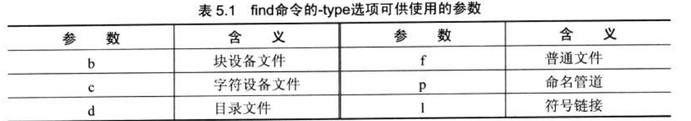
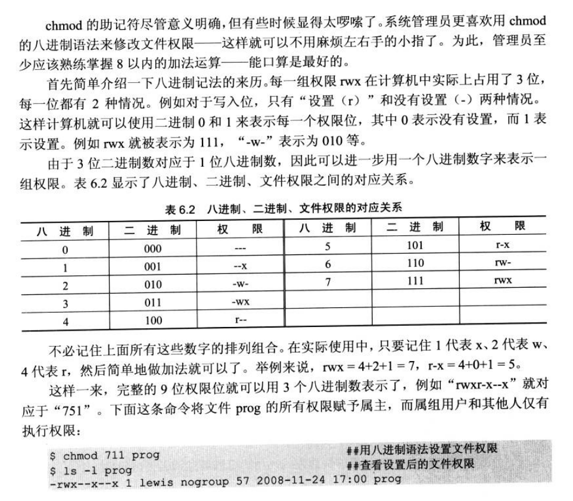

<center><span style="font-size:2rem;font-weight:bold;">linux系统常用命令总结</span></center>

<div style="page-break-after: always;"></div>

[toc]

<div style="page-break-after: always;"></div>

# 介绍

linux系统的管理是通过shell进行的，shell即命令解释器

命令行和Shell这两个概念常常是令人困惑的。在很多并不正式的场合中，这两个名词代表着相同的概念，即命令解释器

然而，命令行值得是供用户输入命令的界面，其本身只是接受输入，然后将命令传递给命令解释器，即Shell。

Shell是一个程序，他在用户和操作系统之间提供了一个面向型的交互接口。

Linux使用BASH作为默认的shell。

# 关机与重启命令

```BASH
shutdown -h now          #立刻关机
shutdown -h 5            # 5分钟后关机
poweroff                 # 立刻关机

shutdown -r now        # 立刻重启
shutdown -r 5          # 5分钟后重启
reboot                 # 立刻重启
```

# cd命令的使用

cd命令是在Linux文件系统中的不同部分之间移动的基本 工具，既可以通过从cd进入不同的目录内

## 常用用法

```BASH
cd /path                # 进入到path目录中
cd ..                   # 进入到上一个目录捏
cd ../..                # 进入到上上个目录中国
cd                      # 回到home目录
cd ~                    # 回到home目录
cd -                    # 切换到上次访问的目录
```

# pwd命令的使用

pwd即返回目前路径，显示当前目录的路径

例子

```BASH
cd /usr/local/bin
pwd
/usr/local/bin
```

# ls命令的使用

## 作用

列出目录内容

## 用法

```bash
ls -a          # 列出目录内的所有文件
ls -          # 列出文件并标出其属性
ls -F         # 列出文件，并标出其类型
ls            #列出目录中的文件
```

# mkdir的使用

## 作用

创建文件夹

## 用法

```BASH
mkdir filename
mkdir -p /path/filename
```

# touch使用

## 作用

创建文件

## 用法

```BASH
touch hello               # 创建hello文件
touch hello.cpp           # 更新hello.cpp文件的时间 
```

# mv的使用

## 作用

将文件移动到另一个文件中，也可以用于重命名

## 用法

```BASH
mv hello /new_path              # 将本目录下的hello文件移动到new_path目录中
mv hello hello_new              # 将本目录下的hello文件改名为hello_new
mv -r file/ newpath/            # 将file目录下的所有内容移动到new_path中
mv -i hello /new_path           # 将本目录下的hello文件移动到new_path目录中，若是新目录中存在同名文件，则询问
mv -b hello /new_path           # 将本目录下的hello文件移动到new_path目录中，若是新目录中存在同名文件，则将源文件改为hello~
```

# cp的使用

## 作用

复制文件

## 用法

```bash
cp hello /new_path              # 复制本目录下的hello文件移动到new_path目录中
cp -r file/ newpath/            # 复制file目录下的所有内容到new_path中
mv -i hello /new_path           # 复制本目录下的hello文件到new_path目录中，若是新目录中存在同名文件，则询问
mv -b hello /new_path           # 复制本目录下的hello文件到new_path目录中，若是新目录中存在同名文件，则将源文件改为hello~
```

# rm的用法

## 作用

用于删除文件与目录

## 用法

```bash
rm hello             # 删除本目录下的hello文件
rm -r file/          # 删除file文件夹
rm test/*.cpp        # 删除test文件夹里面所有的cpp文件
rm -i hello          # 删除本目录下的hello文件，在删除前询问
rm -f hello          # 强制删除本目录下的hello文件，不会在删除前询问
rm -rf*              # 删除本目录下的所有文件
```

# 文本文件查看工具的使用

## cat的使用

### 作用

cat命令用于查看文件内容，可以查看多个文件

### 用法

```bash
cat filename                    # 显示文件内容
cat filename1 filename2         #显示两个文件的内容
cat -n filename                 # 显示文件内容，并加上行号
```

### 缺陷

cat命令会一次将所有内容全部显示在屏幕上。

## more的使用

### 作用

一页一页的显示内容

### 用法

```bash
more filename                  # 显示文件内容，空格向下翻动一页，回车向下滚动一行，Q键退出
```

## head和tail的使用

### 作用

head显示文件的开头，动态显示

tail显示文件的结尾，动态显示

### 用法

```BASH 
head -n 2 filename    # 只显示头部两行的内容
tail -n 2 filename    # 只显示尾部两行的内容
```

## less的使用

### 作用

less与more较为类似，但是功能更为强大

### 用法

```BASH 
less filename             # 显示文件
less -M filename          # 显示文件内容，并在末尾给出文件信息
```

#打开文件后，底部存在一个冒号：，

* 此时按下空格可以向下翻页，按下B键可以想上翻页

* 输入`/string` 可以在文件中查找string，并高亮显示第一个位置，继续查看该string，输入`/`即可
* Q键退出

# grep的使用

## 作用

在文件中寻找特定的信息，并输出

使用的正则表达式搜索

## 用法

```BASH
grep key filename
grep 'key and key' filename1 filename2
```

# find命令

## 作用

在指定范围内查找文件

## 用法

```BASH
find /path -name zip -print            # 在path中寻找zip命令，并将结果打印在屏幕上
find / -name zip -print                # 在所有文件中寻找zip命令，并将结果打印在屏幕上
find /path -name init.d type d -print  # 在path中寻找名称为init.d的文件，且类型为d,并将结果打印在屏幕上
find /path -type f -atime -100 -print  # 在path中寻找类型为f,且在100天前使用过的文件，并将结果打印在屏幕上
find /path -type f -atime +100 -print  # 在path中寻找类型为f,且在超过100天前使用过的文件，并将结果打印在屏幕上
find /path -type f -mtime -100 -print  # 在path中寻找类型为f,且在100天前修改过的文件，并将结果打印在屏幕上
find /path -type f -mtime +100 -print  # 在path中寻找类型为f,且在超过100天前修改过的文件，并将结果打印在屏幕上
```

   

# In命令

## 作用

给两个文件之间建立链接

## 用法

```BASH
In -s Target LINK_NAME            # 建立软链接，即相当于给Target起了一个别名：Link_name
注：软链接删除LINK_NAME与target文件无关
In Target LINK_NAME        # 建立硬链接，即将Target起与Link_name联系在一起
注：硬链接删除LINK_NAME与target文件有关，相同的作用
```


# locate命令

## 作用

搜索文件位置

## 用法

```BASH 
locate *.doc               # 搜索所有.doc文件的位置
updatedb                   # 更新文件数据库
```

# whereis命令

## 作用

查找特定的程序

## 用法

```bash
whereis find                # 返回find命令所在的位置
whereis -b find             # 返回find二进制命令所在的位置
```

# uname命令

## 作用

显示当前系统的版本信息

## 用法

```BASH
uname -a           #显示操作系统所有信息
uname -r           #显示系统内核信息
```

# chown命令

## 作用

用于改变文件的所有权

## 用法

```BASH
chown new_owner:root day
chown new_owner day
chown -R new_pwner file/
```

# chmod命令

## 作用

用于改变一个文件的权限

## 用法

```BASH
chmod +x test
```

   

# ps命令

## 作用

监视进程的命令

## 用法

```BASH
ps -aux            # 用于显示当前系统是哪个运行的所有进行
ps -ef
```

# top的用法

## 作用

实时跟踪进程表信息

## 用法

```BASH
top
```

# VIM编辑器的用法

## Vim的三种模式

### 命令模式

```BASH 
(1) :set nu : #添加行号 (临时设定)
(2) p : #粘贴
(3) u : #撤销
(4) dw : #删除一个单词
(5) dd : #删除一行
(6) 3dd : #删除三行
(7) yy : # 复制光标所在行
```

### 插入模式

```BASH 
i #在光标所在位置插入字符
I #在光标所在行的行首插入字符
o #光标所在行的下一行新行插入字符
O #光标所在行的上一行新行插入字符
s #删除光标所在字符并插入字符
S #删除光标所在行并插入字符
a #光标所在字符的下一个字符插入
A #光标所在行的行尾插入字符
```

###  退出模式

```BASH 
:q #当vim进入文件没有对文件内容做任何操作可以按"q"退出
:q! #当vim进入文件对文件内容有操作但不想保存退出
:wq #正常保存退出
:wq! #强行保存退出，只针对于root用户或文件所有人生效
```

### 跳转

```BASH 
(1) gg ：跳转到文件开头
(2) Shift + g ：跳转到文件结尾
(3)100 : 跳转到文件的第100行
```

### 分割窗口

```BASH 
(1) :vsplit ：垂直分割
(2) :split ：水平分割窗口
```

### VIM中常用文本处理命令

#### 查找

```BASH 
(1) /pattern : 从上往下查找关键词 pattern 并高亮显示
(2) ?pattern : 从下往上查找关键词 pattern 并高亮显示
(4) /pattern1 [ ]+ pattern2: 查找关键词 pattern1 之后为任意个空格之后是关键词 pattern2
(5) /^C.*\spattern : 查找行头第一个字符为C之后任意多个字符后是空格且空格后是pattern关键词的内容
```

#### 添加

```BASH
(1) :%s/^/pattern/ : 将每行行首添加 pattern 字符串
(2) :%s/$/pattern/ : 将每行行尾添加 pattern 字符串
(3) :3,521 s/^/pattern/ : 将从第3行到第521行的行首添加 pattern 字符串
```

#### 替换

```BASH
(1) :%s/.*pattern/pattern/g : 将每行中内容为 *pattern 的内容替换为 pattern
(1) :1,5s/.*pattern/pattern/g : 将1到5行中的内容为 *pattern 的内容替换为 pattern
注：g替换出现的所有关键字，如果不加"g"只替换出现的第一个
```

#### 删除

```BASH
(1) :g/pattern/d : 将有关键词 pattern 的行删除
(2) :g/^$/d : 删除不包含任何空格的空行
(3) :g/^\s*$/d : 删除包含空格的空行
(4) :%g!/pattern/d : 删除不包含关键词pattern的所有行
```

#### 字符匹配

```BASH 
(1) * : 匹配0到任意个任意字符
(1) ? : 匹配单个任意字符
```


