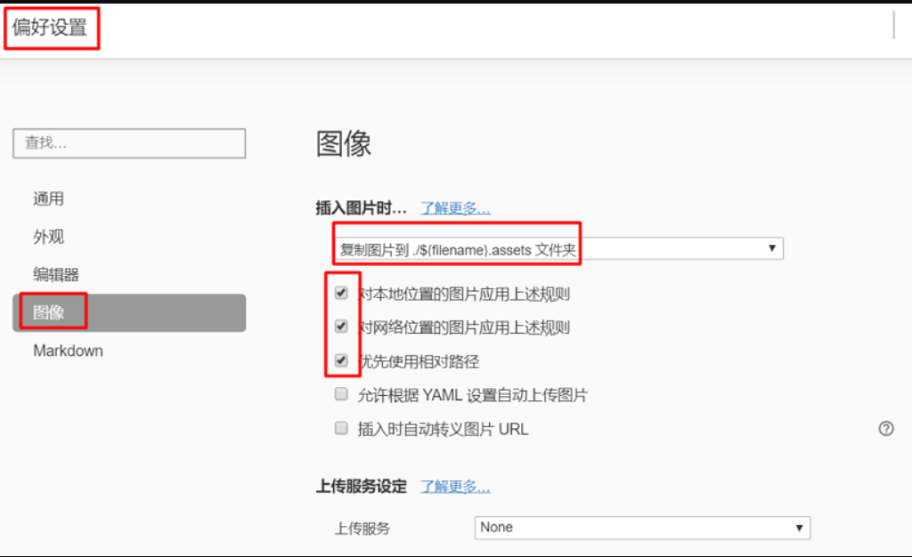
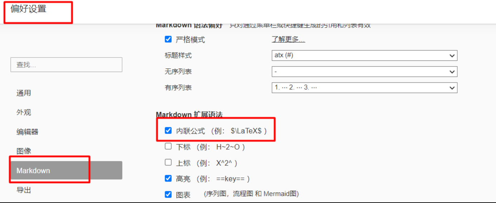
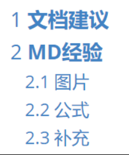

<center><span style="font-size:2rem;font-weight:bold;">MarkDown学习笔记</span></center>    

| 版本   | 日期      | 作者   | 备注             |
| ------ | --------- | ------ | ---------------- |
| V1.0.0 | 2022.09.5 | 庞明慧 | markdown学习笔记 |

<div style="page-break-after: always;"></div>

[toc]

<div style="page-break-after: always;"></div>

# Typora的配置技巧

## Typora介绍

Typora是一款轻量级 Markdown 编辑器，与其他 Markdown 编辑器不同的是，Typora 没有采用源代码和预览双栏显示的方式，而是采用所见即所得的编辑方式，实现了即时预览的功能，但也可切换至源代码编辑模式。

## Typora安装

Typora目前是收费的，89¥可以买断，可以配置在Windows，linux，macos系统上。   

官网：<https://support.typoraio.cn>

免费学术研究版：<链接：https://pan.baidu.com/s/1gVyeSBRgPUudtNZxqZFqkw  提取码：ugn7 >

## Typora配置技巧

### 换行符

建议全平台使用统一的换行符` LF`换行，`文件`->`偏好设置`->`编辑器`->`默认换行符`->`LF(Unix Style)`

### 图片

推荐使用搜狗输入法自带的截图软件，可以自己设置对应的快捷键，快速截图。
**markdown中插入图片推荐使用相对路径，Typora`偏好设置`里面`图像`可设置粘贴图片自动相对路径**


在以上设置完毕之后，在Typora中直接`ctrl+v`粘贴剪切板里的图片，就会自动填入该markdown文本路径`.assets文件夹`下面
如图所示：


### 公式

markdown使用`latex`书写公式，这里推荐一个新手入门的`latex`入门编辑器：<https://www.latexlive.com>
深入了解：https://www.bilibili.com/video/BV14g4y1q7pb

设置如下：


### 实现自动编号显示

Typora多级标题可以实现自动编号显示：`偏好设置`->`外观`->`打开主题文件夹`，配置`base.user.css`文件，推荐使用`css`配置文件：[base.user.css百度网盘下载](https://pan.baidu.com/s/1Kn4M8KAX6bhoX7T9CrTXkg)，提取码`cl2e`。如下图所示：


### Typora内嵌html

* 文档标题居中显示，可参考：
  ```html
  <center><span style="font-size:2rem;font-weight:bold;">文档标题</span></center>
  ```

* 插入分页符
  ```html
  <div style="page-break-after: always;"></div>
  ```

### 小技巧

可以使用搜狗输入法的`自定义短语`功能，将上述的一些命令作为快捷输入，例：

换页：`mdhy` : ```<div style="page-break-after: always;"></div>```

标题：`mdbt` :```center><span style="font-size:2rem;font-weight:bold;">MarkDown标题</span></center>```

版本表：`mdbb`:```| 版本   | 日期 | 作者   | 备注     |
| ------ | ------ | --------- | --------- |
| V1.0.0 | 2022.02.20 | 徐正翔 | 新建文档 |```
