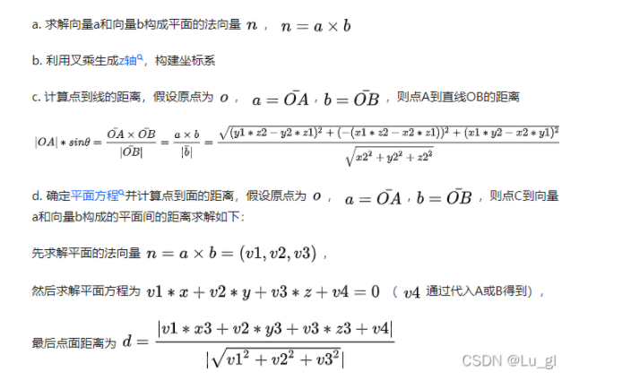

向量点乘(即内积)和叉乘(即外积、向量积)区别与意义分析

[toc]

首先，介绍一下向量（Vector），在几乎所有的几何问题中，向量（有时也称矢量）是一个基本点。向量的定义包含方向和一个数（长度）。
  在二维空间中，一个向量可以用一对x和y来表示。向量：既有方向又有大小的量。通常情况下会将向量放到坐标系中，常用的是笛卡尔坐标系，向量起始点通常放到原点（注：没有固定的起点，只要方向相同，大小相等，就认为两向量是相同的，但为了用数值坐标来表示向量，将起始点放到原点）

# 点乘 （Dot Product）

向量的点乘,也叫向量的内积、数量积，对两个向量执行点乘运算，就是对这两个向量对应位一一相乘之后求和的操作，点乘的结果是一个标量。

点乘，也叫数量积。结果是一个向量在另一个向量方向上投影的长度，是一个标量。
假设向量a和向量b：
     
a和b的点积公式（要求一维向量a和向量b的行列数相同)为：
               

## 点乘的几何意义

**点乘的几何意义是可以用来表征或计算两个向量之间的夹角，以及在b向量在a向量方向上的投影，有公式：**
$$
a·b = |a||b|cos(θ)
$$
**θ是向量a和向量b见的夹角。这里|a|我们称为向量a的模(norm)，也就是a的长度， 在二维空间中就是|a| = sqrt(x2+y2)。**

这样我们就和容易计算两条线的夹角：

 cos(θ) = a·b /(|a||b|)

### 推导过程

推导过程可以稍微利用余弦定理如下，
首先看一下向量组成：  
定义向量： c = a - b
根据三角形余弦定理有：
             
根据关系c = a - b（a、b、c均为向量）有：
   
向量a，b的长度都是可以计算的已知量，从而有a和b间的夹角θ：
               
**根据这个公式就可以计算向量a和向量b之间的夹角。从而就可以进一步判断这两个向量是否是同一方向，是否正交(也就是垂直)等方向关系，具体对应关系为：**
   **a·b>0    方向基本相同，夹角在0°到90°之间**
   **a·b=0    正交，相互垂直**
   **a·b<0    方向基本相反，夹角在90°到180°之间****

### 物理意义

**假如 向量a 为（x1, y1），向量b为(x2, y2)**
**点积（也叫内积)结果 为a·b = x1 * x2 + y1 * y2 = |a||b| cos<a,b>，可以理解为向量a在向量b上投影的长度乘以向量b的长度。**

## 常用应用

         

# 叉乘（cross product）

  两个向量的叉乘，又叫向量积、外积、叉积，叉乘的运算结果是一个向量而不是一个标量，并且两个向量的叉积与这两个向量组成的坐标平面垂直。
对于向量a和向量b：

                   
    

## 叉乘的几何意义

   在三维几何中，向量a和向量b的叉乘结果是一个向量，更为熟知的叫法是法向量，该向量垂直于a和b向量构成的平面。叉乘的结果是个向量，方向在z轴上,在二维空间里，让我们暂时忽略它的方向，将结果看成一个向量，那么这个结果类似于上述的点积，有公式：
$$
axb = |a||b|sin(θ)
$$
**然而角度 θ和上面点乘的角度有一点点不同，他是有正负的，是指从a到b的角度。因此 ，向量的外积不遵守乘法交换率，因为向量a×向量b=-向量b×向量a在物理学中，已知力与力臂求外积，就是向量的外积，即叉乘。**

在3D图像学中，叉乘的概念非常有用，可以通过两个向量的叉乘，生成第三个垂直于a，b的法向量，从而构建X、Y、Z坐标系。如下图所示：

             
**在二维空间中，叉乘还有另外一个几何意义就是：aXb等于由向量a和向量b构成的平行四边形的面积。**            
叉积的绝对值就是A和B为两边说形成的平行四边形的面积。也就是AB所包围三角形面积的两倍。在计算面积时，我们要经常用到叉积。

   

### 方向判定：

  向量c的方向与a,b所在的平面垂直，且方向要用“右手法则”判断。判断方法如下：
 1.右手手掌张开，四指并拢，大拇指垂直于四指指向的方向；
 2.伸出右手，四指弯曲，四指与A旋转到B方向一致，那么大拇指指向为C向量的方向。

   

### 物理意义   

假如 向量a 为（x1, y1），向量b为(x2, y2)
叉积（也叫外积）的模为a x b = x1 * y2 - x2 * y1 = |a||b| sin<a,b>，可以理解为平行四边形的有向面积（三维以上为体积）。外积的方向垂直于这两个方向。

## 常用应用

   

      
